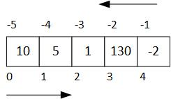

---
jupytext:
  formats: ipynb,md:myst
  text_representation:
    extension: .md
    format_name: myst
    format_version: 0.12
    jupytext_version: 1.7.1
kernelspec:
  display_name: Python 3
  language: python
  name: python3
---

# Secuencias: Listas, tuplas y rangos

+++

[Contenedores de datos](#Contenedores_de_datos)<br>
[Listas](#Listas)<br>
[Tuplas](#Tuplas)<br>
[Rangos](#Rangos)<br>
[Operadores comunes de las secuencias](#Operadores_comunes_secuencias)<br>
[Creación de listas](#Creación_de_listas)<br>
[Modificando una lista](#Modificando_una_lista)<br>
[Obteniendo información de una lista](#Obteniendo_información_de_una_lista)<br>
[Cadenas de caracteres (`str`) como colecciones secuenciales](#Cadenas_de_caracteres_como_colecciones_secuenciales)<br>

[Funciones nativas y listas](#Funciones_nativas_y_listas)<br>
[Métodos de las listas](#Métodos_de_las_listas)<br>

+++

***
<a id='Contenedores_de_datos'></a>

+++

## Contenedores de datos

En muchas aplicaciones resulta conveniente ser capaz de almacenar en memoria, para luego manipular a conveniencia y de forma consistente, un determinado conjunto de datos. 

Hasta el momento, hemos introducido tipos de datos **escalares**, `int`, `float`, `complex` y `bool`, datos que conceptualmente contienen un único valor. Y también hemos introducido ya un contenedor de datos, las cadenas de caracteres `str`.

Supongamos, por un momento, que se desea retener un conjunto de 5 enteros en memoria, para luego  manipularlos, posiblemente de diversas formas: sumándolos, o hallando el máximo de los mismos, o graficándolos, etc. 

Con lo visto hasta ahora el recurso lógico es definir 5 variables enteras y tratarlas individualmente.
```python
    a0 = 10
    a1 = 5
    a2 = 1
    a3 = 130
    a4 = -2
    
    suma = a0 + a1 + a2 + a3 + a4
```
¿Qué pasa si ahora se necesitaran 100 variables? Habría que crear otras tantas variables, con nombres diferentes y extender el código previo manteniendo la idea básica. Algo impracticable.

En Python los objetos nativos de tipo **contenedor** (**container**) cubren esa necesidad.

+++

### Contenedores en Python

Todos los lenguajes de programación brindan la posibilidad de trabajar con colecciones de datos de una forma consistente. Por ejemplo, en C/C++ se tiene el concepto de vector (*array*).

Python ofrece un conjunto de opciones muy efectivas y flexibles para resolver este tipo de problemas. Permiten  representar tipos de datos **contenedores** de otros datos de forma nativa. 

Los tipos nativos contenedor más relevantes son:

|Nombre                    | Tipo    | Ejemplo                     |Descripción                               |
|:-------------------------|:--------|:----------------------------|:-----------------------------------------|
|**Lista**                 | `list`  | ``[1, 2, 3]``               | Secuencia heterogénea de datos mutable   |
|**Tupla**                 | `tuple` | ``1, 2, 3`` o ``(1, 2, 3)`` | Secuencia heterogénea de datos inmutable |
|**Rango**                 | `range` | ``range(1, 20, 2)``         | Secuencia de enteros inmutable           |
|**Cadena de caracteres**  | `str`   | ``'Hola'``                  | Secuencia de caracteres inmutable        |
|**Diccionario**           | `dict`  | ``{'a':1, 'b':2, 'c':3}``   | Tabla asociativa (clave, valor)          |
|**Conjunto**              | `set`   | ``{1, 2, 3}``               | Colección sin orden de valores únicos    |

El uso de corchetes, ``[]``, paréntesis, ``()`` o llaves, ``{}``, es lo que distingue entre sí las **listas**, **tuplas**, **diccionarios** y **conjuntos**.

Las **secuencias** son contenedores donde los elementos se almacenan siguiendo un orden. **Listas**, **tuplas** y **rangos** son las secuencias básicas que define Python. Además, un tipo de dato que ya conocemos, la **cadena de caracteres**, es
también una secuencia ordenada de caracteres alfanuméricos.

Entre las secuencias destacan las **listas**, tipo `list` a las que prestaremos la atención en primer lugar.

+++

***
<a id='Listas'></a>

+++

## Listas
En la siguiente celda, se define una variable **lista** llamada `lista_enteros` asignándola una **colección** de valores caracterizada por: 
* una **secuencia** de literales enteros
* **separados por comas**
* **delimitados por corchetes**

```{code-cell} ipython3
lista_enteros = [10, 5, 1, 130, -2]
print(lista_enteros)
type(lista_enteros)
```

El concepto de lista impone necesariamente una relación de **orden**, una **secuencia**.

Observe además que la variable de tipo **lista** puede ser enviada como argumento real a la función `print()`, que la interpreta correctamente y la saca por la consola de la forma esperada.

La variable `lista_enteros` representa a la colección completa. Pero este recurso del lenguaje no sería tan útil si no permitiera el acceso individual a cada uno de los enteros *contenidos* en la colección.

+++

### Indexación
La **indexación** permite acceder a un miembro individual de la lista.

Véase el ejemplo siguiente (se debe haber ejecutado antes la celda previa):

```{code-cell} ipython3
x = lista_enteros[0]
y = lista_enteros[1]
z = lista_enteros[4]
print(x, y, z)
```

En la celda anterior, se almacenan en variables ciertos valores de la secuencia.

Para acceder a un miembro individual de la lista:
* se utiliza un **índice**, siempre de tipo entero, que indica la posición del dato miembro dentro de la colección
* el índice se pone entre corchetes `[]`, que actúan como un **operador de indexación**
* al primer elemento de la secuencia le corresponde siempre el valor ``0``

Dado que una lista implementa una **secuencia**, el elemento de índice *i* aparece siempre antes que el elemento *i+1* si se está *recorriendo* la lista desde la *izquierda*.

+++

A diferencia de otros lenguajes, Python permite que el índice pueda especificarse también desde la derecha, utilizando enteros negativos: el índice `-1` hace referencia al último elemento de la lista (o al primero desde la izquierda).

Vea el siguiente esquema:



```{code-cell} ipython3
print(lista_enteros[-1], lista_enteros[-2])
```

Si se intenta acceder a un elemento no existente dentro de la secuencia, se produce un error en tiempo de ejecución:

```{code-cell} ipython3
:tags: [raises-exception]

lista_enteros[5]
```

Es muy importante ir identificando el tipo de error que se lanza al producirse la excepción. En este caso, ``IndexError: list index out of range`` nos da toda la información necesaria de la causa del error.

+++

### Mutabilidad
Una lista es, además, una secuencia **mutable**. Esto quiere decir que se pueden:
* **modificar** los elementos de la lista
* **borrar** determinados elementos
* **añadir** elementos nuevos
* etc.

En la celda siguiente, podemos observar mediante la función `id()` que la identidad del objeto no ha cambiado, pero su valor sí.

```{code-cell} ipython3
lista = [0, 1, 2, 3]
print("Lista antes:", lista)
print("Identidad antes:", id(lista))
lista[0] = lista[1] + lista[2]  # Modificamos el elemento [0]
print("Lista después:", lista)
print("Identidad después:", id(lista))
```

### Lista vacía
En muchas ocasiones. los algoritmos construyen iteradamente una lista a partir de una **lista vacía**, que se construye con los corchetes vacíos.

```{code-cell} ipython3
lista = []
```

***
<a id='Tuplas'></a>

+++

## Tuplas

Las **tuplas**, tipo ``tuple``, representan, al igual que las listas, una secuencia de valores en Python. 

A diferencia de las listas, las **tuplas** son **inmutables**: una vez creadas no pueden modificarse.

Tanto las listas como las tuplas pueden contener valores de diferente tipo, datos heterogéneos. Sin embargo, el uso más habitual para las listas es de utilizarlas para almacenar datos homogéneos.

Una tupla se crea asignando un conjunto de valores a una variable. Los valores están separados entre sí por una coma y opcionalmente pueden estar rodeados de paréntesis.

Por ejemplo:

```{code-cell} ipython3
datos_asig = 'Fundamentos de Programación', 40, 1, 2
print(datos_asig)

otro = (1, 2, 3)  # Uso de paréntesis opcional
print(otro)
```

Nótese que, aunque los paréntesis son opcionales, aportan una mejor legibilidad. 

Se pueden crear tuplas de un solo elemento. Cómo podría existir ambigüedad, se tiene que poner una coma al final.
```python
un_elemento = (10,)
otro_elemento = 'Hola',
```

```{code-cell} ipython3
una_tupla = 'Hola',
una_cadena = 'Hola'
print(type(una_tupla))
print(type(una_cadena))
```

También pueden existir tuplas vacías, usando paréntesis sin contenido:

```{code-cell} ipython3
tupla_vacia = ()
```

Se pueden acceder a los elementos de las tuplas con el operador de indexación ``[]``.

```{code-cell} ipython3
x = 3, 7, 9, 10
print(x[0] + x[1])
```

### Inmutabilidad
Sin embargo, dado su carácter inmutable, lo que no se puede es modificar los valores ni el tamaño de la tupla una vez creada.

```{code-cell} ipython3
:tags: [raises-exception]

x[1] = 10   # La ejecución de esta línea provoca un error al ser las tuplas inmutables
```

***
<a id='Rangos'></a>

+++

## Rangos
Un **rango** es una secuencia **inmutable de enteros** que, como veremos, se usa habitualmente con **bucles**: la ejecución de un grupo de sentencias un número determinado de veces.

La construcción de un rango de enteros admite varias sintaxis, donde los parámetros ``start``, ``stop`` y ``step`` son enteros:

* ```python
  range(stop)
  ```
  La secuencia de enteros representada es ``0, 1, 2, ..., stop-1``. Si ``stop <= 0`` la secuencia no tendrá elementos.

* ```python
  range(start, stop)
  ```
  La secuencia de enteros representada es ``start, start+1, start+2, ..., stop-1``. Si ``stop <= start`` la secuencia no tendrá 
  elementos.
* ```python
  range(start, stop, step)
  ```
  La secuencia de enteros representada es ``start, start+1*step, start+2*step, ..., start+i*step``. Si ``stop <= start`` la   
  secuencia no tendrá elementos.
  
  - Si ``step`` es un entero positivo, la secuencia finalizará para aquel valor ``i`` para el que ``start+i*step < stop``
  - Si ``step`` es un entero negativo, la secuencia finalizará para aquel valor ``i`` para el que ``start+i*step > stop``

A diferencia de las secuencias ``list`` o ``tuple``, un objeto de tipo ``range`` no almacena los valores de la secuencia en memoria, con el consiguiente ahorro de recursos. Solo necesita almacenar los valores para ``start``, ``stop`` y ``step``: calcula dinámicamente los valores intermedios a medida que los va necesitando.

+++

### Listas y tuplas a partir de rangos
Tanto las listas como las tuplas tienen **constructores**, ``list()`` y ``tuple()``, que admiten un rango como parámetro para ser creadas. Veámoslos en acción.

```{code-cell} ipython3
# Enteros del 0 al 9
lista = list(range(10))
print("Lista contruida con range(10):\n  {}".format(lista))
# Enteros del 5 al 20
tupla = tuple(range(5, 15))
print("Tupla contruida con range(5, 15):\n  {}".format(tupla))
# Pares del 4 al 20
lista = list(range(4, 21, 2))
print("Lista contruida con range(4, 21, 2):\n  {}".format(lista))
# Secuencia del 3 al -12 en pasos de -3
tupla = tuple(range(3, -13, -3))
print("Tupla contruida con range(3, -13, -3):\n  {}".format(tupla))
```

***
<a id='Operadores_comunes_secuencias'></a>

+++

## Operadores comunes de las secuencias 

### El operador de pertenencia ``in``
El **operador de pertenencia** ``in`` comprueba si un determinado valor forma parte de una secuencia. Dado que ``in``
devuelve un valor booleano, ``True`` o ``False``, el operador ``not in`` devolverá justo el resultado contrario.

| Operador |Descripción                                                       |
|:--------:|:-----------------------------------------------------------------|
|    `in`  | Devuelve `True` si el elemento está contenido en la secuencia    |
| `not in` | Devuelve `True` si el elemento no está contenido en la secuencia |   

```{code-cell} ipython3
lista = [1, 3, 5, 7, 2, 4, 6]
if 2 in lista:
    print('El valor 2 está en la lista {}'.format(lista))
rango = range(10)
if 10 not in rango:
    print('El valor 10 no está en {}'.format(rango))
```

### Concatenación
El operador ``+`` actúa de forma sobrecargada para formar secuencias lista o tupla concatenadas.

```{code-cell} ipython3
lista = [1, 2, 3] + [6, 7, 8]
print(lista)
```

El operador ``*`` concatena consigo mismo una secuencia un determinado número ``n`` de veces.

Resulta un recurso conveniente para inicializar una secuencia de tamaño conocido ``n`` con un valor o un patrón dado.

```{code-cell} ipython3

num = 10
tupla = (0,)*num
print("Una tupla de {} elementos inicializada a 0:\n  {}".format(num, tupla))
```

Por razones obvias, los operadores ``+`` y ``*`` no están permitidos en los tipos ``range``, dado que su aplicación generaría con caracter general una secuencia que no correspondería a un rango. 

+++

### Obteniendo información de la secuencia
#### La longitud de la secuencia ``len()``
Permite obtener el número de elementos.

```{code-cell} ipython3
lista = [1, 2, 3, 4, 5]
rango = range(10)
print("El número de elementos de {} es {}".format(lista, len(lista)))
print("El número de elementos de {} es {}".format(rango, len(rango)))
```

#### Los valores extremos: ``min()`` y  ``max()``
Permiten obtener el valor mínimo o máximo de la secuencia.

```{code-cell} ipython3
lista = [1, 2, 3, 4, 5]
rango = range(10)
tupla = ('Hola', 'Adiós', 'Buenos días')
print("El valor mínimo de {} es {}".format(lista, min(lista)))
print("El valor máximo de {} es {}".format(rango, max(rango)))
print("El valor máximo de {} es {}".format(tupla, max(tupla)))
```

Estas y otras funciones similares no tiene sentido utilizarlas en secuencias heterogéneas. Tanto ``min()`` como ``max()`` utilizan el operador ``<`` para comparar entres sí los elementos. Si la secuencia tiene tipos incompatibles con este operador,
se lanzará una excepción. Véase un ejemplo:

```{code-cell} ipython3
:tags: [raises-exception]

min([1, 2, 'hola'])
```

#### Posición de un elemento y número de ocurrencias
Mediante la función miembro ``index(x)`` podemos obtener la posición de la primera ocurrencia del valor ``x`` en la secuencia. 

```{code-cell} ipython3
lista = [2, 4, 6, 8, 10]
x = 6
print("El valor {} ocupa la posición {} en la lista {}".format(x, lista.index(x), lista))
```

Las secuencias también disponen del método ``count(x)`` para determinar cuantas veces aparece el valor ``x`` en la secuencia.

```{code-cell} ipython3
lista = [1, 1, 2, 3, 1]
x = 1
print("El valor {} aparece {} veces en la lista {}".format(x, lista.count(x), lista))
```

### Operadores de comparación

Estos operadores comparan de izquierda a derecha elemento a elemento en posiciones correlativas.

| Operador |Descripción                                                                                           |
|:--------:|:-----------------------------------------------------------------------------------------------------|
| `==`     | `True` si las listas son iguales                                                                     |
| `!=`     | `True` si las listas son desiguales                                                                  |
| `>`      | `True` si el primer elemento diferente es mayor en la lista de la izquierda                          |
| `>=`     | `True` si las listas son iguales o el primer elemento diferente es mayor en la lista de la izquierda |
| `<`      | `True` si el primer elemento diferente es mayor en la lista de la derecha                            | 
| `<=`     | `True` si las listas son iguales o el primer elemento diferente es mayor en la lista de la derecha   |

```{code-cell} ipython3
lista1 = [1, 2, 3, 4, 5]
lista2 = [1, 2, 3, 4, 5]
lista3 = [1, 1, 30, 30, 50]
lista4 = [1, 2, 3, 4, 5, -1]
if lista1 == lista2:
    print('{} es igual a {}'.format(lista1, lista2))
if lista1 > lista3:
    print('{} es mayor a {}'.format(lista1, lista3))
if lista1 < lista4:
    print('{} es menor a {}'.format(lista1, lista4))
```

***
<a id='Creación_de_listas'></a>

+++

## Creación de listas
Las listas pueden ser creadas de diferentes formas. Previamente hemos visto algunas de ellas, en lo que sigue veremos algunas otras.

Los siguientes operadores son **sobrecargados**, es decir, **reinterpretados**, para trabajar con listas:

* Operadores de *creación* de nuevas listas a partir de otras

| Operador |Descripción                                                                  |
|:--------:|:----------------------------------------------------------------------------|
| `+`      | Concatena listas                                                            |
| `+=`     | Añade lista a lista existente                                               |
| `*`      | Crea nueva lista a partir de repetir un número de veces una lista existente |

+++

### De forma explícita

```{code-cell} ipython3
r = range(0, 20, 2)
print(r[1])
type(r)
```

```{code-cell} ipython3
# Asignando valores con la sintaxis habitual
x = 1.1
y = 2.3
z = 5.0
num_reales = [x, y, z]
```

### Concatenando listas
Para ello se usan los operadores `+` o `+=`.

```{code-cell} ipython3
# Concatenando listas
a = [1, 4, 10] + [5, 6] + [1, 0]
print(a)
a += a
print(a)
```

***
<a id='Modificando_una_lista'></a>

+++

## Modificando una lista

+++

### Añadiendo elementos
El método `.append()` invocado desde un objeto lista concreta añade **un único elemento** al final de la lista (dicho elemento podría ser otra lista). El método `.extend()` permite *extender* la lista aplicando varios elementos a la vez.

```{code-cell} ipython3
# Creando una lista vacía e ir añadiendo elementos mediante métodos append() y/o extend()
a = [] # ¡Lista vacía!
a.append(1)
a.extend([3, 2, 'hola'])
print(a)
```

#### Mediante el operador `+=`
También se pueden utilizar la sentencia compuesta de asignación `+=`, para añadir elementos al final de una lista, como se muestra a continuación:

```{code-cell} ipython3
a = []
a += [1, 2, 3]
print(a)
```

### Insertando elementos en una posición arbitraria
Se hace uso del método ```.insert()``` que posee dos parámetros, la posición (un entero) y el elemento único a insertar (si elemento es a su vez una lista, se inserta como una sub-lista).

```{code-cell} ipython3
a = [1,2]
a.insert(1,3)
print(a)
```

### Borrando elementos de la lista

La función `del()` tiene el propósito de borrar valores de la memoria del ordenador. Puede aplicarse a variables simples (tipo `int`, `float`, etc) y a variables que representan colecciones o secuencias.

Si se aplican a la lista en su conjunto, la borran completamente de la memoria del ordenador, de forma que cualquier acceso posterior a ella daría un error de ejecución.

Pero la función `del()`también puede ser usada para borrar elementos concretos de la lista de la forma que se muestra a continuación:

```{code-cell} ipython3
a = ["lista", "palabras", "sueltas", "representadas", "por", "cadenas"]
del a[1]
print(a)
```

Otros tres métodos nos permiten borrar elementos:
* `.pop()` reduce el tamaño de la misma en uno, eliminando el último elemento si se pasa sin argumentos o el elemento cuya posición es indicada en el argumento. A diferencia de `del()`, este método devuelve el elemento eliminado.
* `.remove()` permite borrar la primera aparición del elemento que se pasa como parámetro.
* `.clear()` borra todo el contenido de la lista, haciendo que esta al final esté vacía.

```{code-cell} ipython3
lista = ["lista", "palabras", "sueltas", "representadas", "por", "cadenas"]
valor = lista.pop()
print("Con pop() hemos eliminado el elemento \'{}\'.".format(valor))
valor = lista.pop(2)
print("Con pop(2) hemos eliminado el elemento \'{}\'.".format(valor))
lista.remove('palabras')
print("Usando remove('palabras') eliminamos el primer elemento que coincide con 'palabras'")
print(lista)
lista.clear()
print("Con clear() la lista se vacía.", lista)
```

***
<a id='Obteniendo_información_de_una_lista'></a>

+++

## Obteniendo información de una lista
La función intrínseca (*built in*) de Python ```len()``` devuelve el tamaño de la lista que se pase como parámetro.

```{code-cell} ipython3
lista = [1, 2]*5
tam = len(lista)
print("La lista {} tiene tamaño {}".format(lista, tam))
```

El **operador de pertenencia** `in` sirve para comprobar si un elemento determinado se encuentra en la colección. Devuelve un valor de `True` si el elemento aparece en la lista y `False` en caso contrario.

```{code-cell} ipython3
3 in [1, 20, 3, [20,4]]
```

```{code-cell} ipython3
3 not in [1, 3, 4]
```

```{code-cell} ipython3
5 in range(20)
```

Como habrá notado, Python ofrece varias alternativas similares para llevar a buen puerto el objetivo buscado. 
* Podemos conocer si un elemento está en una lista mediante el método `count()`, que además devuelve cuántas veces el elemento aparece.
* El método `index()` por su parte nos indica el índice de la primera aparición en la lista (si elemento no está se genera error de ejecución).

```{code-cell} ipython3
a = [1, 2, 4, 2]
valor = 2
veces = a.count(valor);

print('El {} aparece en la lista {} en {} posiciones.'.format(valor, a, veces))
print('La primera vez aparece en la posición', a.index(valor))
```

### Mediante la función nativa `range()`
La función nativa `range()` genera un objeto que consiste en una **secuencia** de enteros. Admite diferente número de argumentos:
* cuando es utilizada con dos argumentos enteros, `range(start, stop)`, es capaz de *generar* todos los enteros en el intervalo semiabierto $[start, stop)$.
* si se usa un solo argumento, `range(stop)`, entonces se generan los enteros en el intervalo $[0, stop)$.
* en su forma más general, con tres argumentos, `range(start, stop[, step])`,  el argumento `step` indica el incremento o paso entre un entero y el siguiente. Por defecto tiene el valor 1.

```{code-cell} ipython3
# Creación de listas de enteros utilizando la función list() y el generador range()
a = list(range(20, 30, 2))
print(a)
a = list(range(30, 20, -2))
print(a)
```

***
<a id='Cadenas_de_caracteres_como_colecciones_secuenciales'></a>

+++

## Cadenas de caracteres (`str`) como colecciones secuenciales
Ya conocíamos, sin haberlo reconocido, otro tipo de colección. Las cadenas de caracteres pueden concebirse como _secuencias_ de caracteres alfanuméricos. La mayor parte de las veces, se trabaja con las cadenas tomándolas en su conjunto. Pero es perfectamente posible acceder a los caracteres individuales, utilizando los conceptos vistos previamente.

```{code-cell} ipython3
cadena = "La cadena de caracteres es una secuencia"
car1 = cadena[0]
car2 = cadena[-1]
print('La frase "{}" tiene una longitud {}. Comienza por \'{}\' y termina por \'{}\'.'.format(cadena, len(cadena), car1, car2))
```

A diferencia de las listas, **las cadenas de caracteres son objetos inmutables**.

```{code-cell} ipython3
cadena = "hola"
cadena[0] = 'H'
```

### Operaciones con tuplas

Puede consultarse [aquí](https://docs.python.org/3/library/stdtypes.html?highlight=tuple#typesseq-common) el conjunto de operadores, métodos y funciones que son comunes a todos las secuencias listas y tuplas.

Las operaciones con tuplas serán un subconjunto de las vistas con las listas y la regla básica es que la operación en cuestión no será válida para una tupla si pretende una modificación de los datos del objeto tupla, que es inmutable.

Se pueden comparar las tuplas utilizando los operadores conocidos (`>`, `<=`, `>=`, etc.). También se puede utilizar el operador especial de pertenencia (`in`) para saber si un elemento pertenece a la tupla o no.

Funciones como `len()`, que brindan información sobre la secuencia, son igualmente utilizables.

```{code-cell} ipython3
a = 1, 2, 3, 4, 5
print('El tamaño de la tupla es:', len(a))
print('¿Contiene el elemento 4?', 4 in a)
```

### Desempaquetado de una tupla
Los elementos de una tupla se pueden asignar a tantas variables como elementos haya en la misma en un proceso llamado **desempaquetado** (**unpacking**).

```{code-cell} ipython3
datos_ciudad = ('Valladolid', 'Castilla y León', 'España')
ciudad, comunidad, pais = datos_ciudad
print(ciudad, comunidad, pais)
```

En el ejemplo se han creado nuevas variables con nombre: `ciudad`, `comunidad` y `pais` que contiene las cadenas de caracteres incluidas en las posiciones `0`, `1`, `2` de la tupla `datos_ciudad`.

+++

Nótese que, en realidad, el desempaquetado es el mecanismo del lenguaje que se pone en juego cuando se hacen asignaciones múltiples en Python:

```{code-cell} ipython3
a, b = 1, 2
```

Un código como el anterior funciona primero como el **empaquetado** o creación de una tupla con los elementos `1` y `2` (nótese que los paréntesis son opcionales) y el posterior **desempaquetado** o asignación a las variables `a` y `b`.

Veremos la utilidad de este esquema a lo largo del curso. Recordad que, en particular en muy útil para el intercambio de los valores de dos variables: una operación que se requiere con alguna frecuencia en programación:

```{code-cell} ipython3
x = 2
y = 3
x, y = y, x
print('x = ', x, 'y = ', y)
```

***
<a id='Funciones_nativas_y_listas'></a>

+++

## Funciones nativas que soportan listas como argumento
Una relación no completa:

* Funciones generales que aceptan listas:

| Función  |Descripción                                 |
|:---------|:-------------------------------------------|
| `print()`| Saca la lista por consola                  |
| `type()` | Aplicada a la lista la identifica como tal |   

* Funciones específicas para listas (o colecciones similares):

| Función    |Descripción                               |
|:-----------|:-----------------------------------------|
| `len()`    | Devuelve el número de elementos          |
| `list()`   | Crea una lista a partir de una secuencia |
| `sorted()` | Ordena la lista                          |   
| `max()`    | Determina el máximo                      |   
| `min()`    | Determina el mínimo                      |

+++

***
<a id='Métodos_de_las_listas'></a>

+++

## Métodos de las listas

Las listas, como cualquier entidad en Python, son objetos. Por tanto, se puede modificar u obtener información de una lista recurriendo a los métodos definidos para este tipo de objeto.

| Método       |Descripción                                          |
|:-------------|:----------------------------------------------------|
| `.append()`  | Añade un único elemento al final de la lista        |
| `.extend()`  | Añade varios elementos al final de la lista         |   
| `.insert()`  | Inserta elemento en posición indicada               |   
| `.pop()`     | Elimina elemento al final de la lista               |    
| `.remove()`  | Elimina elemento indicado de la lista               |    
| `.clear()`   | Borra todos los elementos de la lista               |    
| `.copy()`    | Realiza una copia superficial                       |    
| `.count()`   | Cuenta apariciones de un elemento                   |    
| `.index()`   | Devuelve el índice de primera aparición de elemento |    
| `.reverse()` | Invierte la secuencia de la lista                   |    
| `.sort()`    | Ordena la lista                                     |   

Puede consultarse [aquí](https://docs.python.org/3.8/tutorial/datastructures.html) una lista completa de los métodos de los objetos `list`.

+++

### Elementos con tipos heterogéneos
Las listas no necesariamente tienen que contener elementos del mismo tipo de dato. Aún más, un elemento de la lista puede ser a su vez otra lista (**listas anidadas**) u otro tipo de contenedor. Véase el siguiente ejemplo:

```{code-cell} ipython3
notas = ["Fundamentos de Programación", 1, [10.0, 7.8, 6.7, 9.5, 3.3, 7.5, 6.3, 0.5, 4.2, 7.1]]
print("Asignatura", notas[0], "Curso", notas[1])
print("Notas:", notas[2])
```

La lista asignada a la variable `notas` tiene:
* como primer elemento (índice `0`) una cadena de caracteres (`str`)
* como segundo elemento (índice `1`) un entero (`int`)
* como tercer elemento (índice `2`) una lista (`list`) cuyos elementos, en este caso particular, son todos de tipo `float`. En este caso, podrían ser las notas de 10 alumnos. 

Para las listas con elementos homogéneos, el equivalente en C/C++ sería el _array_. En el caso de elementos de diferente tipo, la equivalencia podría asimilarse a las *estructuras* de C/C++ (también denominadas como *registros* en otros lenguajes de programación).

Si se quisiera acceder a las notas del cuarto alumno, observe la sintaxis, que involucra el uso de dos corchetes:
* con el primero se accede al tercer elemento de la lista original
* con el segundo al cuarto elemento de la sublista resultante

```{code-cell} ipython3
notas[2][3]
```

Otra forma de ver el resultado anterior es crear una variable para obtener la sublista y luego acceder a la nota:

```{code-cell} ipython3
listado_notas = notas[2]
print(listado_notas[3])
```

Se pueden crear tuplas a partir de listas, utilizando la función ```tuple()``` de la forma que se muestra:

```python
elem_lista = [1, 2 ,3]
elem_tupla = tuple(elem_lista)
```

Recíprocamente, se pueden crear listas a partir de tuplas utilizando la función `list()`. Nótese en el siguiente ejemplo, que el identificador `tupla` referencia a un objeto diferente después de la conversión desde una lista. Para ello, hemos utilizado la función nativa `id()`, que devuelve la dirección en memoria donde reside el objeto. Por tanto, no se viola la inmutabilidad de la tupla.

```{code-cell} ipython3
tupla = ('Matrícula', 40)
print('Dirección original de tupla:', id(tupla))
lista = list(tupla)
lista[1] = 50
tupla = tuple(lista)
print('Dirección nueva de tupla:', id(tupla))
print(tupla)
```
