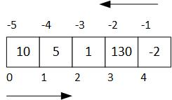

---
jupytext:
  formats: ipynb,md:myst
  text_representation:
    extension: .md
    format_name: myst
    format_version: 0.12
    jupytext_version: 1.7.1
kernelspec:
  display_name: Python 3
  language: python
  name: python3
---

# Secuencias

+++

[Secuencias de datos](#Secuencias_de_datos)<br>
[Listas](#Listas)<br>
[Tuplas](#Tuplas)<br>
[Rangos](#Rangos)<br>
[Operaciones comunes de las secuencias](#Operaciones_comunes_secuencias)<br>
[Operaciones para secuencias mutables](#Operaciones_para_secuencias_mutables)<br>
[Operadores de comparación con secuencias](#Operadores_de_comparacion_con_secuencias)<br>
[Casos de uso de listas y tuplas](#Casos_de_uso)<br>
[Cadenas de caracteres](#Cadenas_de_caracteres)<br>

+++

***
<a id='Secuencias_de_datos'></a>

+++

## Secuencias de datos

En muchas aplicaciones resulta conveniente ser capaz de almacenar en memoria, para luego manipular a conveniencia y de forma consistente, un determinado conjunto de datos. 

Hasta el momento, hemos introducido tipos de datos **escalares**, `int`, `float`, `complex` y `bool`, datos que conceptualmente contienen un único valor. Y de hecho, ya hemos introducido un contenedor de datos, las cadenas de caracteres `str`.

Supongamos, por un momento, que se desea retener un conjunto de 5 enteros en memoria, para luego  manipularlos, posiblemente de diversas formas: sumándolos, o hallando el máximo de los mismos, o graficándolos, etc. 

Con lo visto hasta ahora el recurso lógico es definir 5 variables enteras y tratarlas individualmente.
```python
    a0 = 10
    a1 = 5
    a2 = 1
    a3 = 130
    a4 = -2
    
    suma = a0 + a1 + a2 + a3 + a4
```
¿Qué pasa si ahora se necesitaran 100 variables? Habría que crear otras tantas variables, con nombres diferentes y extender el código previo manteniendo la idea básica. Algo impracticable.

En Python, disponemos tipos nativos que actúan como **contenedores** (**containers**) de datos, que cubren esa necesidad.

+++

### Contenedores en Python

Todos los lenguajes de programación brindan la posibilidad de trabajar con colecciones de datos de una forma consistente. Por ejemplo, en C/C++ se tiene el concepto de vector (*array*).

Python ofrece un conjunto de opciones muy efectivas y flexibles para resolver este tipo de problemas. Permiten  representar tipos de datos **contenedores** de otros datos de forma nativa. 

Los tipos nativos contenedor más relevantes son:

|Nombre                    | Tipo    | Ejemplo                     |Descripción                               |
|:-------------------------|:--------|:----------------------------|:-----------------------------------------|
|**Lista**                 | `list`  | ``[1, 2, 3]``               | Secuencia heterogénea de datos mutable   |
|**Tupla**                 | `tuple` | ``1, 2, 3`` o ``(1, 2, 3)`` | Secuencia heterogénea de datos inmutable |
|**Rango**                 | `range` | ``range(1, 20, 2)``         | Secuencia de enteros inmutable           |
|**Cadena de caracteres**  | `str`   | ``'Hola'``                  | Secuencia de caracteres inmutable        |
|**Diccionario**           | `dict`  | ``{'a':1, 'b':2, 'c':3}``   | Tabla asociativa (clave, valor)          |
|**Conjunto**              | `set`   | ``{1, 2, 3}``               | Colección sin orden de valores únicos    |

El uso de corchetes, ``[]``, paréntesis, ``()`` o llaves, ``{}``, es lo que distingue entre sí algunos de los contenedores anteriores.

+++

### Secuencias en Python
Las **secuencias** son contenedores donde los elementos se almacenan siguiendo un **orden**. **Listas**, **tuplas** y **rangos** son las secuencias básicas que define Python. Además, un tipo de dato que ya conocemos, la **cadena de caracteres**, es
también una secuencia ordenada de caracteres alfanuméricos.

Entre las secuencias destacan las **listas**, tipo `list`, a las que prestaremos la atención en primer lugar.

+++

***
<a id='Listas'></a>

+++

## Listas
En la siguiente celda, se define una variable **lista** llamada `lista_enteros` asignándola una **colección** de valores caracterizada por: 
* una **secuencia** de literales enteros
* **separados por comas**
* **delimitados por corchetes**

```{code-cell} ipython3
lista_enteros = [10, 5, 1, 130, -2]
print('El tipo de {} es {}.'.format(lista_enteros, type(lista_enteros)))
```

El concepto de lista impone necesariamente una relación de **orden**, una **secuencia**.

Observe además que la variable de tipo ``list`` puede ser enviada como argumento real a la función `print()`, que la interpreta correctamente y la saca por la consola de la forma esperada.

La variable `lista_enteros` representa a la colección completa. Pero este recurso del lenguaje no sería tan útil si no permitiera el acceso individual a cada uno de los enteros *contenidos* en la colección.

+++

### Indexación
La **indexación** permite acceder a un miembro individual de la lista.

Véase el ejemplo siguiente (se debe haber ejecutado antes la celda previa):

```{code-cell} ipython3
x = lista_enteros[0]
y = lista_enteros[1]
z = lista_enteros[4]
print(x, y, z)
```

En la celda anterior, se almacenan en variables ciertos valores de la secuencia.

Para acceder a un miembro individual de la lista:
* se utiliza un **índice**, siempre de tipo entero, que indica la posición del dato miembro dentro de la colección
* el índice se pone entre corchetes `[]`, que actúan como un **operador de indexación**
* al primer elemento de la secuencia le corresponde siempre el valor ``0``

Dado que una lista implementa una **secuencia**, el elemento de índice *i* aparece siempre antes que el elemento *i+1* si se está *recorriendo* la lista desde la *izquierda*.

+++

A diferencia de otros lenguajes, Python permite que el índice pueda especificarse también desde la derecha, utilizando enteros negativos: el índice `-1` hace referencia al último elemento de la lista (o al primero desde la izquierda).

Vea el siguiente esquema:



```{code-cell} ipython3
print(lista_enteros[-1], lista_enteros[-2])
```

Si se intenta acceder a un elemento no existente dentro de la secuencia, se produce un error en tiempo de ejecución:

```{code-cell} ipython3
:tags: [raises-exception]

lista_enteros[5]
```

Es muy importante que el alumno se habitúe a identificar el tipo de error que se lanza al producirse la excepción y, con ello, corregir el fallo. En este caso:
* la descripción del error, ``IndexError: list index out of range``, y
* la línea donde se produce el error, ``----> 1 lista_enteros[5]``,

nos dan toda la información necesaria acerca de la causa y situación del error.

+++

### Mutabilidad
Una lista es, además, una secuencia **mutable**. Esto quiere decir que se pueden:
* **modificar** los elementos de la lista
* **borrar** determinados elementos
* **añadir** elementos nuevos
* etc.

En la celda siguiente, podemos observar mediante la función `id()` que la identidad del objeto no ha cambiado, pero su valor sí.

```{code-cell} ipython3
lista = [0, 1, 2, 3]
print('Lista {} antes de modificarla y su identidad {}.'.format(lista, id(lista)))
lista[0] = lista[1] + lista[2]  # Modificamos el elemento [0]
print('Lista {} después de modificarla y su identidad {}.'.format(lista, id(lista)))
```

### Lista vacía
En muchas ocasiones. los algoritmos construyen iteradamente una lista a partir de una **lista vacía**, que se construye con los corchetes vacíos.

```{code-cell} ipython3
lista = []
```

***
<a id='Tuplas'></a>

+++

## Tuplas

Las **tuplas**, tipo ``tuple``, representan, al igual que las listas, una secuencia de valores en Python. 

A diferencia de las listas, las **tuplas** son **inmutables**: una vez creadas no pueden modificarse.

Una tupla se crea asignando un conjunto de valores a una variable. Los valores están separados entre sí por una coma y opcionalmente pueden estar rodeados de paréntesis.

Por ejemplo:

```{code-cell} ipython3
datos_asig = 'Fundamentos de Programación', 40, 1, 2
print(datos_asig)

otra_tupla = (1, 2, 3)  # Uso de paréntesis opcional
print(otra_tupla)
```

Nótese que, aunque los paréntesis son opcionales, aportan una mejor legibilidad. 

Se pueden crear tuplas de un solo elemento. Cómo podría existir ambigüedad, se tiene que poner una coma al final.
```python
un_elemento = (10,)
otro_elemento = 'Hola',
```

```{code-cell} ipython3
una_tupla = 'Hola',
una_cadena = 'Hola'
print('{} es una tupla, {}, mientras que {} es una cadena {}'.
      format(una_tupla, type(una_tupla), una_cadena, type(una_cadena)))
```

También pueden existir tuplas vacías, usando paréntesis sin contenido:

```{code-cell} ipython3
tupla_vacia = ()
```

Se pueden acceder a los elementos de las tuplas con el operador de indexación ``[]``.

```{code-cell} ipython3
x = 3, 7, 9, 10
print(x[0] + x[1])
```

### Inmutabilidad
Sin embargo, dado su carácter inmutable, lo que no se puede es modificar los valores ni el tamaño de la tupla una vez creada.

```{code-cell} ipython3
:tags: [raises-exception]

x[1] = 10   # La ejecución de esta línea provoca un error al ser las tuplas inmutables
```

### Desempaquetado de una tupla
Los elementos de una tupla se pueden asignar a tantas variables como elementos haya en la misma en un proceso llamado **desempaquetado** (**unpacking**).

```{code-cell} ipython3
datos_ciudad = ('Valladolid', 'Castilla y León', 'España')
ciudad, comunidad, pais = datos_ciudad
print('Ciudad: {}\nComunidad: {}\nPaís: {}'.format(ciudad, comunidad, pais))
```

En el ejemplo se han creado nuevas variables con nombre: `ciudad`, `comunidad` y `pais` que contiene las cadenas de caracteres incluidas en las posiciones `0`, `1`, `2` de la tupla `datos_ciudad`.

+++

Nótese que el desempaquetado es el mecanismo del lenguaje que se pone en juego cuando se hacen asignaciones múltiples en Python:

```{code-cell} ipython3
a, b = 1, 2
```

Lo que ocurre en esa sentencia es lo que sigue:

1. Previo a la operación de asignación, se crea un objeto tupla **empaquetando** los elementos `1` y `2` (nótese que los paréntesis son opcionales)
2. Se procede a la aisgnación. Como aparece a la izquierda del operador ``=`` más de una variable, se procede al **desempaquetado** o asignación a las variables `a` y `b`.

Veremos la utilidad de este esquema a lo largo del curso. Recordad que, en particular, es muy útil para el intercambio de los valores de dos variables, una operación que se requiere con alguna frecuencia en programación:

```{code-cell} ipython3
x = 2
y = 3
x, y = y, x
print('x = ', x, 'y = ', y)
```

El número de variables a asignar en el desempaquetado debe coincidir con el tamaño de la tupla. En caso contrario, se lanzará una excepción.

```{code-cell} ipython3
:tags: [raises-exception]

x, y = 1, 2, 3  # Demasiados valores a desempaquetar
```

```{code-cell} ipython3
:tags: [raises-exception]

x, y = 1,   # Pocos valores a desempaquetar
```

***
<a id='Rangos'></a>

+++

## Rangos
Un **rango** es una secuencia **inmutable de enteros** que, como veremos, se usa habitualmente con **bucles**: la ejecución de un grupo de sentencias un número determinado de veces.

La construcción de un rango de enteros admite varias sintaxis. Los parámetros ``start``, ``stop`` y ``step`` utilizados a continuación son enteros:

* ```python
  range(stop)
  ```
  La secuencia de enteros representada es el intervalo abierto $[0, stop)$, es decir, la secuencia 
  ``0, 1, 2, ..., stop-1``. Si ``stop <= 0`` la secuencia no tendrá elementos.

* ```python
  range(start, stop)
  ```
  La secuencia de enteros representada es el intervalo abierto $[start, stop)$, es decir, la 
  secuencia ``start, start+1, start+2, ..., stop-1``. Si ``stop <= start`` la secuencia no tendrá 
  elementos.
* ```python
  range(start, stop, step)
  ```
  La secuencia de enteros representada es ``start, start+1*step, start+2*step, ..., start+i*step``. 
  - Si ``step`` es un entero positivo, la secuencia finalizará para aquel valor `` i >= 0`` para el que 
    ``start+i*step < stop``
  - Si ``step`` es un entero negativo, la secuencia finalizará para aquel valor ``i >= 0`` para el que 
    ``start+i*step > stop``

Nótese como el valor correspondiente a ``stop`` nunca pertenecerá al rango.

A diferencia de las secuencias ``list`` o ``tuple``, un objeto de tipo ``range`` no almacena los valores de la secuencia en memoria, con el consiguiente ahorro de recursos. Solo necesita almacenar los valores para ``start``, ``stop`` y ``step``: calcula dinámicamente los valores intermedios a medida que los va necesitando.

+++

### Listas y tuplas a partir de rangos
Tanto las listas como las tuplas tienen **constructores**, ``list()`` y ``tuple()``, que admiten un rango como parámetro para ser creadas. Veámoslos en acción.

```{code-cell} ipython3
# Enteros del 0 al 9
lista = list(range(10))
print("Lista contruida con range(10):\n  {}".format(lista))
# Enteros del 5 al 20
tupla = tuple(range(5, 15))
print("Tupla contruida con range(5, 15):\n  {}".format(tupla))
# Pares del 4 al 20
lista = list(range(4, 21, 2))
print("Lista contruida con range(4, 21, 2):\n  {}".format(lista))
# Secuencia del 3 al -12 en pasos de -3
tupla = tuple(range(3, -13, -3))
print("Tupla contruida con range(3, -13, -3):\n  {}".format(tupla))
```

***
<a id='Operaciones_comunes_secuencias'></a>

+++

## Operaciones comunes de las secuencias 

### El operador de pertenencia ``in``
El **operador de pertenencia** ``in`` comprueba si un determinado valor forma parte de una secuencia. El operador ``in``
devuelve un valor booleano, ``True`` o ``False``, por lo que el operador conjunto ``not in`` devolverá justo el resultado contrario.

| Operador |Descripción                                                       |
|:--------:|:-----------------------------------------------------------------|
|    `in`  | Devuelve `True` si el elemento está contenido en la secuencia    |
| `not in` | Devuelve `True` si el elemento no está contenido en la secuencia |

```{code-cell} ipython3
lista = [1, 3, 5, 7, 2, 4, 6]
if 2 in lista:
    print('El valor 2 está en la lista {}'.format(lista))
rango = range(10)
if 10 not in rango:
    print('El valor 10 no está en {}'.format(rango))
```

En la siguiente celda retomamos el ejemplo del tema anterior referente a la determinación del número de días de un mes.
Véase la elegante combinación de tuplas y el operador de pertenencia ``in`` para resolver el problema.

```{code-cell} ipython3
:tags: [raises-exception, remove-output]

# Estructura condicional anidada (if ... elif ...else) (con tuplas y operador in)
mes_31 = (1, 3, 5, 7, 8, 10, 11)
mes_30 = (4, 6, 9, 11)

mes = int(input("Introduzca el mes del año "))

if mes in  mes_31:
    print("El mes tiene 31 días")
elif mes in mes_30:
    print("El mes tiene 30 días")
elif mes == 2: 
    print("El mes tiene 28 o 29 días")
else:
    print("Mes no válido")
```

### Concatenación
El operador ``+`` actúa de forma sobrecargada para formar secuencias lista o tupla concatenadas.

```{code-cell} ipython3
lista = [1, 2, 3] + [6, 7, 8]
print(lista)
```

El operador ``*`` concatena consigo mismo una secuencia un determinado número ``n`` de veces.

Resulta un recurso conveniente para inicializar una secuencia de tamaño conocido ``n`` con un valor o un patrón dado.

```{code-cell} ipython3
num = 10
tupla = (0,)*num
print("Una tupla de {} elementos inicializada a 0:\n  {}".format(num, tupla))
```

Por razones obvias, los operadores ``+`` y ``*`` no están permitidos en los tipos ``range``, dado que su aplicación generaría con caracter general una secuencia que no correspondería a un rango.

+++

### Obteniendo información de la secuencia
#### La longitud de la secuencia ``len()``
Permite obtener el número de elementos.

```{code-cell} ipython3
lista = [1, 2, 3, 4, 5]
rango = range(10)
print("El número de elementos de {} es {}".format(lista, len(lista)))
print("El número de elementos de {} es {}".format(rango, len(rango)))
```

#### Los valores extremos: ``min()`` y  ``max()``
Permiten obtener el valor mínimo o máximo de la secuencia. En el caso de cadenas, se sigue el [**orden lexicográfico**](https://es.wikipedia.org/wiki/Orden_lexicografico).

```{code-cell} ipython3
lista = [1, 2, 3, 4, 5]
rango = range(10)
tupla = ('Hola', 'Adiós', 'Buenos días')
print("El valor mínimo de {} es {}".format(lista, min(lista)))
print("El valor máximo de {} es {}".format(rango, max(rango)))
print("El valor máximo de {} es {}".format(tupla, max(tupla)))
```

Estas y otras funciones similares no tiene sentido utilizarlas en secuencias heterogéneas. Tanto ``min()`` como ``max()`` utilizan el operador ``<`` para comparar entre sí los elementos. Si la secuencia tiene tipos incompatibles con este operador,
se lanzará una excepción. Véase un ejemplo:

```{code-cell} ipython3
:tags: [raises-exception]

min([1, 2, 'hola'])
```

#### Posición de un elemento y número de ocurrencias
Mediante la función miembro ``.index(x)`` podemos obtener la posición de la primera ocurrencia del valor ``x`` en la secuencia. Si no se encuentra el valor ``x`` se genera un error.

```{code-cell} ipython3
:tags: [raises-exception]

lista = [2, 4, 6, 8, 10]
rango = range(2, 12, 2)
x = 6
print("El valor {} ocupa la posición {} en la lista {}".format(x, lista.index(x), lista))
print("El valor {} ocupa la posición {} en el rango {}".format(x, rango.index(x), rango))
x = 12
print("Si el valor no se encuentra se genera una excepción ValueError:")
rango.index(x)
```

Las secuencias también disponen del método ``.count(x)`` para determinar cuantas veces aparece el valor ``x`` en la secuencia.

```{code-cell} ipython3
tupla = 1, 1, 2, 3, 1
x = 1
print("El valor {} aparece {} veces en la tupla {}".format(x, tupla.count(x), tupla))
```

### Cortes (slices)
Los **cortes** o **rebanadas** son *subsecuencias* extraídas de otra secuencia. Por ejemplo, dada la secuencia
``[1, 3, 5, 7, 2, 4, 6]``, la secuencia ``[3, 5, 7, 2]`` es un corte de la primera obtenido entre los índices ``1`` y ``5``, este último sin incluir.

El **operador de corte** ``[i:j]`` selecciona de la secuencia original aquella fomada por los valores situados en las posiciones ``i, i+1, ..., j-1``.

```{code-cell} ipython3
lista = [1, 3, 5, 7, 2, 4, 6]
sublista = lista[1:5]
print(sublista)
```

Aunque de gran uso en diferentes ámbitos de la programación en Python, en este curso introductorio no utizaremos apenas este operador. Se comenta aquí con el único propósito de que el alumno reconozca este operador cuando maneje la bibliografía.

+++

### Ordenación
Es posible **obtener una lista ordenada** a partir de una secuencia con la función nativa ``sorted()``. Los elementos de la secuencia deben tener un tipo para los que esté definido el concepto de orden, es decir, el operador ``<``.

```{code-cell} ipython3
lista = sorted((1, 3, 5, 7, 9, 2, 4, 6, 8))
print(lista)
```

Para ordenar los elementos de mayor a menor, ``sorted()`` tiene un argumento booleano opcional, ``reverse``, que permite conseguir este propósito.

```{code-cell} ipython3
lista = sorted(range(10), reverse=True)
print(lista)
```

***
<a id='Operaciones_para_secuencias_mutables'></a>

+++

## Operaciones para secuencias mutables
El contenedor ``list`` es la principal secuencia nativa mutable de Python y, sin duda, el contenedor más utilizado. La regla básica de uso de una operación es que si supone una modificación de la secuencia, entonces no es aplicable a una secuencia inmutable.

+++

### El operador de asignación ``=``
Ya hemos visto más arriba que un elemento de una secuencia puede modificarse individualmente.

```{code-cell} ipython3
lista = [1, 2, 3, 4, 5]
lista[0] = 100
print(lista)
```

### Borrando elementos

#### El operador ``del``
El operador `del` tiene el propósito de desligar los indentificadores con el objeto en memoria. Puede aplicarse a variables simples (tipo `int`, `float`, etc.) y también a secuencias mutables.

Cualquier utilización posterior de la variable previa a una nueva asociación a otro objeto dará un error de ejecución.

El operador ``del`` también puede ser usado para borrar elementos concretos de la lista de la forma que se muestra a continuación:

```{code-cell} ipython3
:tags: [raises-exception]

lista = ["lista", "palabras", "sueltas", "representadas", "por", "cadenas"]
indice = 1
print('De la lista:\n  {}'.format(lista))
del lista[indice]
print('se borra el elemento {}, obteniendo la nueva lista\n  {}'.format(indice,lista))
print('\nAhora se elimina la lista de memoria\n')
del lista
print('Si intentamos acceder a ella se genera una excepción.');
lista
```

También es posible eliminar con ``del`` un corte de la lista.

```{code-cell} ipython3
lista = [0, 1, 2, 3, 4, 5, 6, 7, 8, 9]
del lista[1:-1]  #  Elimina desde el índice 1 hasta el -1 menos 1, es decir, hasta el -2
print(lista)
```

#### Los métodos ``.pop()``, ``.remove()`` y ``.clear()``
* `.pop()` o `.pop(i)` reduce el tamaño de la secuencia en uno:
    - elimina el último elemento si se pasa sin argumentos: equivale a pasar el argumento ``-1``
    - elimina el elemento de índice ``i`` 
    
  Este método **devuelve el elemento eliminado**. Si se usa un índice que no es válido se genera una 
  excepción.
* `.remove(x)` permite borrar la primera aparición del elemento ``x``.
    
  Debe usarse con prudencia: si se intenta eliminar un valor que no existe en la lista, se genera una 
  excepción.
* `.clear()` borra todo el contenido de la lista, creando una lista vacía, ``[]``.

```{code-cell} ipython3
lista = [0, 1, 2, 3, 4, 5, 5, 6, 7, 8, 9]
valor = lista.pop()
print('Con pop() hemos eliminado el último elemento, de valor {}.'.format(valor))
valor = lista.pop(2)
print('Con pop(2) hemos eliminado el tercer elemento, de valor {}.'.format(valor))
lista.remove(5)
print('Usando remove(5) eliminamos el primer elemento que coincide con 5. La lista es ahora\n {}'
     .format(lista))

lista.clear()
print('Con clear() la lista se vacía\n {}'.format(lista))
```

```{code-cell} ipython3
:tags: [raises-exception]

lista = [1, 2, 3]
lista.pop(3)  # Excepción index out of range
```

```{code-cell} ipython3
:tags: [raises-exception]

lista = [1, 2, 3]
lista.remove(4)  # Excepción ValueError
```

### Añadiendo elementos
#### Concatenación 
Para concatenar la secuencia original con otra se puede usar el operador sobrecargado `+=` o el método ``.extend()``.

```{code-cell} ipython3
# Concatenando listas
a = [1, 2, 3]
print('La identidad de la lista {} es {}'.format(a, id(a)))
b = [4, 5, 6]
c = [7, 8, 9]
a += b
print('Tras concatenar con el operador += la lista {} obtenemos\n {}'.format(b, a))
a.extend(c)
print('Tras concatenar con el método extend() la lista {} obtenemos\n {}'.format(c, a))
print('La identidad de la lista {} es la original:{}'.format(a, id(a)))
```

Si lo que deseamos es actualizar la lista con su contenido repetido ``n`` veces, puede utilizarse el operdor ``*=``

```{code-cell} ipython3
lista = [1, 2, 3]
lista *= 3
print(lista)
```

#### Añadir al final de la secuencia un elemento
El método `.append()` añade **un único elemento** al final de la lista (dicho elemento podría ser otra lista).

```{code-cell} ipython3
a = []  # ¡Lista vacía!
a.append(1)
a.append(2)
a.append(3)
print('La lista, inicialmente vacía, tras añadir sucesivamente los elementos 1, 2 y 3 es ahora \n {}'.
     format(a))
a.append([1, 2, 3])
print('Hemos añadido un cuarto elemento, ¡que es una lista!\n {}'.
     format(a))
```

#### Insertando elementos en una posición arbitraria
Se hace uso del método ```.insert()``` que posee dos parámetros, la **posición** (un entero) y el **elemento único** a insertar (si elemento es a su vez una lista, se inserta como una sub-lista).

Este método tiene la particularidad de que si la posición de inserción sobrepasa los límites de la secuencia, entonces se inserta el elemento bien al principio, si se sobrepasa por defecto, bien al final, si se sobrepasa por exceso.

```{code-cell} ipython3
a = [1, 2, 3, 4]
a.insert(1,25)
a.insert(10,100)
a.insert(-10,-100)
print(a)
```

### Invirtiendo la secuencia
El método ``.reverse()`` invierte el orden de la secuencia.

```{code-cell} ipython3
lista = [1, 2, 3, 4, 5]
lista.reverse()
print(lista)
```

### Ordenando la secuencia
Para aquellas secuencias mutables formadas por elementos para cuyos tipos esté definido el concepto de orden, es decir, el operador ``<``, es posible ordenar los elementos de menor a mayor con el método ``.sort()``. A diferencia de ``sorted()`` es la propia secuencia la que se ordena. No se crea una diferente. De ahí que solo sea aplicable a secuencias mutables.

```{code-cell} ipython3
lista = [1, 3, 5, 7, 9, 2, 4, 6, 8]
lista.sort()
print(lista)
```

Para ordenar los elementos de mayor a menor bastaría aplicar el método ``.reverse()`` tras ``.sort()``. Sin embargo, sería ineficiente para listas de gran número de elementos. Al igual que ``sorted()``, el método ``.sort()`` tiene el argumento opcional ``reverse`` que permite conseguir este propósito.

```{code-cell} ipython3
lista = [1, 3, 5, 7, 9, 2, 4, 6, 8]
lista.sort(reverse=True)
print(lista)
```

***
<a id='Operadores_de_comparacion_con_secuencias'></a>

+++

## Operadores de comparación con secuencias

Estos operadores comparan de izquierda a derecha elemento a elemento en posiciones correlativas. No están definidos para rangos.

| Operador |Descripción                                                                                           |
|:--------:|:-----------------------------------------------------------------------------------------------------|
| `==`     | `True` si las listas son iguales                                                                     |
| `!=`     | `True` si las listas son desiguales                                                                  |
| `>`      | `True` si el primer elemento diferente es mayor en la lista de la izquierda                          |
| `>=`     | `True` si las listas son iguales o el primer elemento diferente es mayor en la lista de la izquierda |
| `<`      | `True` si el primer elemento diferente es mayor en la lista de la derecha                            | 
| `<=`     | `True` si las listas son iguales o el primer elemento diferente es mayor en la lista de la derecha   |

```{code-cell} ipython3
:tags: [raises-exception]

lista1 = [1, 2, 3, 4, 5]
lista2 = [1, 2, 3, 4, 5]
if lista1 == lista2:
    print('{} es igual a {}'.format(lista1, lista2))

tupla1 = (1, 2, 3, 4, 5)
tupla2 = (1, 1, 30, 30, 50)
if tupla1 > tupla2:
    print('{} es mayor que {}'.format(tupla1, tupla2))
    
rango1 = range(0, 10)
rango2 = range(1, 10)
rango1 < rango2
```

***
<a id='Casos_de_uso'></a>

+++

## Casos de uso de listas y tuplas
### Mutabilidad
La principal diferencia entre listas y tuplas es la mutabilidad. Si la aplicación necesita de una secuencia de datos que puede sufrir modificaciones durante la ejecución del programa, entonces la secuencia a elegir es obviamente la lista.

+++

### Heterogeneidad de los elementos
Tanto listas como tuplas pueden contener elementos de diferentes tipos de datos. Un elemento de una lista puede ser a su vez otra lista (**listas anidadas**) o una tupla, y viceversa. 

En general, es un uso extendido pero no obligado:
* Usar listas para almacenar datos homogéneos en secuencias que puedan cambiar de tamaño durante el programa o que puedan 
  alterar el valor de sus elementos. Sería el equivalente a los vectores de lenguajes como C++.
* Usar tuplas para almacenar datos homogéneos o heterogéneos cuya estructura o valor no vaya a sufrir modificaciones. Sería el 
  equivalente a las estructuras en C++.

+++

En la siguiente celda se muestra un ejemplo en el que, siguiendo las pautas anteriores, se usan:
* tuplas, para conformar una **estructura fija de datos** heterogéneos correspondiente a alumnos
* una lista, para almacenar un **vector** homogéneo, probablemente cambiante, de alumnos

```{code-cell} ipython3
nombre_apellidos_1 = 'Juan', 'Sierra', 'Gómez'
dni_1 = '13120714E'
nia_1 = 123434
alumno_1 = nombre_apellidos_1, dni_1, nia_1

print('{} es una tupla homogénea formada por 3 campos str'.format(nombre_apellidos_1))
print('{} es una tupla heterogénea formada por una tupla, un dato str y un dato int'.format(alumno_1))

nombre_apellidos_2 = 'Pedro', 'López', 'Roldán'
dni_2 = '73131714F'
nia_2 = 471394
alumno_2 = nombre_apellidos_2, dni_2, nia_2
nombre_apellidos_3 = 'María de las Mercedes', 'Santurce', 'Bilbao'
dni_3 = '17571924T'
nia_3 = 729219
alumno_3 = nombre_apellidos_3, dni_3, nia_3

# Simulamos la formación dinámica de la lista
lista_alumnos = []  # Lista homogénea construida dinámicamente a partir de tuplas
lista_alumnos.append(alumno_1)
lista_alumnos.append(alumno_2)
lista_alumnos.append(alumno_3)
print(lista_alumnos)
```

***
<a id='Cadenas_de_caracteres'></a>

+++

## Cadenas de caracteres
Las cadenas de caracteres son **secuencias inmutables de caracteres alfanuméricos**. La mayor parte de las veces, se trabaja con las cadenas tomándolas en su conjunto. Pero es perfectamente posible acceder a los caracteres individuales, utilizando los conceptos vistos previamente.

```{code-cell} ipython3
cadena = "La cadena de caracteres es una secuencia"
car1 = cadena[0]
car2 = cadena[-1]
print('La frase "{}" tiene una longitud {}. Comienza por \'{}\' y termina por \'{}\'.'.format(cadena, len(cadena), car1, car2))
```

Si intentamos modificar un elemento, se origina una excepción.

```{code-cell} ipython3
:tags: [raises-exception]

cadena = "hola"
cadena[0] = 'H'
```

En los siguientes temas iremos introduciendo métodos específicos de las cadenas de caracteres. Como adelanto, veamos como el operador ``in`` aplicado a una cadena de caracteres es capaz de determinar si una subcadena está contenida dentro de otra.

```{code-cell} ipython3
cadena = 'La vida es dura'
subcadena = 'dura'
if 'dura' in cadena:
    print('La subcadena \'{}\' está contenida en la cadena \'{}\''.format(subcadena, cadena))
```

```{code-cell} ipython3

```
