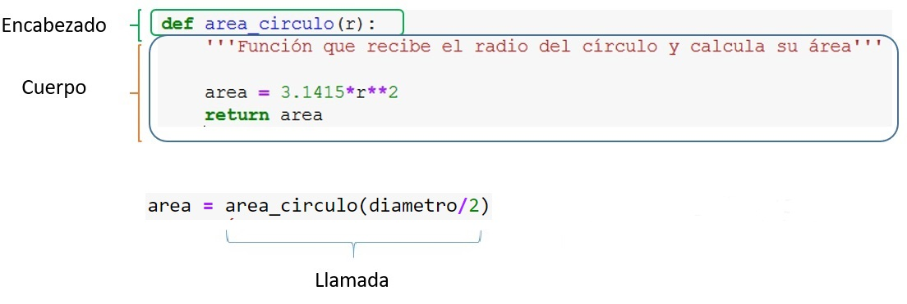
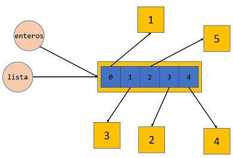
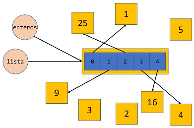
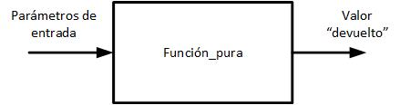

---
jupytext:
  formats: ipynb,md:myst
  text_representation:
    extension: .md
    format_name: myst
    format_version: 0.12
    jupytext_version: 1.7.1
kernelspec:
  display_name: Python 3
  language: python
  name: python3
---

+++ {"hideCode": false, "hidePrompt": false}

# Funciones

+++ {"hideCode": false, "hidePrompt": false}

[Introducción](#Introducción)<br>
[Definición de funciones](#Definición_de_funciones)<br>
[Tipos de funciones según sus parámetros de entrada y resultados devueltos](#Tipos_de_funciones_según_sus_parámetros_de_entrada_y_valores_devueltos)<br>
[Parámetros y argumentos](#Parametros_argumentos)<br>
[Funciones y tratamiento de excepciones](#Funciones_excepciones)<br>
[Proceso de desarrollo de un programa](#Proceso_desarrollo_programa)

+++ {"hideCode": false, "hidePrompt": false}

***
<a id='Introducción'></a>

+++ {"hideCode": false, "hidePrompt": false}

## Introducción

En los temas previos ya hemos tenido oportunidad de trabajar con **funciones**. En este tema aprenderemos a definir y utilizar funciones **creadas por nosotros**.

A lo largo del tiempo y en diferentes lenguajes el concepto de función aparece definido también por otros nombres: **subprograma**, **subrutina** o **procedimiento** son los más habituales y con diferentes matices denotan lo mismo.
>Una función es un **conjunto de instrucciones** al que se asigna un nombre, opcionalmente **parámetros** de entrada y **resultados** de salida, y que puede ser **llamada** desde otras partes de un programa para realizar una tarea concreta.

+++ {"hideCode": false, "hidePrompt": false}

### La necesidad de las funciones

Los lenguajes de programación utilizan los recursos que brinda el _hardware_ del ordenador: la capacidad de codificar diferentes tipos de datos y la posibilidad de realizar sobre ellos operaciones aritméticas y lógicas. 

Las operaciones que el ordenador brinda de forma nativa, son bastante elementales y no van mucho más allá de:
* la capacidad de realizar sumas, restas, multiplicaciones y divisiones, etc.
* controlar el flujo del programa modificando la ejecución secuencial de las sentencias mediante la utilización de condicionales y bucles.

De manera que la realización de todo el resto de complicadas operaciones que sabemos que son capaces de realizar los programas de ordenador deben ser *construidas* a partir de esas operaciones básicas. 

Cuando hemos utilizado los operadores más sencillos en Python (suma, resta, etc.), el intérprete *traduce* los comandos de alto nivel dados por el programador y usa, casi directamente, las funcionalidades del *hardware*. 

Por tanto, a la hora de hacer operaciones más complejas, estas tienen que ser creadas a partir de esos bloques elementales implementando procedimientos más elaborados. Python y otros lenguajes brindan la posibilidad de agrupar estos bloques de instrucciones en forma de una **función**, para su posterior invocación de forma sencilla.

+++ {"hideCode": false, "hidePrompt": false}

#### Un ejemplo usando funciones de biblioteca

La **función** es entonces el recurso que el lenguaje de programación brinda para implementar esos subprogramas. Ya hemos utilizado muchas funciones, algunas intrínsecas y otras disponibles en módulos como el módulo `math`.

Por ejemplo, supongamos que queremos determinar el siguiente cociente:
$$
\begin{align}
\\y & = \frac{1-{{sin(x/4)}{cos(x)} }^4}{1+cos(x)^2} \\
\end{align}
\notag
$$

El cálculo de $y$ se podría implementar en Python con un programa como el siguiente, que hace uso de las funciones trigonométricas `sin()` y `cos()` definidas en el módulo `math`:

```{code-cell} ipython3
:hideCode: false
:hidePrompt: false

# Desaconsejado usar import *, pero utilizado aquí para argumentar el uso de funciones
from math import *  

x = pi
y = (1 - sin(x/4)*cos(x)**4)/(1+cos(x)**2)
print(y)
```

+++ {"hideCode": false, "hidePrompt": false}

Se debe resaltar lo siguiente en el ejemplo anterior:

- **Claridad**
> Observad la similitud en el uso (que no equivalencia) para este caso concreto de las funciones en Python con el concepto matemático de función. La función **recibe** valores como parámetros y **devuelve** un **resultado** que entonces participa en la evaluación del resto de la expresión.

- **Abstracción**
> Como *usuarios* de las funciones `sin()` y `cos()` no sabemos cómo están implementadas. Podríamos aventurar que es posible que la implementación de las mismas recurra a la expansión de series que converjan a las funciones requeridas, con una precisión alta pero finita. Pero el hecho cierto es que no lo sabemos, y tampoco nos interesa para utilizarlas: evidentemente hay que dar un *salto de fe* y confiar en que sean correctas dentro de los límites de la precisión que aseguran.

- **Reutilización**
> Hemos utilizado dos veces la función `cos()` y una el `sin()`. Podemos imaginar que utilizar más expresiones, usando estas funciones un número mayor de veces, no implicaría una dificultad mucho mayor.

Imaginemos, por el contrario, que las funciones no existieran. Y que cada vez que quisiéramos determinar el seno o coseno de un número, tuviésemos que programar los bucles y condicionales del algoritmo específico que determina el valor de estas funciones a partir de operaciones más básicas. Ciertamente, sería muy complicado resolver cualquier problema matemático sencillo. El código resultante sería enormemente difícil de entender. Por otra parte, si se decidiera cambiar la implementación del código, para utilizar otro algoritmo más preciso o eficiente, eso implicaría modificar todo el programa.

+++ {"hideCode": false, "hidePrompt": false}

Una vez visto el ejemplo, mostramos ahora la forma recomendada de usar funciones importadas de un módulo.

```{code-cell} ipython3
:hideCode: false
:hidePrompt: false

import math

x = math.pi
y = (1 - math.sin(x/4)*math.cos(x)**4)/(1+math.cos(x)**2)
print(y)
```

+++ {"hideCode": false, "hidePrompt": false}

***
<a id='Ventajas_del_uso_de_funciones'></a>

+++ {"hideCode": false, "hidePrompt": false}

### Ventajas del uso de funciones

Las funciones brindan dos beneficios importantes de los que se pueden derivar muchos otros:
- **Estructura**: Es un recurso que permite descomponer una tarea compleja en varias subtareas de menor entidad, que puedan ser abordables con mayores garantías de éxito.
- **Abstracción**: Las funciones ocultan detalles tras una **interfaz pública** bien definida. Se hace abstracción de los detalles de implementación y lo que interesa únicamente son los valores de entrada que se le suministran y los resultados que devuelve. 


A partir de estas dos características básicas, se derivan el resto de las ventajas que brinda el uso de las funciones:

- Permiten **reutilizar código** sin tener que reescribirlo cada vez.
- Permite el **encapsulamiento** del código de la función. Así, por ejemplo, una vez dado por válido el código interno de una función, los errores de un programa no serán imputables a la implementación interna de la función.
- La implementación interna puede cambiar sin que el programador que use esas funciones tenga que preocuparse de ello.
- Hace que el código resultante sea más claro y mantenible.
- Las funciones brindan el mecanismo para dividir un problema grande en subproblemas pequeños, acotando la interacción entre los mismos a los datos intercambiados a través de su interfaz pública. 
- Es el mecanismo ideal para permitir la colaboración entre varios programadores: una vez puestos de acuerdo en la interfaz, cada cual tiene la libertad de programar la solución a los subproblemas parciales sin temor a que le afecte lo hecho por otros programadores (siempre que el resultado brindado sea el correcto).

+++ {"hideCode": false, "hidePrompt": false}

### Pautas de diseño de una función
Las  características que deben prevalecer a la hora de diseñar una función son aquellas que refuerzan el hecho de que las funciones son abstracciones.

Una función como abstracción debe centrarse en 3 propiedades:
* Su **dominio**, conjunto de valores que pueden tomar sus parámetros de entrada.
* Su **rango**, conjunto de valores que puede devolver como resultado.
* Su **propósito**, la relación existente entre los valores de entrada y los de salida, así como los posibles efectos colaterales que puedan existir.

Cómo se logran las salidas a partir de las entradas queda oculto, ese el mecanismo de la abstracción.

Para lograr reforzar el mecanismo de abstracción de una función hay algunas pautas que son de ayuda:
1. Cada función debe tener un único propósito. Es el **principio de responsabilidad única**.
    * El objetivo perseguido con la función debería ser fácilmente identificado con un nombre corto.
    * Si una función hace múltiples tareas de forma consecutiva, debería rehacerse en múltiples funciones.
2. **No te repitas** (**DRY**, **Don't repeat yourself**).
    * Si un fragmento de código aparece varias veces repetido, es una buena oportunidad para darlo un nombre e invocarlo múltiples veces.
3. Las funciones deben ser **generales**.
    * No tiene sentido, por ejemplo, definir una función específica para elevar un número a la quinta, cuando podemos definir con carácter general, una función que eleve un número a cualquier exponente.

+++ {"hideCode": false, "hidePrompt": false}

***
<a id='Definición_de_funciones'></a>

+++ {"hideCode": false, "hidePrompt": false}

## Definición de funciones
Al acto de utilizar una función, tal y como hemos venido haciendo hasta ahora con las funciones nativas (*built-in*) y también con las de biblioteca, se le conoce con el nombre de _llamar_ o _invocar_ a la función.

Aprenderemos a continuación cómo definir nuestras propias funciones con algunos ejemplos sencillos.

```{code-cell} ipython3
:hideCode: false
:hidePrompt: false

# Primero definimos la función, especificando su nombre y sus parámetros
def area_circulo(r):
    area = 3.1415*r**2
    return area


diametro = 10
area = area_circulo(diametro/2)
print("Área del círculo de diámetro {} es {}.".format(diametro, area))
```

+++ {"hideCode": false, "hidePrompt": false}



+++ {"hideCode": false, "hidePrompt": false}

Observe en lo anterior los dos momentos del trabajo con las funciones, la **definición** y la **llamada**: 

* **Definición**: 
    ```python
    def area_circulo(r):
        '''Función que recibe el radio del círculo y calcula su área'''

        area = 3.1415*r**2
        return area
    ```
  Debe aparecer **antes de la primera llamada** a la función definida y está formada por dos partes, el **encabezado** y el **cuerpo**:

    - **Encabezado**: 
      ```python
      def area_circulo(r): 
      ```  
        Se utiliza la palabra reservada `def` seguida del identificador que da **nombre a la función**, `area_circulo` en el ejemplo. Le sigue entre paréntesis (obligatorios) la lista de **parámetros**, que puede estar vacía. En el ejemplo, consta de un sólo parámetro al que hemos identificado dentro de la definición de la función con el nombre `r`. 
    
        Note que, al definir la función, todavía no se ejecuta el código que ella representa, aunque aparezca primero dentro de la secuencia del programa. 
    - **Cuerpo**:
      ```python
         area = 3.1415*r**2
         return area
      ```   
        Después del encabezado, se tiene el cuerpo de la función. Se debe notar que, de nuevo, Python exige el *sangrado* apropiado para identificar el cuerpo de la función.
         - La primera sentencia **asigna** a la variable `area` el resultado de evaluar la expresión a su derecha
         - La segunda sentencia utiliza la palabra reservada `return` para **devolver** el contenido de `area` al código que haya invocado a la función.

    Es importante entender que `area` dentro de la definición de la función da nombre a una **variable local** que solo está definida y **accesible** dentro de la función `area_circulo()`. El identificador `r` igualmente sólo está definido dentro de la función.
    
* **Llamada(s)**: 
    ```python
    area = area_circulo(diametro/2)
    ```
    Se realiza escribiendo el nombre de la función, seguido obligatoriamente de los paréntesis con los **argumentos** (en este caso uno) que se le *pasarán* a la misma. Aquí el argumento se obtiene evaluando la expresión indicada, `diametro/2`.

+++ {"hideCode": false, "hidePrompt": false}

A tener en cuenta:
- Antes de llamar a una función, esta debe haber sido **definida** previamente en el programa.
- La primera sentencia _útil_ que se ejecuta es la primera sentencia del **programa principal**. Programa principal es el conjunto de todas las sentencias que **no** están incluidas dentro del cuerpo de ninguna función.
- Si la función tiene parámetros de entrada, a la hora de llamar a la función se calculan los valores de los argumentos, evaluando las expresiones correspondientes (en el ejemplo se evalúa `diametro/2`). El valor del argumento resulta asociado al parámetro de la función (en este caso `r`).

+++ {"hideCode": true, "hidePrompt": true}

En el siguiente ejemplo, que calcula el área de un cilindro, vemos una **reutilización** de la función `area_circulo(r)`. Hemos añadido entre triples comillas,`'''texto'''`, un comentario para **documentar** brevemente el objeto de la función.

```{code-cell} ipython3
:hideCode: false
:hidePrompt: false
:tags: [raises-exception, remove-output]

def area_circulo(r):
    '''Función que recibe el radio del círculo y calcula su área'''

    area = 3.1415*r**2
    return area


# El estilo PEP 8 recomienza dejar dos líneas en blanco después de una función
# Ahora comienza el programa principal: la primera línea ejecutable es diametro = 10

# Programa principal
radio = float(input("Diga el radio: "))
altura = float(input("Diga la altura: "))

area_cilindro = 2*area_circulo(radio) + 2*3.1415*radio*altura

print('El área lateral de un cilindro de radio {} y altura {} es {}.'.
      format(radio, altura, area_cilindro))
```

+++ {"hideCode": false, "hidePrompt": false}

Las sentencias que se ejecutarán primero de forma secuencial corresponden al **programa principal**:
* la asignación a las variables `radio` y  `altura` de los valores que el usuario introduzca por teclado
* la evaluación de la expresión que se asigna a una nueva variable, `area_cilindro`. Como la función `area_circulo()` devuelve un valor, la llamada a dicha función puede participar de la expresión en la que se calcula el área lateral del cilindro. Nótese que esta forma de utilizar la función que acabamos de definir, no difiere de lo ya visto en temas anteriores o del ejemplo del inicio de este documento con las funciones de biblioteca `cos()` y `sin()`.
* la salida por pantalla de los resultados

Al evaluar la expresión en la que aparece la llamada a `area_circulo()`, se procede siguiendo las reglas de precedencia de los operadores implicados. Primero, cuando se intenta realizar el primer producto, el intérprete de Python *comprende* que necesita antes evaluar la función `area_circulo()`, con lo que se detiene la evaluación de la expresión para *invocar* a la función, asociando el contenido del argumento `radio` al parámetro `r` de la definición de la función. Tras terminar la ejecución, la función devuelve el valor del área del circulo contenida en la variable local `area`, y dicho valor es recibido en el programa principal para proceder con la evaluación del resto de la expresión.

Nótese que `area_circulo()` tiene un comportamiento similar a las funciones matemáticas: a cada valor del dominio de definición (cada valor del parámetro `r`) le corresponde un único valor de la imagen (la salida que se logra mediante la sentencia `return`) y que además este valor siempre es el mismo.

+++ {"hideCode": false, "hidePrompt": false}

### Principios de responsabilidad única y de generalidad
Desde el punto de vista de la ingeniería del software es deseable que una función realice una única labor, lo que podría englobarse dentro de lo que se conoce como **principio de responsabilidad única**.

Veamos un ejemplo de diseño de función desafortunado:

```{code-cell} ipython3
:hideCode: false
:hidePrompt: false

def area_circulo_desafortunado(r):
    area = 3.1415*r**2
    print("Área del círculo de radio {} es {}.".format(r, area))
    return area
```

+++ {"hideCode": false, "hidePrompt": false}

Esta función tiene dos responsabilidades: calcular el área de un círculo e imprimir su valor por pantalla.

A la hora de programar funciones, se debe buscar que están sean lo más generales posible, de forma que puedan ser reusadas en diferentes circunstancias. La función anterior no es muy flexible, puesto que siempre *imprime* en pantalla el resultado y, probablemente, no en todas las ocasiones ese es el comportamiento que se desea.

Por tanto, desde otro punto de vista, violaría un **principio de generalidad**: no en todos los casos en que se quiera calcular el área del círculo, se desea imprimir el resultado por pantalla. Más bien lo contrario.

+++ {"hideCode": false, "hidePrompt": false}

***
<a id='Tipos_de_funciones_según_sus_parámetros_de_entrada_y_valores_devueltos'></a>

+++ {"hideCode": false, "hidePrompt": false}

## Tipos de funciones según sus parámetros de entrada y resultados devueltos
### Funciones sin parámetros de entrada

```{code-cell} ipython3
:hideCode: false
:hidePrompt: false

def intro():
    print('Este código sólo imprime este mensaje.')

    
intro()
intro()
```

+++ {"hideCode": false, "hidePrompt": false}

Las funciones pueden carecer de parámetros de entrada. Observe que el único objetivo en este caso es sacar un aviso por pantalla.

Pueden existir una función trivial, _que no hace nada_.

```python
def funcion():
    pass  # TODO: completar más tarde
```
En todo caso, los paréntesis deben ser obligatoriamente utilizados tanto en la definición como en cada una de las llamadas a la función.

#### La sentencia ``pass``
La palabra clave ``pass`` indica algo así como no hacer nada. Suele utilizarse en ocasiones para crear la estructura de un programa sin que sea necesario tener completado todo su código.

+++ {"hideCode": false, "hidePrompt": false}

### Funciones que no devuelven valores mediante `return`

El caso del ejemplo anterior, también ejemplifica a las funciones que no contienen la sentencia `return`.
Este tipo de funciones, al ser utilizadas incorrectamente en contextos en que se espera un valor devuelto (al realizar composición de funciones o en sentencias de asignación), _devuelven_ el valor especial ```None``` que indica la ausencia de un valor válido.

Por ejemplo:

```{code-cell} ipython3
:hideCode: false
:hidePrompt: false

a = intro()
print(a)
```

+++ {"hideCode": false, "hidePrompt": false}

### Funciones con más de un parámetro

Las funciones pueden tener más de un parámetro. Tomando como referencia el ejemplo ya visto, definamos una función que reciba el radio y la altura de un cilindro y devuelva su área lateral.

```{code-cell} ipython3
:hideCode: false
:hidePrompt: false

# Primero definimos la función, especificando su nombre y sus parámetros
def area_cilindro(r, h):
    '''Función que recibe el radio y la altura de un cilindro y calcula su área lateral'''
    
    pi = 3.14159
    area = 2*pi*r**2 + 2*pi*r*h
    return area


area_c = area_cilindro(1, 4.5)
print('El área lateral del cilindro es {}.'.format(area_c))
```

+++ {"hideCode": false, "hidePrompt": false}

Note que los parámetros de ```area_cilindro()``` ahora son dos, representando el radio (```r```) y la altura (```h```).

Obsérvese la **correspondencia posicional** entre los parámetros y los argumentos: la constante literal `1` será copiada en el primer parámetro `r` y la constante `4.5` en el segundo `h`.

+++ {"hideCode": false, "hidePrompt": false}

### Funciones que devuelven más de un resultado

En Python, las funciones pueden devolver mediante la sentencia ```return``` un número arbitrario de valores separados por coma, es decir, **tuplas**. Esta característica es una potente característica del lenguaje que lo diferencia de otros que no lo poseen de forma directa, como el C/C++.

Por ejemplo:

```{code-cell} ipython3
:hideCode: false
:hidePrompt: false

def min_max(lista):
    '''Devuelve el mínimo y el máximo de la lista que recibe como argmento'''
    
    mn = mx = lista[0]
    for elem in lista[1:]:  #[1:] evita comparar con el índice 0
        if mn > elem:
            mn = elem
        elif mx < elem:
            mx = elem
    return mn, mx  # Devolvemos una tupla


lista_prueba = [1, 10, 2, -3, 6, 8]

mn, mx = min_max(lista_prueba)  # Desempaquetado de la tupla

print('Los valores extremos de la lista {} son:\nMin: {} Max: {}'.format(lista_prueba, mn, mx))
```

+++ {"hideCode": false, "hidePrompt": false}

Observe que en el ejemplo anterior, el parámetro que espera la función ```min_max()``` es de tipo lista. Este ejemplo, además, ilustra bien el hecho de que las funciones deben ser entendidas como subprogramas, capaces de utilizar todas las posibilidades vistas: definir sus propias variables, utilizar estructuras de control de flujo como condicionales y bucles, etc.

La sentencia ```return``` devuelve el mínimo y máximo valor de la misma, creando una **tupla**.

En la línea en que se realiza la llamada, se asigna el resultado a dos variables, **desempaquetando** la tupla.

+++ {"hideCode": false, "hidePrompt": false}

### Especificando el nombre de los parámetros
Python permite especificar los nombres de los parámetros a la hora de invocar a la función.

```{code-cell} ipython3
:hideCode: false
:hidePrompt: false

area_c = area_cilindro(1, h=4.5)
print("El área lateral del cilindro", area_c)
```

```{code-cell} ipython3
:hideCode: false
:hidePrompt: false

area_c = area_cilindro(r=1, h=4.5)
print("El área lateral del cilindro", area_c)
```

+++ {"hideCode": false, "hidePrompt": false}

Por supuesto, en la llamada no se permite que un argumento que no tenga nombre, **argumento posicional**, esté a la derecha de un argumento con nombre.

```{code-cell} ipython3
:hideCode: false
:hidePrompt: false
:tags: [raises-exception]

area_c = area_cilindro(r=1, 4.5)
print("El área lateral del cilindro", area_c)
```

+++ {"hideCode": false, "hidePrompt": false}

Poder especificar nombres permite que los argumentos pueden ser enviados a la función en cualquier orden.

```{code-cell} ipython3
:hideCode: false
:hidePrompt: false

area_c = area_cilindro(h=4.5, r=1)
print("El área lateral del cilindro", area_c)
```

+++ {"hideCode": false, "hidePrompt": false}

### Parámetros con valores por defecto
En ocasiones resulta útil definir funciones para las que uno o varios parámetros tengan valores por defecto.

Supongamos, por ejemplo, que hacemos una función para garantizar que el valor que se pasa como argumento está entre dos límites dados: 
* si lo está, devuelve el valor tal cual.
* si no lo está, devuelve el límite superior o inferior, según el caso. 

Se sabe además que, en la aplicación de que se trata, el rango de valores que interesa normalmente suele ser el [0,1]. Una implementación posible de dicha función es la que se muestra:

```{code-cell} ipython3
:hideCode: false
:hidePrompt: false

def limita(valor, inf=0.0, sup=1.):
    '''Devuelve valor si inf < valor < sup.
    Si valor < inf devuelve inf.
    Si valor > sup devuel sup'''
    
    if inf <= valor <= sup:
        return valor
    elif valor > sup:
        return sup
    else:
        return inf

valor = 3.
# con límites por defecto
print('Valor {} limitado en el rango por defecto [0.0, 1.0]: {}'.format(valor, limita(valor)))

# con un límite cambiado: inf -> -1.
print('Valor {} limitado en el rango [-1.0, 1.0]: {}'.format(valor, limita(valor, -1.)))

# con un límite cambiado: sup -> 5.
print('Valor {} limitado en el rango [0.0, 5.0]: {}'.format(valor, limita(valor, sup=5.)))

# con los dos límites cambiados: inf -> -1., sup -> 5.
print('Valor {} limitado en el rango [-1.0, 5.0]: {}'.format(valor, limita(valor, -1., 5.)))
```

+++ {"hideCode": false, "hidePrompt": false}

Observe que, en el encabezado de la definición de la función, a los parámetros `inf`y `sup` se les asignan respectivamente los valores `0.0` y `1.0`. Esto significa que, si a esos parámetros no se les pasa un valor durante la llamada a la función, se utilizarán en el cuerpo de la misma esos valores por defecto.

En la tercera llamada a la función, se requiere cambiar el límite superior solamente. Para estos casos, se puede utilizar una llamada a función que utiliza, no la posición del argumento como criterio de emparejamiento, sino utilizar directamente el nombre del parámetro y el signo ```=``` para pasar el argumento. De no hacerlo así, y utilizar el paso posicional, habría que haber utilizado una llamada a función como la que se muestra a continuación, perdiendo la ventaja de los parámetros por defecto:
```python
limita(valor, 0, 5)
```

+++ {"hideCode": false, "hidePrompt": false}

***
<a id='Parametros_argumentos'></a>

+++

## Parámetros y argumentos
En los apartados anteriores hemos establecido una clara diferencia entre los términos **parámetro** y **argumento**, que con frecuencia aparecen usados como sinónimos. A los primeros a veces se les denomina **parámetros formales** y a los segundos **parámetros reales** en otros lenguajes.

* los **argumentos** se utilizan en las **llamadas** a las funciones
* los **parámetros** son internos a las funciones y reciben inicialmente los valores de los argumentos.

+++

### Paso por referencia a objeto
Como ya hemos comentado, las variables en Python son identificadores que **referencian** a objetos almacenados en bloques de memoria.

En el mecanismo de llamada a una función se relaciona típicamente una variable correspondiente a un argumento con una variable correspondiente a un parámetro. El mecanismo que subyace en esta asociación entre argumento y parámetro es el de que la variable parámetro pasa a estar ligada al mismo objeto al que referencia la variable argumento. Por ello, este mecanismo se conoce como **paso por referencia a objeto**. 

+++

La siguiente celda ilustra claramente el mecanismo. La variable `num` referencia a un objeto con valor entero `3`.
Tras la llamada, ambas variables están ligadas al mismo objeto, como prueba la función `id()`.

```{code-cell} ipython3
def square(x):
    print('Dentro de la función: x= {}, id={}'.format(x, id(x)))
    return x**2

num = 3
print('Antes de la llamada: num= {}, id= {}'.format(num, id(num)))
square(num)
```

Este mecanismo es muy efectivo puesto que ahorra crear un nuevo objeto en memoria para el parámetro, copia del correspondiente al argumento. Esto es lo que ocurre en otros lenguajes en el mecanismo de **paso por valor**.

+++

Veamos lo que ocurre en la siguiente celda:

```{code-cell} ipython3
def square(x):
    print('Dentro de la función: x= {}, id={}'.format(x, id(x)))
    x = x**2
    print('Dentro de la función tras asignación: x= {}, id={}'.format(x, id(x)))
    return x

num = 3
print('Antes de la llamada: num= {}, id= {}'.format(num, id(num)))
square(num)
```

La sentencia superflua `x = x**2` crea un nuevo objeto, en el ejemplo de valor `9`, al que pasa ahora a estar ligada la variable local `x`. No es sino una consecuencia del caracter **inmutable** de los tipos `int`, entre otros.

Los parámetros de la función y las variables creadas en el cuerpo de la misma, son **variables locales** a dicha función y sólo pueden ser accedidas desde código definido en el cuerpo de la misma en sentencias posteriores a su creación.

Esto parece contradecir lo que ocurre en el siguiente ejemplo, que usa como parámetro una lista. En esta caso la aparente variable local `lista` afecta a la variable externa `enteros`:

```{code-cell} ipython3
def square_lista(lista):
    print('Dentro de la función, antes de realizar cálculos: lista= {}, id={}'.format(lista, id(lista)))
    for i, x in enumerate(lista):
        lista[i] = x**2
    print('Dentro de la función, después de realizar cálculos: lista= {}, id={}'.format(lista, id(lista)))        


enteros = [1, 3, 5, 2, 4]
print('Antes de la llamada: enteros= {}, id= {}'.format(enteros, id(enteros)))
square_lista(enteros)
print('Después de la llamada: enteros= {}, id= {}'.format(enteros, id(enteros)))
```

¡**Vemos que se cumple el paso por referencia a objeto**! El argumento `enteros` y el parámetro `lista` antes, durante y después de la llamada **referencian al mismo objeto**. Sin embargo, dentro de la función se han modificado sus elementos. Se ha producido un **efecto colateral**, en el que la función modifica objetos externos a ella.

Esto es una consecuencia del carácter **mutable** de las listas. En realidad, lo que ocurre es que una variable de tipo `list`
es un **objeto compuesto de objetos**. El bloque de memoria asociado al objeto contenedor original permanece inalterado, pero las referencias internas a sus elementos, que son objetos enteros inmutables, cambian necesariamente.

La figura representa con fondo naranja varios objetos: un objeto tipo `list`y objetos tipo `int`, que son elementos de la lista y que pueden referenciarse a través del operador de indexación `lista[i]`. El mecanismo del objeto tipo `list` para acceder a sus elementos se representa en la figura de forma abstracta con los cuadrados de fondo azul.

+++



+++

Tras llamar a la función `square_lista(lista)` la situación pasa a ser la siguiente:

+++



+++

Se crean nuevos objetos `int`, `9`, `16` y `25`, y otros permanecen o ¡son reutilizados! Los objetos `int` `2`, `3` y `5` ya no están ligados a `lista`, pero podrían estarlo a otras variables del programa.

Veamos en el ejemplo lo que ha ocurrido con los elementos:

```{code-cell} ipython3
def square_lista(lista):
    for i, x in enumerate(lista):
        print('\nEl elemento {} de la lista está asociado\nantes al objeto con dirección \n {}'.format(i, id(lista[i])))
        lista[i] = x**2
        print('después al objeto con dirección \n {}'.format(id(lista[i])))
        
enteros = [1, 3, 5, 2, 4]
square_lista(enteros)
```

### Funciones puras e impuras

Las **funciones** de Python que tienen un comportamiento **similar a las funciones matemáticas**, esto es, constituyen una relación unívoca entre el dominio de los valores de entrada y el valor de la salida, se denominan **funciones puras**.



+++

Se puede decir de las **funciones puras** que:

- Devuelven el **mismo resultado** al ser _llamadas_ con los **mismos argumentos de entrada**.
- El resultado sólo depende de la entrada: no tienen **memoria**, no conservan un **estado** que les permita _recordar_ que la misma ha sido _invocada_ antes, para entonces devolver un valor distinto en llamadas sucesivas.
- No tiene **efectos colaterales** (**side effects**). La única forma de interacción con el resto de programa, o el contexto en que éste se desarrolla, es a través de la sentencia `return`. En especial:
    - No modifican **variables externas** a la función.
    - No imprime nada por pantalla, ni interaccionan de ninguna otra manera con el _mundo exterior_. 
    
Las **funciones impuras** son el resto de las funciones, entre ellas aquellas modifican los argumentos que sean **mutables**.

+++

#### Ventajas de las funciones puras

El trabajar preferentemente con **funciones puras** está en la base del **paradigma funcional** de programación, que en los últimos años está recobrando un nuevo auge. 

El uso de **funciones puras** permite utilizar en programación las herramientas de análisis en las matemáticas y _demostrar_, en el sentido matemático del término, la _corrección_ de un programa de ordenador. En cualquier caso, una descripción de los principios y prácticas de la **programación funcional** está fuera de los marcos de este curso introductorio.

Eso no impide que recomendemos, siempre que sea razonable, el uso **funciones puras**:
- Al _prohibir_ los *efectos colaterales*, hace que los programas sean más fácilmente depurables. 
- Permite además la **composición** de funciones: el pasar como argumentos de funciones, directamente el valor devuelto por otra función (con cualquier grado de anidamiento). Ejemplo: `cos(log(x))`.

+++

La función `square_lista(lista)` podría fácilmente reimplementarse como una función pura:

```{code-cell} ipython3
def square_lista_pura(lista):
    '''Se recibe una lista y se devuelve una lista con los elementos de la original elevados
       al cuadrado. La lista original no sufre modificación'''
    lista_salida = [0]*len(lista)
    for i, x in enumerate(lista):
        lista_salida[i] = x**2
    return lista_salida
        

enteros = [1, 3, 5, 2, 4]
lista_salida = square_lista_pura(enteros)
print(enteros, '\n', lista_salida)
```

El caracter puro cuando se usan argumentos mutables es un auto de fe. Salvo que nos aseguremos mediante la inspección del código, solo nos queda confiar en la documentación de la función al respecto.

La versión que vemos a continuación es un ejemplo de un error típico:

```{code-cell} ipython3
def square_lista_fallida(lista):
    lista_salida = lista
    for i, x in enumerate(lista_salida):
        lista_salida[i] = x**2
    return lista_salida
        

enteros = [1, 3, 5, 2, 4]
lista_salida = square_lista_fallida(enteros)
print(enteros, '\n', lista_salida)
```

Debemos recordar que las sentencias del tipo `lista_salida = lista` no crean un nuevo objeto. Crean una nueva referencia al objeto original, pero el objeto es el mismo.

Sin embargo, en la versión pura, `lista_salida = [0]*len(lista)` crea un objeto lista totalmente diferente.

Otra alternativa podría haber sido utilizar una notación especial de los **cortes** de listas:

```{code-cell} ipython3
def square_lista_pura_v2(lista):
    lista_salida = lista[:]  
    for i, x in enumerate(lista_salida):
        lista_salida[i] = x**2
    return lista_salida
```

Finalmente, a modo de recordatorio, una forma elegante de sustituir la llamada a la función hubiese sido usar simplemente una lista por comprensión:

```{code-cell} ipython3
lista_salida = [x**2 for x in lista]
```

#### Las funciones impuras son inevitables

El objetivo de la programación es **aceptar datos** del *mundo exterior*, **procesarlos** de alguna forma y **devolverlos** al usuario. O sea, la utilidad global de los programas está precisamente en lograr determinados **efectos colaterales**.

En todo caso, resulta útil, confinar estás interacciones con el **mundo exterior** a determinadas funciones bien _localizadas_.

Ejemplos de funciones impuras imprescindibles o útiles:
- Las funciones de entrada y salida, utilizando la consola, ficheros o redes informáticas, entre otras:
> Por ejemplo, la función `input()`: aunque sea llamada con el mismo parámetro de entrada, puede devolver cada vez valores diferentes: el usuario humano tiene un **estado** o **memoria**.
- Función que devuelve un número aleatorio: resulta útil porque precisamente tiene **memoria**: devuelve un valor diferente cada vez.

+++ {"hideCode": false, "hidePrompt": false}

***
<a id='Funciones_excepciones'></a>

+++ {"hideCode": false, "hidePrompt": false}

## Funciones y tratamiento de excepciones

El **tratamiento estructurado de excepciones** y el enfoque **EAFP** (**Easier to Ask Forgiveness than Permission**), visto con anterioridad, alcanza su mayor utilidad cuando es aplicado conjuntamente con las funciones.

Veamos un ejemplo que implementa una función clónica del método `index()` de las listas.

```{code-cell} ipython3
:hideCode: false
:hidePrompt: false

# Función clónica del método index() de las listas
def indice(lista, valor):
    for i, x in enumerate(lista):
        if x == valor:
            return i
    raise ValueError('{} is not in list.'.format(valor))


lista = [-5, 1, 3, 4, 12, 21, 23, 34, 43, 123]
try:
    valor = 0
    print('{} está en la posición {} de la lista {}.'.format(valor, indice(lista, valor), lista))
except ValueError as error:
    print(error)

# Usando el método index()
try:
    valor = 0
    print('{} está en la posición {} de la lista {}.'.format(valor, lista.index(valor), lista))
except ValueError as error:
    print(error)
```

+++ {"hideCode": false, "hidePrompt": false}

La función `indice()` utiliza el mecanismo de excepciones para comunicar la existencia de un error que lanza una excepción `ValueError`, utilizando la sentencia `raise`. Esta excepción será manejada por el primer bloque `try: ... except:` que englobe la llamada a la función.

Nótese que una excepción termina inmediatamente el **hilo de ejecución** de la función.

Veamos un ejemplo en el que dividimos valor por valor dos listas. La idea es que si un valor de una lista que actúa como *denominador* es nulo, asignamos el valor **Not a number** `nan`. 

Para el resto de excepciones:
* Las listas tienen tamaños diferentes
* Datos incompatibles entre sí

será el usuario de la función quien deba manejarlas:

```{code-cell} ipython3
:hideCode: false
:hidePrompt: false

# Función que divide valor por valor dos listas
def divide_dos_listas_entre_si(lista_num, lista_den):
    lista_coc = []
    for i in range(len(lista_num)):
        try:
            lista_coc.append(lista_num[i]/lista_den[i])
        except ZeroDivisionError:
            lista_coc.append(float('nan'))            
    return lista_coc


lista_num = [-5, 1, 3, 4, 12, 21, 23, 34, 43, 123]
lista_den_1 = [1]
lista_den_2 = [-5, 0, 'a', 4, 12, 21, 23, 34, 43, 123]
lista_den_3 = [-5, 0, 3, 4, 12, 21, 23, 34, 43, 123]

# Probamos dividir lista_num entre las tres listas siguientes, capturan las excepciones
try:
    print(divide_dos_listas_entre_si(lista_num, lista_den_1))
except (IndexError, TypeError) as error:
    print(error)
    
try:
    print(divide_dos_listas_entre_si(lista_num, lista_den_2))
except (IndexError, TypeError) as error:
    print(error)
    
try:
    print(divide_dos_listas_entre_si(lista_num, lista_den_3))
except (IndexError, TypeError) as error:
    print(error)
```

+++ {"hideCode": false, "hidePrompt": false}

***
<a id='Proceso_desarrollo_programa'></a>

+++

## Proceso de desarrollo de un programa
Una vez conocido cómo definir funciones, tenemos muchas de las herramientas necesarias para acometer el **desarrollo de un programa**.

La programación es una tarea compleja a la que es mejor enfrentarse de manera **iterativa**.

Algunos pasos generales para hacerlo son:

### 1. Análisis del problema a resolver
* Utilizar en esta etapa **lápiz y papel** y la ayuda de **bosquejos**, entre otros recursos.
* Identificar los **datos de entrada** y cuales deben ser las **salidas** buscadas, para todas las posibles condiciones.
* Hacer cálculos paso a paso. Identificar **resultados intermedios** tratando de encontrar el algoritmo adecuado. 

### 2. Versión inicial del problema
Una vez se llega a una primera solución *en papel* razonable, se pasa a programar, utilizando los recursos provistos por el lenguaje. Como se ha dicho, ya se poseen los elementos imprescindibles para resolver cualquier problema solucionable por un ordenador. Por supuesto, en la medida que avance el curso, los recursos a nuestra disposición crecerán.

### 3. Identificación de casos límite o especiales
Puede darse el caso de que el programa no funcione para los **casos límites o especiales** (¿funciona para el 2, que es el primer posible primo?, ¿pueden producirse divisiones por 0?, etc.). Es importante identificar esos casos para poder testarlos y, en su caso, corregir los fallos. 

### 4. Casos de uso por parte del usuario
Por otro lado, es frecuente que en un primera esbozo del programa, se asuma que el usuario va a actuar de la forma prevista pero ¿qué pasa si no lo hace? (En el caso de los primos, ¿qué pasa si el número introducido es menor que dos o incluso negativo?). En ocasiones, el no prever todas estas posibles situaciones puede dar un resultado incorrecto o que el programa se interrumpa bruscamente por un error de ejecución. La solución de cada uno de los problemas detectados, implicará probablemente volver al paso 1 y la realización de modificaciones del código más o menos importantes, hasta que se llega a un código robusto y que funcione para todas las posibles entradas de datos. El **manejo de excepciones** tiene aquí un papel importante.

### 5. Legibilidad
Se debe tener en cuenta que un programa tiene otras virtudes además de dar las salidas correctas para todas los casos. Los programas deben ser **legibles**, estar escritos de forma clara y consistente, de manera que otros programadores o el mismo programador original pasado un tiempo, puedan comprenderlos con facilidad para hacer las modificaciones que son frecuentemente necesarias.

Los identificadores de las variables deben ser **autoexplicativos**, las estructuras de control deberán estar bien elegidas.

El sangrado del código y el uso correcto de los espacios en blanco ayuda notablemente en este aspecto. En este sentido, Python ha adoptado la decisión de *exigir* sintácticamente un sangrado correcto del código.

### 6. Refinamiento descendente
Frecuentemente ocurre que, en la medida en que el programa crece, se debe **reestructurar** el código. Buena legibilidad y facilidad de reestructuración están íntimamente ligadas. El **refinamiento descendente** agrupando código en funciones es la estrategia habitual.

### 7. Optimización del código
Las primeras veresiones de un programa seguramente no constituyen la forma más **eficiente** (más rápida, por ejemplo) de resolver el problema. Un código que ya funciona correctamente puede estar sujeto a mejoras y optimizaciones. Aunque no se hará hincapié sobre este tema en un curso básico, en algunas ocasiones, sobre todo cuando se manipulan grandes volúmenes de datos, son importantes las consideraciones de cómo crece, por ejemplo, el tiempo de ejecución del programa cuando aumenta el *tamaño* de los datos de entrada. El encontrar un código eficiente es una tarea en general difícil, y debe ser en todo caso enfrentada cuando ya se tenga un programa básico que funcione correctamente. 

Por otro lado, ¡no se debe caer en la trampa de la **optimización prematura**! En este sentido, es útil conocer que en la gran mayoría de los casos es bueno sacrificar la velocidad de ejecución en aras de una mayor claridad del código.

### 8. Documentación
Los comentarios en el código son útiles pero es mejor evitarlos usando código autoexplicativo. Lo que sí es importante es **documentar** nuestros programas y, en especial, las funciones. Añadir en las zonas adecuadas del código información para explicar qué hacen, en su caso, cómo lo hacen, y cómo deben ser utilizadas.

+++

### Ejemplos de desarrollo de un programa sencillo
Vamos a analizar a continuación algunos ejemplos, aplicando algunos de los pasos que acabamos de relatar.

El alumno atento observará que en muchos de los ejemplos que hemos visto o que veremos más adelante
en temas sucesivos, no nos *preocupamos* de **manejar las excepciones**, por ejemplo, las causadas por entradas con un formato incorrecto de datos por parte del usuario. La razón principal es la de centrarnos en los aspectos clave de Python, evitando *distracciones* y exponiendo código de la forma más escueta posible. Esta *táctica* es la habitual en cualquier texto introductorio sobre lenguajes de programación.

+++

#### Ejemplo 1: Determinación de si una serie de enteros son primos
La última versión para determinar si un número es primo sólo puede *analizar* un número cada vez. ¿Cómo modificarlo para darle la oportunidad al usuario de que analice sucesivamente varios enteros sin tener que ejecutar varias veces el programa?

La solución es utilizar otro bucle (bucles anidados), que incluya el código anterior, de manera que se pueda repetir cuantas veces se desee.

+++

Comenzemos por una versión ya vista en temas anteriores:

```{code-cell} ipython3
:tags: [raise-exception, remove-output]

# Determina si un número entero es primo. (Versión 1)
numero = int(input('Deme un entero positivo mayor que 1: '))

es_primo = True  # Variable centinela o bandera
for div in range(2, numero):
    if numero % div == 0:
        es_primo = False
        break

if es_primo:
    print("El número {} es primo".format(numero))
else:
    print("El número {} no es primo".format(numero))
```

Vamos a estructurar el código usando refinamiento descendente usando una función ``es_primo(n)``.

```{code-cell} ipython3
:tags: [raises-eception, remove-output]

# Determina si un número entero es primo, usando una función. (Versión 2)

def es_primo(n):
    '''Si el número entero n es primo devuelve True. False en caso contrario.
       La función solo acepta valores enteros y mayores que 1'''
    
    for div in range(2, numero):
        if numero % div == 0:
            return False
    return True


numero = int(input('Deme un entero positivo mayor que 1: '))

if es_primo(numero):
    print("El número {} es primo".format(numero))
else:
    print("El número {} no es primo".format(numero))
```

Ahora, mediante un bucle, podemos conseguir que el programa solicite nuevos números hasta que el usuario desee finalizar.

```{code-cell} ipython3
:tags: [raises-exception, remove-output]

# Determina si una serie de enteros son primos. Bucle infinito. (Versión 1)

while True:
    numero = int(input('Deme un entero positivo mayor que 1: '))
    if es_primo(numero):
        print("El número {} es primo".format(numero))
    else:
        print("El número {} no es primo".format(numero))
    
    opcion = input("Desea salir (s/n):")
    if opcion == 's' or opcion == 'S':
        break
```

La expresión de control del bucle `while` externo es la constante literal `True`: es un *bucle infinito*. Este tipo de bucles, muy habituales en programación, tienen asociada una sentencia `break` interna que permite su terminación prematura. Es el caso con el `break` de la estructura condicional donde se pregunta al usuario si quiere seguir introduciendo enteros.

+++

Una alternativa al bucle infinito podría haber sido la siguiente:

```{code-cell} ipython3
:tags: [raises-exception, remove-output]

# Determina si una serie de enteros son primos. Sin bucle infinito. (Versión 2)

opcion = 'n'
while opcion != 's' and opcion != 'S':
    numero = int(input('Deme un entero positivo mayor que 1: '))
    if es_primo(numero):
        print("El número {} es primo".format(numero))
    else:
        print("El número {} no es primo".format(numero))
    
    opcion = input("Desea salir (s/n):")
```

```{code-cell} ipython3
# Determina si una serie de enteros son primos, sin bucle infinito (Versión 2)

opcion = 'n'
while opcion != 's' and opcion != 'S':
    try:
        numero = int(input('Deme un entero positivo mayor que 1: '))
        if numero < 2:
            raise ValueError('El valor introducido debe ser mayor que 1.')
    except ValueError as e:
        print(e)
    else:
        es_primo = True
        for div in range(2, numero):
            if numero % div == 0:
                es_primo = False
                break
        if es_primo:
            print("El número {} es primo.".format(numero))
        else:
            print("El número {} no es primo.".format(numero))
    finally:
        opcion = input("Desea salir (s/n):")
        if opcion == 's' or opcion == 'S':
            break
```

En esta parte del desarrollo del programa ya podemos introducir los elementos que protegen al programa de entradas de datos incorrectas por parte del usuario, manejando las excepciones:
* el usuario no introduce un valor entero
* el valor entero introducido es inferior a ``2``

```{code-cell} ipython3
:tags: [raises-exception, remove-output]

# Determina si una serie de enteros son primos. Con manejo de excepciones. (Versión 3)

while True:
    try:
        numero = int(input('Deme un entero positivo mayor que 1: '))
        if numero < 2:
            raise ValueError('El valor introducido debe ser mayor que 1.')
    except ValueError as e:
        print(e)
    else:
        if es_primo(numero):
            print("El número {} es primo.".format(numero))
        else:
            print("El número {} no es primo.".format(numero))
    finally:
        opcion = input("Desea salir (s/n):")
        if opcion == 's' or opcion == 'S':
            break
```

Nótese que el manejo de excepciones se ha realizado de forma externa a la función ``es_primo()``.
Podríamos haber diseñado la función de tal forma que sea ésta la que se preocupa de que el entero recibido es válido.

```{code-cell} ipython3
# Función es_primo() con manejo interno de excepciones
def es_primo_con_excepciones(n):
    '''Si el número entero n es primo devuelve True. False en caso contrario.
       Si el valor n no es entero o es menor que 1 lanza una excepción ValueError'''
    
    if type(n) != int:
        raise ValueError('El parámetro de entrada no es de tipo int: {}'.format(n))
    elif n < 2:
        raise ValueError('El valor introducido debe ser mayor que 1.')
    for div in range(2, numero):
        if numero % div == 0:
            return False
    return True


try:
    if es_primo_con_excepciones(3.4):
        print('3.4 es primo.')
except ValueError as error:
    print(error)
try:
    if es_primo_con_excepciones(-1):
        print('-1 es primo.')
except ValueError as error:
    print(error)
try:
    if es_primo_con_excepciones(97):
        print('97 es primo.')
except ValueError as error:
    print(error)
```

El criterio para manejar o no las excepciones dentro de una función no es una ciencia exacta. Verificar la validez de los datos de entrada o de algún resultado intermedio es una tarea que consume tiempo de computación. Y, en determinadas aplicaciones, puede que sea más práctico dejar esa responsabilidad al programador usuario de la función y que sea éste el que garantice su correcto uso. Es lo que hicimos en la versión previa.

Esto pone de relevancia lo importante que es la **documentación** de las funciones. Entre otras cosas, la documentación debe informar de aquellas situaciones que eventualmente se puedan generar excepciones, si éstas son manejadas (`try`) o si son levantadas (`raise`).

+++

La versión 3 del programa hace lo que nos proponíamos, aunque su uso por el usuario puede ser algo engorroso debido a la pregunta explícita sobre si se desea salir o no del programa. 

En ocasiones, la naturaleza del problema es tal que el rango posible de la entrada de datos está limitado. Este hecho se puede utilizar en nuestra ventaja para simplificar el diseño del programa y mejorar la experiencia del usuario. ¿Cómo se hace? Simplemente se utilizan los valores no útiles del rango de entrada para señalar otros *caminos* al programa.

En el caso que nos ocupa se puede hacer, por ejemplo, que la introducción por parte del usuario de un valor menor que 2 señale su deseo de abandonar el programa. En caso contrario, se continuaría con las iteraciones en el bucle externo, preguntando por otros enteros a considerar.

Por tanto, la introducción de un valor menor que 2 deja de ser una excepción. Es parte de los valores válidos que puede utilizar el usuario.

```{code-cell} ipython3
:tags: [raises-exception, remove-output]

# Determina si una serie de enteros son primos (versión 3)

numero = 2         # Valor incial arbitrario para que entre al bucle la primera vez
while numero > 1:
    print('\nPara salir introduzca un entero menor que 2.')
    try:
        numero = int(input('Deme un entero: '))
    except ValueError as e:
        print(e)
    else:
        if numero > 1:
            if es_primo(numero):
                print("El número {} es primo.".format(numero))
            else:
                print("El número {} no es primo.".format(numero))
                
print("Fin del programa.")
```

#### Ejemplo 2: Determinación del número $\pi$ mediante la serie de Euler

La constante $\pi$ es una de la más importantes en matemáticas. Conocemos que se trata de un número real con infinitas cifras no periódicas tanto en su representación decimal como en cualquier otra base numérica.

En el módulo `math` se tiene una aproximación bastante precisa del mismo, suficiente para las aplicaciones ingenieriles concebibles. 

En el siguiente ejemplo, se va a proceder a su estimación, utilizando uno de las tantas series que se demuestra que convergen a dicho número.

En particular, se tiene la siguiente serie infinita definida para todos los enteros positivos $k$:
\begin{align}
\\\frac{\pi^2}{12} & = 1 - \frac{1}{2^2}+  \frac{1}{3^2} ...+\frac{(-1)^{k+1}}{k^2} \\
\end{align}

Nótese que la solución de este problema, la suma en principio ilimitada de un conjunto de números, no se puede emprender sin la presencia de un bucle. 

Conviene, antes de comenzar, analizar en detalle el mecanismo propuesto para la generación de una aproximación de $\pi$:

- ¿Sabríamos antes de entrar al bucle el número de iteraciones a ejecutar? Unicamente lo sabríamos si alguien nos dijera que quiere hacer una aproximación que involucre $n$ términos. Esto haría decantarnos hacia la utilización de un bucle `for`. 
- Sin embargo, lo razonable es plantear el problema de forma que el resultado se aproxime a $\pi$ por debajo de una **tolerancia** o cuando se cumpla una **condición de terminación** previamente elegida por el usuario. Esto hace que nos decantemos por utilizar un bucle `while`.

- El trabajo con bucles frecuentemente requiere:
    - Inicializar variables  antes de entrar al bucle.
    - Identificar qué es lo que variará de una iteración a otra y qué objetivos parciales se van cumpliendo de forma tal que en cada iteración nos vayamos acercando cada vez más a la solución buscada.
    - Establecer la condición lógica que determine la permanencia en el bucle.
    - Finalmente, comprobar que el bucle funcione también para los casos límite.

```{code-cell} ipython3
# Determinación del número pi mediante la serie de Euler (Versión 1)

tolerancia = 1e-6

suma_parcial = 0.0
termino = tolerancia + 1 # Para obligar a entrar en el bucle
k = 1
while abs(termino) > tolerancia:
    termino = (-1)**(k + 1)/k**2
    suma_parcial += termino
    k += 1
    
    
pi_aprox = (12.0*suma_parcial)**0.5
    
print("La aproximación de PI hallada es {} y se obtuvo en {} iteraciones".format(pi_aprox, k - 1))
```

* En el ejemplo anterior, se requiere un **contador** (`k`) que recorra los enteros que participan en la definición de cada término de la serie y que debe ser incrementado en cada iteración. 
* También de una variable tipo **acumulador** (`suma_parcial`) que siempre va a contener la suma de todos los términos que se hayan calculado hasta la iteración de que se trate.
* Observe el uso de de la asignación compuesta `+=` para actualizar tanto el acumulador como el contador.
* Se define por comodidad una variable (`termino`) que contine el valor del término que se añade a la serie en cada iteración. Se hace esto porque se ha decidido utilizar como criterio de permanencia en el bucle el hecho de que el *aporte* nuevo a la estimación del valor de `suma_parcial`sea (en valor absoluto) mayor que un valor elegido pequeño, `tolerancia` (en este caso una millonésima: `1e-6`).
* Vea que el uso de la función `abs()` en la expresión de control del `while` es indispensable, puesto que el valor de los términos nuevos van cambiando de signo de una iteración a la siguiente. 
* Antes de entrar al bucle, se eligen los valores iniciales para el contador y el acumulador. En el caso del contador se inicializa a `1`, para que tengamos el primer valor `1` presente en la propia definición de la serie. El acumulador se inicializa a `0.0`. 
* A la variable `termino`, que participa en la expresión de control del bucle, se le da un valor inicial arbitrario, en este caso `tolerancia + 1`. El objetivo aquí es darle un valor que sea mayor que `tolerancia` y que permita por tanto la primera entrada al bucle.

El orden en que aparecen las sentencias dentro del bucle es importante (aunque no es la única posible si el problema se replanteara de otra forma). Es conveniente realizar algunas iteraciones manuales para ver que el esquema elegido funciona correctamente.

Al salir del bucle se saca por pantalla tanto la aproximación hallada como el número de iteraciones que tomó el calcularla.

Pruebe a cambiar el valor de la tolerancia. En cualquier caso, se debe recordar que la precisión con la que son manipulados los `float` en Python es limitada.

+++

Vamos a estructurar el código, encapsulando la serie dentro de una función `calcula_pi_euler(tol=1e-6)`. Nótese el valor de la tolerancia por defecto.

* Dado que el numerador es alternadamente `1` y `-1` se ha hecho una pequeña optimización sustituyendo el cálculo del numerador ``(-1)**(k + 1)``.
* Si ha sustituido el bucle por una versión alternativa con *bucle infinito*.

```{code-cell} ipython3
# Determinación del número pi mediante la serie de Euler, usando una función (Versión 2)

def calcula_pi_euler(tol=1e-6):
    '''Calcula el número pi mediante la serie de Euler.
       El valor tol determina la precisión. Cuando abs(termino) <= tol
       se da por finalizado el cálculo.'''
    
    suma_parcial = 0.0
    termino = tol + 1 # Para obligar a entrar en el bucle
    k = 1
    num = 1
    while abs(termino) > tol:
        termino = num/k**2
        suma_parcial += termino
        k += 1
        num = -num
    
    return (12.0*suma_parcial)**0.5
    

pi_aprox = calcula_pi_euler(0.0)
print("La aproximación de PI hallada es {}".format(pi_aprox))
```

Nótese que si el usuario utiliza una tolerancia cercana a `0` o negativa como argumento, el bucle será *de facto* un bucle infinito. Dejamos al alumno que modifique la función anterior levantando una excepción cuando el parámetro de entrada cumpla `tol <= tol_minima`.

El alumno no debe perder de vista aspectos relativos a la precisión con sumatorios con muchos términos y con expresiones tales como:
$$\frac{(-1)^{k+1}}{k^2}$$
Conforme el valor $k$ aumenta, la representación finita de los datos `float` entra en juego, por lo que el error cometido al calcular cada término hará inservible el utilizar una tolerancia excesivamente pequeña.

El siguiente sencillo ejemplo ilustra este problema:

```{code-cell} ipython3
incr = 0.1  # La representación no es exacta
suma = 0

for i in range(0, 10**6):
    suma += incr
    
print('El valor esperado es {} frente al obtenido {}'.format(10**6, suma))
```

#### Ejemplo 3: Algoritmo para la determinación del máximo comúm divisor (MCD)

Se trata de encontrar el mayor número que divida exactamente dos números enteros positivos dados. El algoritmo que resuelve el problema es uno de los más antiguos y famosos y se atribuye a Euclides.

Sean dos enteros positivos: $p$ y $q$ (suponiendo $p >= q$). En general se puede plantear que $p=q*b+r$.

Es posible demostrar que el máximo común divisor de $p$ y $q$ es el mismo que el de $q$ y $r$. Sea $mcd$ el máximo común divisor de $p$ y $q$. Como $p=q*b+r$ y $mcd$ divide a $p$ y $q$ también divide a $q$ y $r$. Si existiera otro número mayor que $mcd$ que divide a $q$ y $r$, también dividiría a $p$, lo que contradiría que $mcd$ es un máximo común divisor.

Este mismo razonamiento puede repetirse cuantas veces se quiera, haciendo que el dividendo sea el anterior divisor y el nuevo divisor el antiguo resto, hasta que eventualmente, con toda seguridad, se obtendrá un resto igual a cero (puesto que los sucesivos restos van inevitablemente descendiendo y deben ser positivos). Cuando el resto es cero, el último divisor que se utilizó es precisamente el **MCD**.

Si el divisor inicial es $0$, el **MCD** es el dividendo y si ambos son ceros el **MCD** es $0$.

Una primera versión del algoritmo de Euclides podría ser la siguiente:

```{code-cell} ipython3
:tags: [raises-exception, remove-output]

# Halla el MCD de dos numeros enteros naturales, incluido el 0 (Versión 1)

# ENTRADA DE DATOS
print('Introduzca dos enteros, para los que se calculará el MCD.')
while True:
    dividendo = int(input('Introduzca el primer número (>=0): '))
    divisor = int(input('Introduzca el segundo número (>=0): '))
    if dividendo < 0 or divisor < 0:
        print("Ambos números deben ser iguales o mayores que 0.\n")
    else:
        break

        
# ALGORITMO MCD
if dividendo < divisor: # Asegurando que el dividendo sea mayor que el divisor
    dividendo, divisor = divisor, dividendo

if dividendo == divisor == 0:
    mcd = 0
elif divisor == 0:
    mcd = dividendo
else:
    dividendo_copia = dividendo
    divisor_copia = divisor
    resto = dividendo % divisor          # Hallamos el primero resto fuera del bucle
    while resto != 0:
        dividendo = divisor
        divisor = resto
        resto = dividendo % divisor
    mcd = divisor

# SALIDA
print('El MCD de {} y {} es {}.'.format(dividendo_copia, divisor_copia, mcd))
```

Podemos ver claramente las tres partes típicas de un programa:
* Entrada de datos
* Algoritmo
* Salida de datos

Centrándonos en el algoritmo, nótese que:
* la condición de permanencia en el bucle es que el resto sea diferente de cero.
* antes de entrar al bucle se hace una primera división para obtener un resto válido.
* dentro del bucle la tarea es entonces acomodar lo que antes era el divisor de forma que se convierta en el nuevo dividendo y que el antiguo resto pase a ser el divisor. El orden de estas asignaciones es crucial.
* la última sentencia del bucle halla el nuevo resto que será considerado en la siguiente evaluación del control del bucle.
* al salir del bucle el **MCD** es el valor que está en la variable `divisor`.
* para la salida ha sido necesario guardar una copia de los valores originales de `dividendo` y `divisor`.

Debido al caracter iterativo de un bucle, es primordial elegir el momento clave en que se realiza la división entera y que las variables que participan hallan sido actualizadas de forma que desempeñen el _rol_ adecuado en la iteración de que se trate. Esto implica, en muchas ocasiones, hacer reasignaciones como se muestra en el ejemplo.

Es importante antes de entrar al bucle, garantizar que el dividendo es mayor o igual que el divisor. Esto se hace mediante el correspondiente `if`. Véase que el intercambio entre los contenidos de `dividendo` y `divisor` se hace en una sola línea, aprovechando la fácilidad que brinda Python y que no existe en muchos otros lenguajes. ¿Se podría hacer uso de esta **asignación doble** dentro del bucle? ¿Cómo se haría?

+++

En la siguiente versión, vamos a encapsular la entrada de datos en una función `pide_valores()` y el algoritmo de Euclides en una función `mcd_euclides(n, m)`.

```{code-cell} ipython3
:tags: [raises-exception, remove-output]

# Halla el MCD de dos numeros enteros naturales, incluido el 0. Versión usando funciones (Versión 2)

def pide_valores():
    '''Solicita dos valores enteros exigiendo que sean >= que 0'''
    
    print('Introduzca dos enteros, para los que se calculará el MCD.')
    while True:
        num1 = int(input('Introduzca el primer número (>=0): '))
        num2 = int(input('Introduzca el segundo número (>=0): '))
        if num1 < 0 or num2 < 0:
            print("Ambos números deben ser iguales o mayores que 0.\n")
        else:
            break
    return num1, num2


def mcd_euclides(dividendo, divisor):
    '''Calcula es Máximo Común Divisor de los valores de entrada.
       Para el correcto funcionamiento los dos valores deben ser enteros y >= que 0.
       El orden relativo es indiferente.'''
    
    if dividendo < divisor: 
        dividendo, divisor = divisor, dividendo

    if dividendo == divisor == 0:
        mcd = 0
    elif divisor == 0:
        mcd = dividendo
    else:
        resto = dividendo % divisor         
        while resto != 0:
            dividendo, divisor = divisor, resto
            resto = dividendo % divisor
        mcd = divisor
        
    return mcd


num1, num2 = pide_valores()
print('El MCD de {} y {} es {}.'.format(num1, num2, mcd_euclides(num1, num2)))
```

Véase como el uso de funciones y su poder de abstracción ha reducido el programa principal al uso de dos sentencias.

Veamos una posible versión de la función `pide_valores()` más robusta manejando excepciones.

```{code-cell} ipython3
# Versión manejando excepciones
def pide_valores(): 
    '''Solicita dos valores enteros exigiendo que sean >= que 0'''
    
    print('Introduzca dos enteros, para los que se calculará el MCD.')
    while True:
        try:
            num1 = int(input('Introduzca el primer número (>=0): '))
            num2 = int(input('Introduzca el segundo número (>=0): '))
            if num1 < 0 or num2 < 0:
                raise ValueError('Ambos números deben ser iguales o mayores que 0.')
        except ValueError as error:
            print(error)
        else:
            break
            
    return num1, num2
```

Nótese que esta versión maneja un posible error en el formato de la entrada de datos sin que el programa finalice brúscamente.

En este caso, consideramos que la documentación de la función `mcd_euclides()` ya advierte de que debe usarse con enteros positivos o nulos. Es responsabilidad del usuario garantizar esa restricción. De hecho, es lo que hace la función `pide_valores()` en el programa.

+++

#### Ejemplo 4: Conjetura de Collatz

La conjetura de Collatz propone que para cualquier número positivo, tras el proceso iterativo:
$$
n=\begin{cases}
    n/2,  & &\text{si $n$ par}.\\
    3n+1, & & \text{si $n$ impar}.
  \end{cases}
$$
se alcanza en algún momento para $n$ la unidad.

Este hecho no está demostrado, de ahí que se trate de una **conjetura**. El siguiente código implementa el algoritmo propuesto pero añade un contador para acotar el número máximo de iteraciones.

```{code-cell} ipython3
:tags: [raises-exception, remove-output]

# Conjetura de Collatz (Versión 1)
# ENTRADA DE DATOS
n = 0
while n < 1:
    n = int(input("Dame un número entero positivo: "))
    if n < 1:
        print("¡ERROR!. El número debe ser positivo.")

num_max_iteraciones = 1e10

# ALGORITMO
iteraciones = 0
while n != 1 and iteraciones < num_max_iteraciones:
    if n % 2 == 0:  # Par
        n = n // 2
    else:
        n = 3*n + 1
    iteraciones += 1

# SALIDA
if n == 1:
    print("Se ha llegado a 1 en {} iteraciones.".format(iteraciones))
else:
    print("No se ha llegado a 1 en {} iteraciones. ¡Se debe investigar más!".format(iteraciones))
```

Fuera del bucle se solicita el valor inicial de $n$ y se inicializa el contador. Dentro del bucle, simplemente se actualiza el valor de $n$ según el procedimiento dado. Se saldrá del bucle cuando $n$ llega al valor de $1$ (reforzando nuestra convicción de que la conjetura de Collatz es válida) o cuando el contador llega al valor de la constante utilizada.

De forma similar al ejemplo anterior, vamos a utilizar funciones y manejo de excepciones para mejorar el programa.

```{code-cell} ipython3
:tags: [raises-exception, remove-output]

# Conjetura de Collatz con funciones y manejo de excepciones (Versión 2)

def pide_valor(inf=0): 
    '''Solicita un valor entero exigiendo que sea >= que el parámetro de entrada inf'''
    
    while True:
        try:
            num = int(input('Introduzca un entero (>={}): '.format(inf)))
            if num < inf:
                raise ValueError('Ambos números deben ser iguales o mayores que 0.')
        except ValueError as error:
            print(error)
        else:
            break
            
    return num


def collatz(n, max_iter=1e10):
    '''Implementa la conjetura de Collatz con un valor límite de iteraciones max_iter.
       Devuelve True o False en función de si se cumple la conjetura para el valor de entrada num
       y el número de iteraciones que se han necesitado'''
    
    iteraciones = 0
    while n != 1 and iteraciones < max_iter:
        if n % 2 == 0: 
            n = n // 2
        else:
            n = 3*n + 1
        iteraciones += 1
    
    if n == 1:
        return True, iteraciones
    else:
        return False, iteraciones
    

n = pide_valor(1)
resultado = collatz(n, 1000)

if resultado[0]:
    print('Desde el valor {}, se ha llegado a 1 en {} iteraciones.'.format(n, resultado[1]))
else:
    print('Desde el valor {}, no se ha llegado a 1 en {} iteraciones. ¡Se debe investigar más!'.format(n, resultado[1]))
```

En esta variante, la función `pedir_valor(inf=0)` incorpora como argumento un límite inferior para que el valor introducido desde teclado sea válido. Por defecto, el valor `0`.

+++

Los valores intermedios por los que pasa $n$ hasta finalmente llegar a $1$ oscilan con amplitudes muy grandes. 

Aprovechando esta característica, vamos a introducir otra idea básica, que al igual que los **acumuladores**, permite obtener alguna característica del conjunto de números procesados mediante un bucle. 

Se trata de obtener, el valor máximo o mínimo de todos los valores procesados. En el caso que nos ocupa, sería interesante obtener al final cuál ha sido el valor mayor por el que ha pasado $n$.

La idea para resolver este tipo de problema es tan sencilla como efectiva y se puede enunciar de la siguiente forma para el caso de querer obtener el valor máximo:

- Fuera del bucle, incializar una variable, `maximo`, con el primer valor del conjunto de números (o con el menor de los valores del rango esperado, si es que esta información se conoce)

- Si el algoritmo encuentra un $n$ impar, interrogar mediante un condicional, si el valor actualmente inspeccionado del conjunto de números es mayor que el que teníamos *memorizado* en `maximo` y, en caso afirmativo, actualizar el valor de esta última variable. Nótese que si $n$ es par, el nuevo valor $n$ será necesariamente inferior.

Basta añadir a la función `collatz()` un nuevo resultado de salida.

```{code-cell} ipython3
def collatz(n, max_iter=1e10):
    '''Implementa la conjetura de Collatz con un valor límite de iteraciones max_iter.
       Devuelve True o False en función de si se cumple la conjetura para el valor de entrada num,
       el número de iteraciones que se han necesitado y el máximo valor alcanzado'''
    
    iteraciones = 0
    maximo = n    # inicializamos a un valor conocido
    while n != 1 and iteraciones < max_iter:
        if n % 2 == 0: 
            n = n // 2
        else:
            n = 3*n + 1
            if n > maximo:
                maximo = n
        iteraciones += 1
    
    if n == 1:
        return True, iteraciones, maximo
    else:
        return False, iteraciones, maximo
```

#### Ejemplo 5: Algoritmo de ordenación por inserción
Una de las actividades más habituales en programación es la de ordenar una colección de datos. Es tan común esta tarea que existen funciones y métodos ya listos para ser utilizados, predefinidos en el lenguaje, como por ejemplo, la función nativa `sorted()` o el método `.sort()`  de las listas.

La razón que justifica la importancia de tener listas ordenadas radica en la facilidad posterior de encontrar elementos en una lista ordenada, al poder realizar sobre ellas las llamadas **búsquedas binarias**, mucho más eficientes que una búsqueda **secuencial**.

Existen muchos algoritmos de ordenación, de diferente grado de complejidad y eficiencia. El algoritmo de ordenación por **inserción** o **método de la baraja** es bastante simple y resulta eficaz para colecciones no muy grandes.

Supongamos que se quiere ordenar una lista dada de menor a mayor. La idea básica consiste en dividir (conceptualmente) la lista en dos: 
* una primera sublista que se mantiene siempre ordenada
* una sublista con los elementos restantes, que están en principio desordenados

De forma iterada, se extrae el primer elemento de la sublista desordenada y se inserta en el lugar adecuado en la sublista ordenada.
De esta forma, en cada iteración la sublista ordenada crece en un elemento y la desordenada disminuirá en uno. 

¿Cómo inicializar el algortimo? El tamaño inicial de la sublista ordenada será uno y el elemento que la compone será el primer elemento de la lista original ¡que está, por supuesto, ordenado!. El resto de elementos constituyen la lista inicial desordenada.

```{code-cell} ipython3
enteros = [20, 1, 4, -1, -10, 0, 1, 6]

for i in range(1, len(enteros)): # Recorre la sublista desordenada
    j = i
    tmp = enteros[i]  # Copia temporal del nuevo elemento
    while j > 0 and enteros[j-1] > tmp: # Bucle que deja un hueco para insertar el nuevo elemento en la sublista ordenada
        enteros[j] = enteros[j-1]
        j -= 1
    enteros[j] = tmp  # Inserta el nuevo elemento

print(enteros)
```

Es importante entender que el algoritmo anterior ordena la lista _in situ_. Se trata de dos bucles anidados. El `for` externo _recorre_ todos los elementos, a partir del segundo utilizando el índice ```i```, esto es recorre uno por uno todos los elementos de la sublista desordenada. El bucle interno, por su parte, utiliza un `while` y otro índice ```j``` para recorrer la sublista de los elementos ya ordenados, hasta encontrar el sitio que le corresponde al elemento que debe ser insertado y que está provisionalmente almacenado en ```tmp```. Nótese que mientras no se encuetra la posición adecuado en la sublista ordenada, los elementos de la misma son _recolocados_ apropiadamente *ascendiéndolos* una posición. 

¿Cómo modificarías el código previo para que se ordene de mayor a menor?

+++

Vamos ahora a encapsular el algoritmo en una función `sort_insercion(lista, reverse=False)`. Si el parámetro `reverse` es `True`, se ordenará de mayor a menor.

```{code-cell} ipython3
def compara(x, y, reverse):
    '''Compara dos valores en función del parámetro reverse'''
    
    if reverse:
        return x < y
    else:
        return x > y

    
def sort_insercion(lista, reverse=False):
    '''Ordena una lista de menor a mayor si reverse es False. De mayor a menor si reverse es True'''
    
    for i in range(1, len(lista)): 
        j = i
        tmp = lista[i]  
        while j > 0 and compara(lista[j-1], tmp, reverse): 
            lista[j] = lista[j-1]
            j -= 1
        lista[j] = tmp


enteros = [20, 1, 4, -1, -10, 0, 1, 6]
sort_insercion(enteros, True)
print(enteros)
```

Nótese que la lista `enteros`, externa a la función, ha sido modificada dentro de la función. Esto no es sino la consecuencia de su caracter **mutable**. Tanto la variable local `lista` como la variable externa `enteros` están ligadas a la misma zona de memoria donde residen los datos de la secuencia. Modificar la secuencia `lista`, por tanto, implica estar haciéndolo con la secuencia `enteros`.

```{code-cell} ipython3

```
