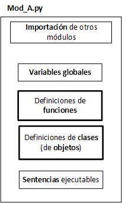

---
jupytext:
  formats: ipynb,md:myst
  text_representation:
    extension: .md
    format_name: myst
    format_version: 0.12
    jupytext_version: 1.7.1
kernelspec:
  display_name: Python 3
  language: python
  name: python3
---

# Módulos

+++

[Introducción](#Introducción)<br>
[Módulos](#Modulos)<br>
[Espacio de nombres (namespace)](#Espacio_de_nombres)<br>
[Importación de un módulo](#Importación)<br>
[Ejemplo de creación de un módulo](#Ejemplo)<br>
[Programa versus módulo](#Diferencias)<br>
[Introducción a las pruebas unitarias (Unit Tests)](#Pruebas_unitarias)<br>
[Biblioteca estándar](#Biblioteca)

+++

***
<a id='Introducción'></a>

+++

## Introducción

+++

Desde el inicio del curso, desde el primer momento, hemos estado utilizando una serie de funciones de Python, tales como las de la **biblioteca** (**library**) matemática `math`. Estas funciones matemáticas y otras muchas están distribuidas en **módulos** que se consideran **estándar**. Así, hemos utilizado estas funciones definidas en **módulos** siguiendo el procedimiento que consiste en **importar** el módulo. De esta forma, estos **objetos** definidos en el módulo pasan a partir de ese momento a estar disponibles para su uso en nuestro programa o guion. Estos **objetos** pueden ser **valores constantes** como `math.pi` o **funciones** como `math.cos()`.

```{code-cell} ipython3
import math

print('cos(Pi) = {}'.format(math.cos(math.pi)))
```

En este cuaderno vamos a comprender mejor:

- el mecanismo que se utiliza para _incorporar_ estas funciones y valores a nuestro programa.
- la naturaleza de estos módulos.
- el concepto de **espacio de nombres** (**namespaces**).
- cómo crear un módulo sencillo.
- cómo documentar nuestros módulos.
- cómo hacer módulos que hagan explícita la forma de **testearlos** (**pruebas unitarias**).
- diferencias (y similitudes) entre el programa principal y un módulo de biblioteca.

+++

Adicionalmente, se hará un recorrido muy rápido por los principales módulos de la **biblioteca estándar**.

+++

***
<a id='Modulos'></a>

+++

## Módulos

+++

### ¿Qué es un módulo?

+++

Un **módulo** es un **fichero**, con extensión `*.py` y, por tanto, accesible al intérprete de Python y ejecutable por el **núcleo** de Python. Puede contener:

- Variables globales, funciones,  clases (patrones de objetos) y sentencias ejecutables.
>La programación de clases no se estudian en un curso introductorio.
- Un módulo, a su vez, puede _importar_ otros módulos.

+++



+++

### ¿Qué diferencia hay entre los módulos y un guion?

En lo que concierne exclusivamente a la **sintaxis** del lenguaje, **no hay diferencias esenciales**. 

La diferencia reside en el **propósito** asignado a cada una de estas piezas:

- El programa principal o guion (**script**) es el que está **diseñado** para contener la lógica de la **aplicación** y, típicamente, es *lanzado* el primero, ya sea desde la consola o desde una herramienta de desarrollo como **Spyder**. 
> Las sentencias del programa principal se ejecutan, de la primera a la última, siguiendo el **hilo** lógico de ejecución, bajo el control de las sentencias de control de flujo programadas y realizando las llamadas a las funciones indicadas.
- Como parte del proceso de ejecución del programa principal, se realiza la **importación  de los módulos** de los que dicho programa depende, en el orden de aparición de las correspondientes sentencias `import`. 
> El proceso de importación implica la **ejecución** de los módulos. Debe comprender que **la ejecución de la definición de una función no ejecuta la función**, sino que **crea el objeto función** con accesibilidad **global**. Esta función con acceso global podrá posteriormente ser ejecutada cuando se **invoque** desde el código del programa principal o desde el código de una función (quizá de otro módulo).

+++

### ¿Qué función juegan entonces los módulos?

Los módulos nos permiten:

- Un nivel de organización superior al que por sí solas nos dan las funciones, permitiendo **estructurar** de manera más simple nuestros programas.
- Implementan un **espacio de nombres** (**namespace**) propio, que limita el riesgo de colisiones entre **identificadores** de valores y funciones.
- Agrupan en un fichero conjuntos de objetos relacionados (funciones, clases, y valores) típicamente codificados alrededor de un propósito que puede estar definido con mayor o menor precisión. 
>Los siguientes serían ejemplos de módulos:
    - el módulo `math` de la biblioteca estándar brinda un conjunto de funciones y valores relacionados con las matemáticas en el campo de los números reales.
    - el módulo `random` tiene el propósito (más restringido) de permitir trabajar con números *pseudoaleatorios*.
    - un módulo, hecho a medida por nosotros, llamado por ejemplo `auxiliares`, que contenga funciones de apoyo a nuestro programa.
    
- Los módulos pueden, a su vez, utilizar otros módulos, con tantos niveles de **anidamiento** como se requiera.

Idealmente, se deben hacer esfuerzos para que los **módulos** los diseñemos de forma que sean: 
- **generales**, con funciones **cohesivas**, **bien testadas** y **desacopladas**.
- con códigos ocultos tras **interfaces** bien diseñadas y **documentadas**.
- de forma que se promueva su **reutilización**, contribuyendo al aumento de la **productividad** del programador.

+++

***
<a id='Espacio_de_nombres'></a>

+++

## Espacio de nombres (namespace)

Cada módulo define un **espacio de nombres** (**namespace**) propio. Esto significa que los **nombres** o **identificadores** de los objetos definidos en el módulo deben ser diferentes solamente dentro de los límites del fichero donde se define el módulo.

Un espacio de nombres establece una **correspondencia** entre los nombres y los objetos. Ejemplos que ya hemos visto de espacios de nombres son:
* las funciones nativas, como `print()` o `abs()`,  definidos en un módulo llamado `builtins`
* las funciones matemáticas definidas en un módulo, como el módulo `math`
* cualquier variable local que hemos usado en nuestras funciones constituye un espacio de nombres local a esa función

Lo que permite el concepto de espacio de nombres es que no exista absolutamente ninguna relación entre nombres pertenecientes a diferentes espacios de nombres. Cuando hacemos referencia a un nombre de un módulo, estamos haciendo referencia a un **atributo** del módulo. La forma de acceder a un atributo es a través de la sintaxis `nombre_modulo.nombre_atributo`.

Los módulos evitan la **contaminación del espacio de nombres** de un programa y esto es un elemento imprescindible en la creación de aplicaciones de tamaño moderado a grande.

+++

***
<a id='Importación'></a>

+++

## Importación de un módulo
Las formas recomendadas (y obligatorias en este curso) de importar un módulo son las siguientes:
* **Forma 1**
```python 
import nombre_modulo1 
```
  Los diferentes objetos definidos con **alcance global** en el módulo `nombre_modulo1` son *incorporados* a los espacios de nombres de los respectivos módulos y/o programa principal, accesibles mediante el operador `.`. Como ya hemos comentado, los identificadores de un espacio de nombres, un módulo en este caso, son atributos del módulo. Por ello, la notación `.` es idéntica a la usada para el caso de acceso desde un objeto a sus atributos: datos y métodos.
> Es lo que venimos haciendo cuando usamos, por ejemplo, `math.cos(x)` o `math.pi`.

* **Forma 2**
```python 
import nombre_modulo2 as nom
```
  En esta segunda variante se especifica un **alias**, `nom` en el ejemplo, lo que permitiría utilizar `nom.` como alias del nombre del módulo.
> Es lo que hemos hecho con el módulo `numpy`, el alias `np` y la función `linspace`, por ejemplo, `np.linspace(0, 2, 10)`.

+++

En la siguiente figura se muestra un ejemplo *artificial* para ver cómo el correcto uso de los espacios de nombres permite no contaminarlos.

Existen dos módulos, `Modulo_A` y `Modulo_B`, que contienen una función con el mismo identificador, `ident()`. La función `ident()` podría hacer exactamente lo mismo, tareas similares pero con alguna diferencia o, directamente, no tener nada que ver la una con la otra respecto a su cometido.
> Hemos visto en un tema anterior como el identificador `sqrt` es utilizado para un cometido similar, pero con resultados diferentes, por los módulos `math`y `cmath`.

En este caso, para echar un poco más de pimienta, el `Modulo_A`, en la propia definición de su función `ident()` usa la definición de `ident()` de `Modulo_B`. El programa principal muestra tres usos de `ident()` donde queda inequívocamente claro cual de las dos definiciones se está utilizando.

+++


```{code-cell} ipython3
import Modulo_A
import Modulo_B

print('Módulo A llama a módulo B')
Modulo_A.ident()

print('Se llama a módulo B a través de A')
Modulo_A.B.ident()

print('Se llama a módulo B directamente')
Modulo_B.ident()
```

Existe otra forma de importar módulos, tal vez más cómoda para guiones de poca complejidad, pero que no respeta el concepto de **espacio de nombres**: 

```python 
from nombre_modulo1 import *  
from nombre_modulo2 import obj1, obj2
```
Esta forma de importar hace que los valores y funciones importadas se **incorporen** al espacio de nombres global del *guion* que realiza la importación. Ahora no se antepone el **calificador** con el nombre del módulo y el operador `.` como el caso previo, pero a costa de **contaminar** el **espacio de nombres** común.

La primera opción **importa** todos los objetos del módulo `nombre_modulo1` mientras que la segunda opción, que resultaría dentro de lo malo preferible, **importa** solamente los nombres `obj1` y `obj2` desde el módulo `nombre_modulo2` resultando una **contaminación** más limitada.

+++

Veamos un ejemplo de por qué nunca utiilizar este método de importación. En este caso, el mero orden cambia por completo la ejecución del programa principal.

```{code-cell} ipython3
from Modulo_A import *
from Modulo_B import *

ident()
```

```{code-cell} ipython3
from Modulo_B import *
from Modulo_A import *

ident()
```

### Funcionamiento de la importación de un módulo

El proceso de importación de un módulo conlleva por parte de Python los siguientes pasos:
1. Localizar el módulo en el sistema de ficheros del Sistema Operativo.
2. Si el código está escrito en Python, convertirlo a **bytecode**. Recordad que este concepto lo estudiamos brevemente en el tema de Lenguajes de Programación. Se trata de una traducción previa del módulo generando una codificación intermedia: el **código intermedio** o **bytecode** (extensión .pyc en Python).
3. Pueden existir módulos **compilados** desarrollados en otros lenguajes (C, por ejemplo).
4. Ejecutar el módulo. La ejecución de la definición de funciones consiste en crear los **objetos** función respectivos.

+++

#### Localización del módulo

Durante la importación, el módulo nombrado en la sentencia ```import``` es buscado, por orden, en los siguientes lugares:

1. El propio directorio dónde se encuentra el programa que hace la importación. Esto se utiliza por módulos creados por el propio programador como parte de un programa relativamente pequeño.
2. Directorios o carpetas recogidos en la variable de configuración de Python llamada `PYTHONPATH`. Se puede acceder desde IDEs como Spyder.
3. Desde los directorios designados por Python durante la instalación, para albergar los módulos de la **biblioteca estándar**.
4. Lo especificado en ficheros con extensión `.pth` si estuvieran presentes (no lo veremos en el curso).

+++

***
<a id='Ejemplo'></a>

+++

## Ejemplo de creación de un módulo

+++

A modo de ejemplo, vamos a crear un módulo **polinomios**, que *exporte* un conjunto de funciones que permitan realizar algunas operaciones básicas con polinomios. Los polinomios serán descritos por **listas** de números reales que representan sus coeficientes en orden decreciente de las potencias de $x$. 

El siguiente polinomio de orden $3$:

$$
p\left(x\right) =a_3x^3 + a_2.x^{2}+ a_1.x + a_0
$$

sería representado por una lista de Python de $4$ elementos, conteniendo los coeficientes:

```python
[a_3, a_2, a_1, a_0]
```

+++

En general, para polinomios de orden $n$, será necesario utilizar listas de $n+1$ elementos.

$$
p\left(x\right) =a_nx^n + a_{n-1}.x^{n-1}+ ...+ a_2x^2 + a_1.x + a_0
$$

El diseño del módulo requiere analizar el campo de aplicación de que se trate y el elegir un conjunto de objetos, funciones en este caso, que sean generales, cohesivas y con interfaces bien definidas. 

Para nuestro ejemplo de modulo, sin ánimo de ser exhaustivos, definiremos las siguientes funciones iniciales:

- `polyval(pol, x)`: evalúa el polinomio en `x` y devuelve un número real.
- `polyconv(pol1, pol2)`: devuelve un polinomio que es la multiplicación (*convolución*) de los polinomios `pol1` y `pol2`.
- `polyder(pol)`: devuelve el polinomio derivada del polinomio que se pasa como argumento.

+++

En el fichero `polinomios.py`, que colocaremos en el mismo directorio del programa que va a importarlo, se definirán las funciones anteriormente mencionadas.
Nótese que, para este ejemplo, en aras a simplificar, el fichero que implementa el módulo se encuentra en el misma carpeta en la que se encuentra nuestro **cuaderno**.
La siguiente celda muestra la definición de una de las funciones incluidas en `polinomios.py`.

```{code-cell} ipython3
def polyder(pol):
    '''
    Devuelve el polinomio derivada del polinomio pol = [a_n, ..., a_2, a_1, a_0].
    Parameters
    ----------
    pol : list: numeric
        Lista con el polinomio a derivar.
    Returns
    -------
    der : list: numeric
        Lista con los coeficientes del polinomio derivada.
    Example
    -------
    >>> print(polyder([2, 5, 3, 1]))
    [6, 10, 3]
    '''

    der = list(pol)
    der.pop()
    orden = len(der)
    for i, a in enumerate(der):
        der[i] *= orden - i
    return der
```

Nótese en el código anterior el uso del *docstring*, que describe el objetivo de la función, así como el parámetro de entrada y lo que se devuelve mediante `return`. Además, es buena práctica añadir uno o varios ejemplos de uso.
En este caso se trata de recibir la lista que da cuenta de los coeficientes del polinomio que se desea derivar simbólicamente, para devolver otra lista con los coeficientes del polinomio que representa la derivada.

El uso de la documentación provista por el *docstring* es siempre recomendable, pero lo es aún más a la hora de crear módulos con la intención de ser utilizados en diferentes proyectos.

Veamos el uso de nuestro módulo y función con dos ejemplos alternativos.

```{code-cell} ipython3
import polinomios as pol

help(pol.polyder)

print(pol.polyder([2, 1, 1]))
```

***
<a id='Diferencias'></a>

+++

## Programa versus módulo

+++

¿Existen diferencias fundamentales entre un módulo y un programa principal?

Desde el punto de vista de la sintaxis de Python **no hay diferencia alguna**. La diferencia la impone el *uso* que se le otorga a uno y otro. No hay ningún impedimento para ejecutar un módulo como si de un programa principal se tratase.

La cuestión relevante es que un módulo puede contener sentencias que el programador solo desea que sean ejecutadas cuando lo hacemos directamente desde el intérprete de Python. Por el contrario, cuando el módulo es importado, esas mismas sentencias no deseamos que se ejecuten.

+++

### ¿Cómo distinguir el uso como módulo del uso como programa principal?
En Python, cada fichero `*.py` tiene asociado un atributo global predefinido por el sistema de tipo `str`, llamado `__name__`.  Esta variable `__name__` tendrá un valor u otro, en dependencia de si se trata del programa principal que está siendo ejecutado o de un módulo que ha sido importado.

La variable `__name__` contiene:

- La cadena `'__main__'` si el fichero en el que es utilizada ha sido invocado directamente por el sistema, es decir, es el programa principal.
- La cadena con el nombre del módulo, si el fichero en el que es utilizada ha sido importado con alguna de las variantes descritas.

+++

Vamos a analizar lo que ocurre con el módulo `Modulo_C`, cuyo contenido es:

```python
#Fichero: Modulo_C.py
def ident():
    print('Función ident en Modulo_C.')

    
print('Valor de __name__ en Modulo_C:', __name__)
```

¡Es importante que resete el núcleo aquí para que se cargue `Modulo_C` por primera vez!

```{code-cell} ipython3
import Modulo_C as mod

mod.ident()
print('Valor de __name__ en programa principal:', __name__)
```

Observe que en el fichero y en la celda, que representaría el progrma principal, existe una línea ejecutable declarada a nivel global que saca por pantalla el valor de la variable `__name__`.

+++

Al ejecutar la celda ocurre lo siguiente:
- El programa de **nivel superior** es el programa que se ejecuta directamente, y que corresponde a nuestro programa principal.
1. Se ejecuta la línea `import Modulo_C as mod` que ejecuta el fichero `Modulo_C.py` (que se encuentra en el directorio de este cuaderno).
2. La ejecución del módulo implica la definición de la función `ident()`, que crea el objeto correspondiente, y la ejecución de la sentencia `print()` mostrada en la segunda celda. Como resultado de esta ejecución, sabemos que la variable `__name__` del módulo tiene el valor `'Modulo_C'`, o sea, el nombre del módulo.
3. Continúa la ejecución del programa principal, se ejecuta la función del módulo `mod.ident()` y luego se imprime la variable `__name__` desde el programa principal y aquí el valor de la misma es la cadena de caracteres `'__main__'`.

+++

Teniendo en cuenta lo discutido, es práctica habitual en Python utilizar la construcción condicional que se muestra en la celda siguiente para ejecutar las sentencias definidas a nivel global (fuera de las funciones) solo en el caso de que el fichero haya sido ejecutado directamente como programa de **nivel superior**.

El fichero `Modulo_D.py` muestra un ejemplo de ello:

```python
#Fichero: Modulo_D.py
def ident():
    print('Función ident en Modulo_D.')

if __name__ == '__main__':
    print('Esta sentencia solo se se ejecuta si actúa si Modulo_D como programa principal.')
```

+++

¡Es importante que resete el núcleo aquí para que se cargue `Modulo_C` y `Modulo_D` por primera vez!

```{code-cell} ipython3
import Modulo_C as modC
import Modulo_D as modD

modC.ident()
modD.ident()
print('Valor de __name__ en programa principal:', __name__)
```

Véase que ahora la sentencia `print()` del módulo `Modulo_D` no se ha ejecutado al estar dentro del condicional `if`.

+++

Las funciones son definidas, típicamente, fuera del condicional. Esto abre la puerta a que nuestro código pueda ser utilizado como si fuera un módulo, por otros programas, en el caso de que las definiciones de las funciones fueran lo suficientemente generales y útiles para los mismos. En este caso, el código dentro del condicional no se ejecutaría, porque `__name__` no contendría `'__main__'`, sino el nombre del fichero, es decir, el nombre del módulo que contiene el código.

Una importante aplicación de esta construcción la tenemos en las **pruebas unitarias** (**unit tests**) como se comenta en la siguiente sección.

+++

***
<a id='Pruebas_unitarias'></a>

+++

## Introducción a las pruebas unitarias (Unit tests)

Una **buena práctica de programación** exige que comprobemos que el funcionamiento de nuestro código es el correcto, realizando **test** que nos permitan asegurar, por ejemplo, que las **funciones** diseñadas cumplan con todos los requerimientos, y funcionen de forma correcta para todos los casos, incluidos los casos límite.

Si bien estos **test** son siempre necesarios, lo son aún más en el caso de los módulos que se supone contienen **funciones** y otros objetos programados de forma general, para formar parte de **bibliotecas** que van a ser utilizadas, una y otra vez, conformando diferentes programas. Un error en una función de este tipo de módulos compromete la fiabilidad de todos los programas que la utilizan.

Se recomienda entonces que, junto con el código de cada función, se diseñe e implemente también el código con aquellas llamadas que realizan los test sobre esa función.

+++

El mecanismo que ofrece la variable o atributo `__name__` para chequear mediante una sentencia condicional si un fichero fuente (`.py`) ha sido  ejecutado directamente o no, resulta muy apropiado para programar estos **test o pruebas unitarias** (**Unit Tests**).

Aunque existen métodos mucho más sofisticados, una forma simple de hacer un test es ayudándonos de la función nativa `assert()`. Una **aserción** (**assert**) es una sentencia que verifica si una determinada condición es cierta o falsa, deteniendo la ejecución del programa en este último caso lanzando un mensaje.
```python
assert expresion
```

```{code-cell} ipython3
"""
Funciones para trabajar con polinomios
"""
# Se han eliminado los docstrings para hacer menos prolija la celda
def polyval(pol, x):
    y = 0
    orden = len(pol) - 1
    for i, coef in enumerate(pol):
        y += coef*x**(orden-i)
    return y


def polyder(pol):
    der = list(pol)
    der.pop()
    orden = len(der)
    for i, a in enumerate(der):
        der[i] *= orden - i
    return der


def polyconv(pol1, pol2):
    orden1, orden2 = len(pol1) - 1, len(pol2) - 1
    if orden1 < 0 or orden2 < 0:
        producto = None
    else:
        orden = orden1 + orden2
        producto = [0]*(orden + 1)
        for i, elem1 in enumerate(pol1):
            for j, elem2 in enumerate(pol2):
                producto[i + j] += elem1*elem2
    return producto


if __name__ == '__main__':
    pol = [4, 3, 2, 1]
    assert polyder(pol) == [12, 6, 2]
    print('Test -> polyder(pol) == [12, 6, 2]\nOk')
    assert polyval(pol, 0.) == 1.
    print('Test -> polyval(pol, 0.) == 1.\nOk')
    assert polyval(pol, 1.) == 10.
    print('Test -> polyval(pol, 1.) == 10.\nOk')
    assert polyval(pol, 2.) == 49.
    print('Test -> polyval(pol, 2.) == 49.\nOk')
    assert polyconv(pol, pol) == [16, 24, 25, 20, 10, 4, 1]
    print('Test -> polyconv(pol, pol) == [16, 24, 25, 20, 10, 4, 1]\nOk')
```

En la celda anterior se muestra un fragmento del módulo `polinomios`. 

Observe que aparecen definiciones de las funciones `polyconv()`, `polyder()` y `polyval()` para determinar la convolución (producto), la derivada y para evaluar un polinomio en un punto, respectivamente.

La definición de estas funciones es el propósito fundamental de la existencia del módulo. En el caso de que el mismo sea importado por un guion u otro módulo, el código de estas definiciones sería ejecutado para crear los respectivos objetos. Sin embargo, en ese caso, como `__name__` tendría un valor diferente de `'__main__'` el código en el cuerpo del `if` no se ejecutaría.

Sin embargo, cuando el fichero que implementa el módulo es ejecutado directamente, entonces si se cumpliría la condición del `if`, con lo cual serían ejecutadas las sentencias asociadas a este bloque. De esta forma, tenemos la oportunidad ideal para programar en este punto una serie de llamadas a las funciones del módulo que sirvan como **test unitarios**, es decir, que demuestren mediante resultados conocidos, la *corrección* de las mismas.

+++

***
<a id='Biblioteca'></a>

+++

## Biblioteca estándar

Python ofrecen multitud de módulos en la [biblioteca estándar](https://docs.python.org/3/library/), convenientemente clasificados por temática. El enlace a la página web oficial del lenguaje ofrece una descripción completa de los mismos. 


De especial interés se tienen los siguientes:

- **math**, **cmath**: funciones matemáticas reales y complejas
- **random**: generación de números pseudoaleatorios
- **os**: para utilizar servicios del Sistema Operativo
- **time**: acceso al tiempo y funciones relativas al calendario
- **csv**, **json**, **xml**, **html**: para leer y escribir ficheros en diferentes formatos (csv, json, xml, html)
- **tkinter**: implementación de interfaces gráficas con el usuario
- **pydoc**, **doctest**: para generar y testar automáticamente documentación de programas python
- **timeit**: para medir el tiempo de ejecución de fragmentos de código
- **sys**: acceso a funciones que interaccionan con el intérprete

+++

En el curso ya hemos utilizado funciones del módulo `math` y `cmath`. En diversos temas, y de forma transversal, estamos incorporando funciones provenientes de otros módulos y ¡**paquetes**!.
