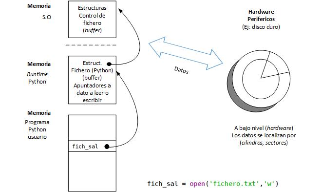
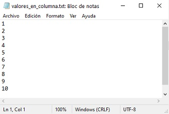
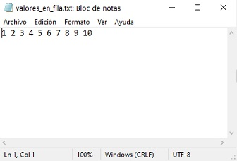
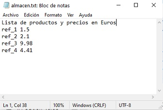

---
jupytext:
  formats: ipynb,md:myst
  text_representation:
    extension: .md
    format_name: myst
    format_version: 0.12
    jupytext_version: 1.7.1
kernelspec:
  display_name: Python 3
  language: python
  name: python3
---

+++ {"slideshow": {"slide_type": "slide"}}

# Ficheros

+++

[Introducción](#Introducción)<br>
[Concepto de fichero](#Concepto_de_fichero)<br>
[Tipos de ficheros](#Tipos_de_fichero)<br>
[Elementos básicos de programación con ficheros](#Ficheros_básico)<br>
[Lectura línea por línea de ficheros en Python](#Lectura_línea_por_línea_de_ficheros_en_Python)<br>
[Manejo de excepciones con ficheros](#Manejo_de_excepciones_con_ficheros)<br>
[Otras formas de lectura en Python](#Otras_formas_de_lectura_en_Python)<br>
[Leyendo un fichero con formato complejo](#Leyendo_un_fichero_con_formato_complejo)<br>
[Escritura en un fichero](#Escritura_en_un_fichero)<br>
[Consideraciones finales](#Consideraciones_finales)

+++

***
<a id='Introducción'></a>

+++

## Introducción

Toda persona que haya interactuado con los ordenadores tiene alguna idea de lo que es un **fichero** o **archivo**. Sabemos que determinadas aplicaciones informáticas los crean para almacenar, por ejemplo, los documentos generados por un editor de textos o una hoja de cálculo. Conocemos que las aplicaciones son preservadas en ficheros ejecutables. Por otro lado, día tras día, copiamos ficheros de una carpeta del disco duro a otra, o hacia una memoria USB, ¡o los borramos definitivamente!

En este tema haremos primero una breve introducción al concepto informático de fichero. Posteriormente, veremos algunas de las herramientas básicas, las más habituales, que proporciona Python para trabajar con ficheros.

+++

***
<a id='Concepto_de_fichero'></a>

+++

## Concepto de fichero

**Un fichero es un conjunto de datos relacionados entre sí**, que son almacenados de forma **permanente** en dispositivos tales como discos duros, memorias *flash*, etc. y que pueden ser tratados, hasta cierto punto, como una unidad. 

En este contexto, **permanente** quiere decir que, salvo fallos catastróficos o hasta que sean borrados a propósito, estos datos permanecen en el medio en que se almacenan (medios magnéticos o de otro tipo) y continúan existiendo después de que el programa que los creó deja de ejecutarse, incluso después de apagar el ordenador. 

Esto marca la diferencia con los datos que son provisionalmente almacenados en la memoria RAM, la **memoria volátil** del ordenador, que no *sobreviven* al programa que los crea y mucho menos a la desconexión del computador de la red eléctrica.

+++

### Utilidad de los ficheros
El concepto de fichero es una **abstracción** del **Sistema Operativo** (**S.O.**) que, de forma transparente al programador,  utiliza los recursos del *hardware* creando sobre ellos una estructura lógica para representarlos, facilitando a los lenguajes de programación el uso de interfaces de usuario simples y versátiles.

El Sistema Operativo crea todo el **sistema de ficheros** del ordenador: los directorios para organizarlos, las tablas para localizarlos en el disco, etc.

Los ficheros son enormemente importantes en programación. No sólo debido al hecho evidente de que brindan el soporte que permite la mera existencia de las aplicaciones en el disco duro. Si no existieran los ficheros, por ejemplo, toda la interacción del usuario con una aplicación concreta, como la introducción y la obtención de resultados parciales, tendría que ser laboriosamente recreada cada vez que se ejecutara el programa. La existencia del fichero hace posible que, al terminar una sesión de trabajo, se almacenen los datos y resultados en el disco, para poder retomar la tarea en una sesión posterior. 

Por otra parte, los ficheros pueden ser útiles como vehículos para el intercambio de información entre diferentes aplicaciones: los datos resultantes *escritos* en un fichero por el programa A podrán servir de *entrada* para un programa B.

+++

***
<a id='Tipos_de_fichero'></a>

+++ {"raw_mimetype": "text/markdown"}

## Tipos de ficheros

El **contenido** y la **estructura** de un fichero responde a un criterio de **diseño libre**, elegido por el desarrollador de una aplicación. En cualquier caso, en relación a la forma en que los datos son almacenados, los ficheros podríamos clasificarlos como:

- **Ficheros binarios**: Contienen una representación exacta del contenido (binario, ceros y unos) de los datos.
No son *editables*. 
> Ejemplo: Representación de 3 números enteros 255 3 10 en complemento a 2. Cada entero ocupa el mismo número de bytes.

- **Ficheros de texto**: Los datos están representados con los caracteres alfanuméricos que los representan. Pueden ser leídos y modificados a través de un editor de texto.

> Ejemplo: Representación de 3 números enteros 255 3 10 codificados en ASCII, separados por espacios en blanco (20H en ASCII). Cada entero ocupa un número de bytes distinto.


En este cuaderno trabajaremos con ficheros de texto. Vamos a ver que el trabajo con los ficheros de texto es esencialmente análogo al trabajo con entrada/salida convencional a través de la consola (habitualmente el teclado y la pantalla). 

+++

***
<a id='Ficheros_básico'></a>

+++

## Elementos básicos de programación con ficheros

La **equivalencia** entre entrada/salida a través de teclado y pantalla y la utilización de ficheros es muy profunda. Los S.O. actuales hacen un tratamiento unificado de estos recursos y tratan, por ejemplo, a la pantalla y al teclado como ficheros de salida y de entrada respectivamente, *ficheros* que están siempre *listos* para ser utilizados. Es una muestra más del mecanismo de abstracción mencionado más arriba.

Recalquemos que cuando en Python usamos `print()`, estamos escribiendo datos en el fichero *por defecto* o *estándar*, la pantalla, y que cuando empleamos `input()`, estamos leyendo datos del fichero *por defecto* o *estándar*, el teclado.

Cuando no usamos los *ficheros estándar*, tanto en Python como en cualquier otro lenguaje de programación, debemos realizar algunas tareas *adicionales*:

- **Abrir el fichero**: hay que asociar el fichero (definido a nivel del S.O.) con un *objeto* que provea la fuente de datos y definir si se va utilizar para entrada o para salida de datos, es decir, para leer o para escribir.
- **Cerrar el fichero**: Una vez finalizada la interacción con el *objeto* que representa el fichero, este hecho debe ser informado al S.O. mediante los métodos apropiados. Así, el S.O. podrá realizar las acciones requeridas para garantizar que el fichero queda en un estado consistente y seguro.

+++

### El concepto de flujo de datos (stream)

Las operaciones de lectura/escritura hacen uso del concepto de **flujo** o **corriente** de datos (**stream**). El símil se basa en el hecho de interpretar la entrada/salida como una corriente o río de datos, donde estos son representados por la aparición **en serie**, uno tras otro, de los **bytes** que  representan cada uno de los valores transferidos. 

El concepto de transferencia de datos en serie es clave. Si desde el teclado queremos introducir el número 543, es evidente que antes de escribir el 3, debemos escribir el 4 y antes el 5. En el caso de los ficheros se utiliza el mismo paradigma, se escribe un dato siempre a continuación del anterior. 

+++



+++

La figura previa describe la relación que existe entre los datos almacenados en el medio físico y la _construcción lógica_ que es el fichero.
A nivel del dispositivo periférico, la forma de referirse al dato es a través de atributos de muy *bajo nivel*, tales como su *dirección*, que puede ser descrita, por ejemplo, por la intersección de *cilindros* y *sectores* definidos por el *hardware*.

El **fichero**, por su parte, es un conjunto **lógico** de datos que el programa que lo crea (con la ayuda indispensable del Sistema Operativo) *decide* tratarlos como una unidad. Nótese, que en el nivel hardware, si se usa un disco duro como almacenamiento, ese conjunto lógico involucrará a múltiples *cilindros* y *sectores*.

+++

### Memoria intermedia (buffers)
La entrada/salida desde/hacia **ficheros** está mediada, de forma transparente al programador, por memoria auxiliar o búferes (**buffers**).

Los **búferes** cumplen distintos cometidos, pero el fundamental es el de servir como **pulmón** de la CPU. Dado que los procesos de lectura/escritura en los dispositivos son mucho más lentos que los realizados en la RAM, los datos son temporalmente leídos/escritos en búferes. De esta forma, los accesos a un dispositivo lento no ralentizan las aplicaciones.

+++

#### Necesidad de cerrar el fichero
Cuando nuestro programa ha terminado de utilizar el **fichero** debe **cerrarlo**. ¿Por qué es necesario cerrar el fichero?
- La escritura/lectura se realiza sobre los *búferes* y estos son eventualmente transferidos al medio físico. Cuando se *cierra* el fichero, se **fuerza** a realizar esa transferencia. De otro modo, se podría incurrir en pérdida de información.
- La utilización de un fichero comporta un consumo importante de memoria del ordenador (*búferes* y otros elementos). Si no se cierra el fichero, esa memoria resulta *inutilizada*.
- El Sistema Operativo establece un número máximo de ficheros que pueden estar *abiertos* simultáneamente. Si no *cerramos* los ficheros que, de momento, no estamos utilizando, puede que nuestro programa no pueda *abrir* otros que sí son necesarios.

+++

***
<a id='Lectura_línea_por_línea_de_ficheros_en_Python'></a>

+++

## Lectura línea por línea de ficheros en Python
Para entender el manejo de ficheros en Python utilizaremos inicialmente un sencillo ejemplo. Para ello, utilizaremos un editor de textos con el que hemos creado un archivo llamado *valores_en_columna.txt*. El contenido es una secuencia de valores enteros fácil de recordar, para que las comprobaciones del buen funcionamiento del código sean sencillas de verificar.


De momento, para simplificar la **ruta de acceso** al fichero, este archivo está situado al mismo nivel que este cuaderno. La extensión `.txt` es la habitual para *recalcar* que el fichero es de tipo texto, pero podemos usar cualquier extensión, preferentemente no utilizando aquellas habituales en aplicaciones estándar, tales como `.doc`, `.exe`, `.lib`, `.pdf`, etc.

+++

### La apertura y el cierre
Los ficheros no estándar deben ser abiertos antes de ser utilizados, y cerrados cuando se concluya (al menos provisionalmente) el trabajo con ellos.

Para abrir un fichero debemos tener en cuenta:
- La localización del fichero: (Ej.: "*datos/temperaturas/Valladolid.dat*")
- La declaración del **modo de apertura**, que es un parámetro que indica si, por ejemplo, queremos leer del fichero o escribir en el fichero:
    * `'w'` para escritura,
    * `'r'` para lectura
- La asignación de un nombre en el programa que a partir de ese momento representará al fichero (Ej.: `fich_sal`)

Para abrir un fichero disponemos de la función `open()`, que nos devuelve el **objeto** fichero con el que vamos a poder trabajar a partir de ese momento. En el ejemplo, se abre un fichero `'Valladolid.dat'` especificando la ruta de acceso desde el **directorio de trabajo**, con la intención de escribir en él datos, (`'w'`) y al que se referenciará con el nombre `fich_sal`. 
```python
fich_sal = open('datos/temperaturas/Valladolid.dat','w')
```

+++

En la siguiente tabla se muestran los diferentes **modos de apertura**. Con saber utilizar los modos `'w'` y `'r'` es más que suficiente para los objetivos del curso.

|   Modo de apertura | Descripción |          Acción                                                            |
|:------------------:|:------------|:---------------------------------------------------------------------------|
| `'w'`              | Escritura   |Si el fichero no existe lo crea. Si existe, borra su contenido              |
| `'r'`              | Lectura     |Si existe fichero: lo abre. Si no existe: excepción `FileNotFoundError`     |
| `'a'`              | Añadir      |Si fichero no existe, lo crea para escritura. Si existe, añade al final     | 
| `'w+'`             | Actualizar  |Escritura/ lectura. Si el fichero no existe lo crea. Si existe: borra       |
| `'r+'`             | Actualizar  |Lectura/Escritura. Si no existe: excepción `FileNotFoundError`              |
| `'a+'`             | Añadir      |Escritura/lectura. Si existe, añade al final.                               | 
| `'b'`              | Binario     |Abre en binario. Combinadas con otras banderas: establece modo              |
| `'x'`              | Creación    |Abre exclusivamente para crear fichero. Si ya existe, falla                 |

Para cerrar el fichero se usa el método `close()`. Siguiendo con el ejemplo anterior:
```python
fich_sal = open('datos/temperaturas/Valladolid.dat', 'w')
# Código de escritura en el fichero
# ...
fich_sal.close()  # Cerramos el fichero
```

+++

En algunas celdas que siguen a continuación vamos a utilizar el **comando mágico** de **IPython** `%reset -f` para resetear las variables del espacio de nombres y que los resultados de una celda no influyan en las otras.

Los comandos mágicos fueron tratados en la sesión de laboratorio 1 en el cuaderno *Introduccion_Jupyter_Notebook.ipynb*.

+++

### Lectura línea por línea
Tras abrir el fichero correspondiente, la forma básica de leer un fichero línea por línea es:
```python
fich_ent = open('nombre_fichero.txt', 'r')
for linea in fich_ent:
    # Procesar la línea
fich_ent.close()
```
La variable `linea` es una **cadena de caracteres** que va tomando secuencialmente las cadenas de caracteres correspondientes a cada una de las líneas del fichero, desde la primera a la última. 

```{code-cell} ipython3
# Leyendo del fichero "valores_en_columna.txt" línea a línea
fich_ent = open('valores_en_columna.txt', 'r')  # Apertura

for linea in fich_ent:
    print(linea)

fich_ent.close()  # Cierre
```

Al ejecutar el código observaréis que aparece una línea en blanco entre cada uno de los números. Esto es así porque cada línea en el fichero de texto tiene un carácter no imprimible nueva línea, el carácter `\n`. A eso se une el que por defecto introduce la función `print()`. 

Este hecho debe recordarnos que, al igual que con la función de lectura estándar `input()`, lo que estamos leyendo son cadenas de caracteres, es decir, `linea` es un dato tipo `str`. Para poder utilizar los valores enteros, podemos recurrir a la función `int()`. 

En el siguiente ejemplo, rehacemos el código para almacenar los valores enteros en una lista.

```{code-cell} ipython3
%reset -f
# Leyendo del fichero "valores_en_columna.txt"  línea a línea
fich_ent = open('valores_en_columna.txt', 'r')  # Apertura

lista_enteros = []
for linea in fich_ent:
    lista_enteros.append(int(linea))

print(lista_enteros)

fich_ent.close()  # Cierre
```

Es muy importante darnos cuenta que el éxito en la lectura del fichero se sustenta en el hecho de que conocemos de antemano su **formato**. En este caso, que el fichero está formado por líneas en las cuales hay un único número entero. Si ese formato no se cumple, tendremos problemas.

Veamos qué ocurre si pretendemos utilizar el mismo código con el fichero *valores_en_fila.txt*.


```{code-cell} ipython3
:tags: [raises-exception]

%reset -f
# Leyendo del fichero "valores_en_fila.txt" línea a línea
fich_ent = open('valores_en_fila.txt', 'r')  # Apertura

lista_enteros = []
for linea in fich_ent:
    lista_enteros.append(int(linea))

print(lista_enteros)

fich_ent.close()  # Cierre
```

Afortunadamente, tenemos una *bonita* excepción:
```Python
ValueError: invalid literal for int() with base 10: '1 2 3 4 5 6 7 8 9 10\n'
```
El análisis del mensaje nos da luz acerca del problema. La primera línea del fichero es la cadena de caracteres `'1 2 3 4 5 6 7 8 9 10\n'`, que Python lógicamente es incapaz de convertir a un entero vía la función `int()`. Observad la presencia del carácter nueva línea `\n` al final.

Decimos afortunadamente porque no hay nada mejor que, de forma automática, el motor de ejecución de Python nos informe de que algo estamos haciendo mal. Imaginad que la ejecución no diese error y que en una importante variable de nuestra aplicación cargásemos un valor espurio.

Veremos más adelante como leer este fichero.

+++

***
<a id='Manejo_de_excepciones_con_ficheros'></a>

+++

## Manejo de excepciones con ficheros
En el caso del uso de **ficheros**, la capacidad de responder de forma consistente a errores que se puedan producir, es muy importante. Hay que tener en cuenta que, cuando se trata de ficheros, existen una serie de elementos *externos* que dependen del *hardware* y del **Sistema Operativo** que pueden fallar y que están fuera del control del programador.

Por ejemplo:
- El fichero que se pretende *abrir* para *lectura* no existe.
- Se pretende *abrir* para *escritura* un fichero en un medio físico (dispositivo) o lógico (carpeta) *protegido* contra escritura.

Otros fallos pueden ser debidos a:
- La estructura o formato que se espera del fichero no es la realmente existente.
> Acabamos de ver el ejemplo más arriba con el fichero *valores_en_fila.txt*.
- Durante la lectura del fichero, se produce otro tipo de excepción, como una división por 0, etc.

+++

Vamos a generar *artificialmente* una excepción `IndexError` y a capturarla debidamente. Lo logramos creando de inicio una lista de 9 elementos, cuando nuestro fichero tiene realmente 10.

```{code-cell} ipython3
:tags: [raises-exception]

%reset -f
# Leyendo del fichero "valores_en_columna.txt"  línea a línea
try:
    fich_ent = open('valores_en_columna.txt', 'r')
    # Línea "artificial" para generar un error de índice en nuestro ejemplo
    # Cambiando 9 por 10 el programa no genera error
    num_valores = 9
    lista_enteros = [0]*num_valores
    for i, linea in enumerate(fich_ent):
        lista_enteros[i] = int(linea)
except IndexError as error:
    print(error)
else:
    print(lista_enteros)
finally:
    print('Cerramos el fichero.')
    fich_ent.close()  # Cierre
```

Aquí vemos entrar en acción al bloque `finally`, un bloque concebido para ser destinado a cerrar recursos abiertos, una especie de *coche escoba*. Tanto si existe excepción como si no, el fichero está abierto y debemos cerrarlo.

+++

Vamos ahora a provocar otro error típico: nos equivocamos al transcribir el nombre. En el siguiente ejemplo, hemos empleado `colunna` en lugar de `columna`.

```{code-cell} ipython3
:tags: [raises-exception]

%reset -f
try:
    fich_ent = open('valores_en_colunna.txt', 'r')
    # Línea "artificial" para generar un error de índice en nuestro ejemplo
    # Cambiando 9 por 10 el programa no genera error
    num_valores = 9
    lista_enteros = [0]*num_valores
    for i, linea in enumerate(fich_ent):
        lista_enteros[i] = int(linea)
except IndexError as error:
    print(error)
else:
    print(lista_enteros)
finally:
    print('Cerramos el fichero.')
    fich_ent.close()  # Cierre
```

**¡Tenemos dos excepciones**!
* La excepción `FileNotFoundError` es bastante descriptiva del tipo de error cometido. 
* La excepción `NameError` nos está diciendo que no conoce la existencia de la variable `fich_ent`. Pero, ¡la tenemos definida en la línea `fich_ent = open('valores_en_colunna.txt','r')`!. Raro ¿no?.

Vamos, de momento, a manejar la excepción `FileNotFoundError`, cuyo origen tenemos claro.

```{code-cell} ipython3
:tags: [raises-exception]

%reset -f
# Leyendo del fichero "valores_en_columna.txt"  línea a línea
try:
    fich_ent = open('valores_en_colunna.txt', 'r')
    # Línea "artificial" para generar un error de índice en nuestro ejemplo
    # Cambiando 9 por 10 el programa no genera error
    num_valores = 9
    lista_enteros = [0]*num_valores
    for i, linea in enumerate(fich_ent):
        lista_enteros[i] = int(linea)
except (IndexError, FileNotFoundError) as error:
    print(error)
else:
    print(lista_enteros)
finally:
    print('Cerramos el fichero.')
    fich_ent.close()  # Cierre
```

Seguimos teniendo la excepción `NameError`.

**¿Qué está pasando?**

El problema es que la excepción `FileNotFoundError` se genera en la parte derecha de la asignación a la variable `fich_ent`, al intentar abrir un fichero que no existe. Y **la asignación nunca llega a producirse** y, por tanto, la variable `fich_ent` no llega a estar definida nunca.

Nuestro `finally` tal y como está programado no nos ayuda. Podríamos solventar el problema a través de la utilización de código más verboso, pero hay mejores opciones.

+++

### El administrador de contextos `with`
A partir de la versión 2.6 de Python se introdujo una *nueva estructura* de control de flujo, la construcción `with`. La estructura `with` ha sido *diseñada* específicamente para lidiar con código donde se manejan **objetos** que utilizan **recursos** externos. Por ello, Python define a la estructura `with` como un **administrador de contextos** (**context manager**).
>El concepto de **contexto** se utiliza en informática para referirse al conjunto de datos utilizados por un **recurso** que deben ser guardados para permitir una posterior reutilización.

Además de los ficheros, un **administrador de contextos** como `with` puede trabajar con otros objetos, tales como aquellos dedicados a gestionar conexiones a red, bases de datos, etc.. Con todos estos recursos, se van produciendo una serie de pasos, generándose nuevos *estados*. Los recursos son *adquiridos* y deben ser *liberados* o *cerrados* aún en presencia de **excepciones**.

Veamos el ejemplo anterior usando `with`:

```{code-cell} ipython3
%reset -f
# Leyendo del fichero "valores_en_columna.txt"  línea a línea
try:
    with open('valores_en_columna.txt', 'r') as fich_ent:
        # Línea "artificial" para generar un error de índice en nuestro ejemplo
        # Cambiando 9 por 10 el programa no genera error
        lista_enteros = [0]*10  # Línea "artificial" que genera un error de índice en este ejemplo
        for i, linea in enumerate(fich_ent):
            lista_enteros[i] = int(linea)
except (FileNotFoundError, IndexError) as error:
    print(error)
else:
    print(lista_enteros)
```

En la celda anterior puede prbar ahora a cambiar el nombre del fichero o el número de elementos de la lista para ver cómo se manejan las excepciones con `with`.

La construcción `with` crea un *contexto* que ante la presencia de posibles excepciones maneja el *recurso* que representa el fichero. En este caso, ya no es necesario *cerrar explícitamente* el fichero utilizando `close()`: el **administrador de contexto** creado con `with` se ocupa de todos estos detalles *tras las bambalinas*.

Una vez analizadas las excepciones, la forma lógica de leer el fichero `'valores_en_columna.txt'` con `with` sería:

```{code-cell} ipython3
%reset -f
# Leyendo del fichero "valores_en_columna.txt"  línea a línea
try:
    with open('valores_en_columna.txt', 'r') as fich_ent:
        lista_enteros = []
        for linea in fich_ent:
            lista_enteros.append(int(linea))
except FileNotFoundError as error:
    print(error)
else:
    print(lista_enteros)
```

Vistas estas ventajas, usaremos a partir de ahora, la estructura `with`.

+++

***
<a id='Otras_formas_de_lectura_en_Python'></a>

+++

## Otras formas de lectura en Python
Una alternativa a leer línea por línea es hacerlo en **un único paso**:
* usando el método `readlines()`. Se crea una lista con las cadenas de caracteres de cada una de las líneas.
* usando el método `read()`. Obtendremos una única cadena de caracteres unión de todas las líneas, incluidos los caracteres nueva línea.

Debemos señalar que estas funciones pueden usarse con un argumento indicando el número de caracteres a leer, opción que no estudiaremos.

+++

#### Ejemplo de uso de `readlines()`
Para el fichero que estamos manejando, podemos observar que el código es menos compacto que con el método de lectura iterada línea por línea.

```{code-cell} ipython3
%reset -f
# Leyendo del fichero "valores_en_columna.txt"  con readlines()
try:
    with open('valores_en_columna.txt', 'r') as fich_ent:
        lista_lineas = fich_ent.readlines()
except FileNotFoundError as error:
    print(error)
else:
    print("Lista con las líneas del fichero\n{}".format(lista_lineas))
    # Transformamos cada una de las líneas en el entero correspondiente
    lista_enteros = [int(linea) for linea in lista_lineas]  # Lista por comprensión
    print("Lista con los enteros del fichero\n{}".format(lista_enteros))
```

#### Ejemplo de uso de `read()`

```{code-cell} ipython3
%reset -f
# Leyendo del fichero "valores_en_columna.txt"  con read()
try:
    with open('valores_en_columna.txt', 'r') as fich_ent:
        lineas_unidas = fich_ent.read()
except FileNotFoundError as error:
    print(error)
else:
    print("Una única cadena de caracteres correspondiente a todo el fichero\n{}".format(lineas_unidas))
```

¡Atención! Lo que hemos sacado por pantalla es una única cadena de caracteres, la cadena `'1\n2\n3\n4\n5\n6\n7\n8\n9\n10\n'`, en cuyo interior hay caracteres nueva línea `\n`.

+++

Si utilizamos esta alternativa, para extraer nuestra secuencia de números enteros podemos recurrir al método `split()` asociado a las cadenas de caracteres. El método `split()` extrae las *palabras* de la cadena de caracteres situadas entre espacios en blanco, que incluyen tabuladores, nuevas líneas, etc..
> El método `split()` ya lo hemos usado cuando introducíamos por teclado valores *secuencialmente separados por espacios sin usar intro*.

```{code-cell} ipython3
%reset -f
# Leyendo del fichero "valores_en_columna.txt"  con read()
try:
    with open('valores_en_columna.txt', 'r') as fich_ent:
        lineas_unidas = fich_ent.read()
except FileNotFoundError as error:
    print(error)
else:
    lista_enteros = [int(palabra) for palabra in lineas_unidas.split()]
    print("Lista con los enteros del fichero en columna\n{}".format(lista_enteros))
```

Con este método, estamos en condiciones de procesar también nuestro archivo de números en una sola línea *valores_en_fila.txt*.

```{code-cell} ipython3
%reset -f
# Leyendo del fichero "valores_en_fila.txt"  con read()
try:
    with open('valores_en_fila.txt', 'r') as fich_ent:
        lineas_unidas = fich_ent.read()
except FileNotFoundError as error:
    print(error)
else:
    lista_enteros = [int(palabra) for palabra in lineas_unidas.split()]
    print("Lista con los enteros del fichero en fila\n{}".format(lista_enteros))
```

Debemos recalcar que existen más posibilidades de lectura de los ficheros, que pueden consultarse en la [documentación de Python](https://docs.python.org/3/tutorial/inputoutput.html#reading-and-writing-files), pero, entre todas las opciones, la lectura línea por línea es probablemente la más fácil y más utilizada.

+++

***
<a id='Leyendo_un_fichero_con_formato_complejo'></a>

+++

## Leyendo un fichero con formato complejo
Los dos ejemplos de ficheros vistos hasta el momento tienen una estructura muy simple, lo que no significa que no sean útiles. 

Las aplicaciones prácticas requieren ser capaces de **crear** y **leer** ficheros que tengan una *estructura compleja* conocida de tamaño arbitrario, con independencia del número de datos que estos ficheros almacenen. En estos ficheros pueden mezclarse comentarios y datos tanto numéricos como cadenas de caracteres.

Para dar sólo algunos ejemplos de los innumerables que podrían citarse, un fichero puede contener:

- los datos del censo de una ciudad o un país: nombre y apellidos, DNI, dirección y edad de los votantes.
- la sucesión de temperaturas recogidas por un sensor en determinado lugar.
- las filas y columnas de una matriz de dimensiones arbitrarias.
- los datos, organizados en número arbitrario de ejes, de un estudio epidemiológico, etc.

Todos los problemas tienen en común que el **significado de los datos** y **la estructura básica** de la organización de los mismos **tienen que ser conocidos por el programador** que diseña la aplicación de lectura y/o escirtura del fichero. El *volumen* total de los datos (cantidad de personas, número de lecturas del sensor, dimensiones de la matriz, numero de ejes y cantidad de elementos por eje) es, en general, desconocido.

+++

La figura siguiente muestra el fichero *almacen.txt*, cuyo formato es algo más complejo, formado por:
* Una línea inicial que es un comentario explicativo del contenido del fichero, en general, útil solo para el usuario que lo abre directamente desde un editor de textos.
* Una serie de líneas que contienen, cada una de ellas, una referencia de un producto y su precio.



+++

Veamos un posible fragmento para su lectura. Lo relevante:
* Leemos la primera línea y la obviamos
* Para cada una de las siguientes líneas, extraemos con `split()` la referencia y el precio.

Es importante darnos cuenta también aquí del concepto de **flujo de datos**. Tras leer con `readline()` la línea del comentario, ésta ya está extraída de él. De hecho, un **puntero** oculto estará ahora *señalando* a la siguiente línea, al siguiente **byte** a extraer, correspondiente a la línea donde se encuentra `ref_1` y `1.5`. Por eso, el bucle `for` que itera a continuación sobre el objeto fichero `fich` lo hace desde esa línea, no desde el principio del fichero.

```{code-cell} ipython3
# Leyendo el fichero "almacen.txt"
try:
    with open('almacen.txt', 'r') as fich:
        fich.readline()  # Leemos la primera línea pero la obviamos
        producto = []
        precio = []
        for linea in fich:
            palabras = linea.split()
            producto.append(palabras[0])
            precio.append(float(palabras[1]))
except FileNotFoundError as error:
    print(error)
else:
    print(producto)
    print(precio)
```

Vamos a introducir en el siguiente fragmento dos mejoras:
* Leemos el fichero a través de una función, encapsulando su código
* Creamos una lista de tuplas con la pareja (referencia, precio)

```{code-cell} ipython3
%reset -f
def lee_fichero(nombre):
    try:
        with open(nombre, 'r') as fich:
            fich.readline()  # Leemos la primera línea pero la obviamos
            listado_precios = []
            for linea in fich:
                palabras = linea.split()
                listado_precios.append((palabras[0], float(palabras[1])))
    except FileNotFoundError as error:
        raise FileNotFoundError(error)
    else:
        return listado_precios


# Programa principal
try:
    lista = lee_fichero('almacen.txt')  # Prueba a introducir un nombre erróneo
except FileNotFoundError as error:
    print(error)
else:
    print(lista)
```

***
<a id='Escritura_en_un_fichero'></a>

+++

## Escritura en un fichero
La escritura en un fichero es comparativamente algo más simple que la lectura. No en vano, es el programador
el que controla cómo es la estructura del fichero. Además, puede *despreocuparse* de elementos tales como los caracteres nueva línea, espacios en blanco, etc.

Aunque puede usarse la función `print()` para escribir en un fichero, el método relevante es `write()`.
A diferencia de `print()`, el método `write()` no añade un carácter nueva línea por defecto al escribir en el fichero.

Si necesitamos añadir una línea, no tenemos mas que añadir a la cadena correspondiente el carácter `\n`.

Otro aspecto importante es ser conscientes de lo que ocurre si abrimos un fichero para escritura usando el modo de apertura `'w'`:
* Si el fichero no existe, se creará uno nuevo con ese nombre
* Si el fichero ya existe, **¡se borrará su contenido!**

En el siguiente fragmento, vamos a crear un fichero *almacen_clon.txt*, idéntico a *almacen.txt*, usando todas las herramientas que ya conocemos.

```{code-cell} ipython3
%reset -f
def escribe_fichero(nombre, comentario, lista):
    try:
        with open(nombre, 'w') as fich:
            fich.write(comentario + '\n')  # Escribimos el comentario
            for x in lista:
                fich.write('{} {}\n'.format(x[0], x[1]))
    except FileNotFoundError as error:
        raise FileNotFoundError(error)


# Programa principal
comentario = 'Lista de productos y precios en Euros'
listado_precios = [('ref_1', 1.5), ('ref_2', 2.1), ('ref_3', 9.98), ('ref_4', 4.41)]
try:
    escribe_fichero('almacen_clon.txt', comentario, listado_precios)
except FileNotFoundError as error:
    print(error)
```

En lugar de utilizar el método `write()` se podría haber utilizado la propia función `print()` que hemos venido utilizando para la salida por la consola (asociada normalmente a la pantalla).

Para que `print()` escriba en un fichero diferente a la consola, que es el *fichero por defecto*, se puede utilizar el parámetro `file` de `print()`de la manera que se muestra:

```python
print(cadena, file=fich)
```
Como ya sabemos, la función `print()` sí incluye automáticamente el cambio de línea al final de la cadena procesada. 

La versión usando `print()` sería la siguiente:

```{code-cell} ipython3
%reset -f
def escribe_fichero(nombre, comentario, lista):
    try:
        with open(nombre, 'w') as fich:
            print(comentario, file=fich)  # Escribimos el comentario
            for x in lista:
                print(x[0], x[1], file=fich)
    except FileNotFoundError as error:
        raise FileNotFoundError(error)


# Programa principal
comentario = 'Lista de productos y precios en Euros'
listado_precios = [('ref_1', 1.5), ('ref_2', 2.1), ('ref_3', 9.98), ('ref_4', 4.41)]
try:
    escribe_fichero('almacen_clon_print.txt', comentario, listado_precios)
except FileNotFoundError as error:
    print(error)
```

***
<a id='Consideraciones_finales'></a>

+++

## Consideraciones finales
En lo anterior, se han discutido algunos conceptos elementales del concepto informático de fichero y también un repaso de los métodos básicos para leer y/o escribir ficheros con Python.

En muchas ocasiones, este acceso básico, es todo lo que se requiere. 

Consecuente con su filosofía, Python ofrece recursos de un mayor nivel de abstracción para lidiar de forma productiva con ficheros que siguen una estructura más compleja. Esta estructura puede ir desde simples ficheros en los que los datos aparecen en columnas separados por comas `,` u otros separadores, llamados ficheros tipo **csv** (**comma separated values**), hasta aquellos ficheros que sirven como infraestructura a **bases de datos**.

Sin pretender catalogar todas las posibilidades, entre los recursos que brinda el *ecosistema* de Python para trabajar con ficheros de diferentes estructuras, se tienen:

- [Módulo csv (biblioteca estándar de Python)](https://docs.python.org/3/library/csv.html): Ficheros csv.

- [Módulo XML (biblioteca estándar de Python)](https://docs.python.org/3/library/xml.html): Para trabajar con ficheros codificados el estándar XML

-  [Módulo JSON (biblioteca estándar de Python)](https://docs.python.org/3/library/json.html): Para ficheros codificados en el estándar JSON (Javascript Object Notation) el estándar _de facto_ en intercambio de información.

- [OpenPyXL](https://openpyxl.readthedocs.io/en/stable/): Biblioteca para la manipulación de hojas de cálculo **Excel**.

- [Pandas](https://pandas.pydata.org/): Para análisis y manipulación de datos.

Más adelante usaremos algunas de estas herramientas para trabajar con ficheros.
