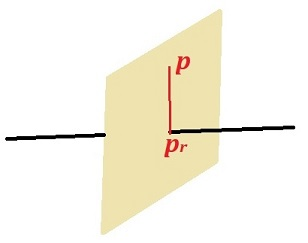

---
jupytext:
  formats: ipynb,md:myst
  text_representation:
    extension: .md
    format_name: myst
    format_version: 0.12
    jupytext_version: 1.7.1
kernelspec:
  display_name: Python 3
  language: python
  name: python3
---

# El paquete Numpy

+++

[Introducción](#Introducción)<br>
[Creación de arrays](#Creacion_arrays)<br>
[Atributos de los arrays](#Atributos_arrays)<br>
[Manipulando arrays](#Manipulando_arrays)<br>
[Álgebra lineal](#Algebra_lineal)<br>
[Combinando matrices](#Combinando_matrices)<br>
[Copia](#Copia)<br>
[Iterando con bucles](#Iterando_bucles)<br>
[Funciones universales](#Funciones_universales)<br>
[Tipos](#Tipos)<br>
[Ejemplo de aplicación](#Ejemplo_aplicacion)

+++

***
<a id='Introducción'></a>

+++

## Introducción

+++

**NumPy**, **Num**eric **Py**thon, es un paquete que dispone de múltiples herramientas para manejar **matrices** de una forma muy eficiente. 

En Python ya hemos trabajado con vectores (matriz unidimensional) y matrices usando **listas**. Sin embargo, la *flexibilidad* de las listas (posibilidad de albergar distintos tipos de datos en una misma lista y la de poder variar su tamaño de forma dinámica), conlleva una estructura interna en memoria que penaliza severamente la manipulación eficiente de listas de gran tamaño. ¡No hay beneficio sin servidumbre!

Por otro lado, la inmensa mayoría de las aplicaciones de interés que manejan matrices se caracterizan porque los datos que las conforman son del mismo tipo. Esta es una de las características de las matrices de **Numpy**: todos sus datos son del mismo tipo, lo que permite un almacenamiento interno en memoria eficiente.

Otro hándicap de Python a la hora de manejar grandes volúmenes de datos es su carácter interpretado. El acceso secuencial vía bucles a todos y cada uno de los elementos de una matriz de gran tamaño conlleva una ejecución, por parte del **intérprete**, inevitablemente lenta. Para contrarestar este severo inconveniente, el paquete **NumPy** permite invocar multitud de métodos de forma **vectorizada**, es decir, pasando como argumento directamente la variable que representa a la matriz, estando la manipulación secuencial a cargo de una implementación eficiente interna en los lenguajes C o Fortran, y de forma transparente al programador.

Con la **vectorización Numpy** ni mucho menos *ha inventado la rueda*. Muchos lenguajes, como C++, permiten implementar funciones *vectorizadas*, es decir, funciones cuyos argumentos son matrices u operadores cuyos operandos son matrices. El quiz está en que, en **Numpy**, *detrás del escenario*, entra en acción una implementación eficiente en un **lenguaje compilado**.

+++

Para usar **NumPy** debemos importar el módulo `numpy`, típicamente usando el alias `np`:

```{code-cell} ipython3
import numpy as np
```

Por consistencia con la denominación dentro del módulo, la terminología que usaremos para referirnos indistintamente a vectores y matrices es el *barbarismo* **array**.

Debe tenerse en cuenta que en este documento expondremos una **pequeña parte** de las funciones  del módulo **NumPy**, las que se corresponden con las aplicaciones más habituales. Además, para cada función, existen multiples alternativas de invocación, con diferentes comportamientos en base a los tipos de los argumentos, argumentos opcionales, etc.

Memorizar todas las posibilidades no tiene sentido, ni en esta ni en ninguna biblioteca o módulo. Lo importante es conocer las características fundamentales del módulo y **aprender a consultar** teniendo *a mano* la documentación pertinente: [**Numpy** reference](https://numpy.org/doc/stable/). Esto último es extensible, en general, a cualquier biblioteca de Python u otro lenguaje.

+++

***
<a id='Creacion_arrays'></a>

+++

## Creación de arrays

+++

El módulo `numpy` introduce en escena un nuevo tipo de objeto, `ndarray` (**n d**imensional **array**) caracterizado por:
* Almacenamiento eficiente de colecciones de **datos del mismo tipo**
* Conjunto de métodos que permiten operar de forma **vectorizada** sobre sus datos

Las formas más habituales de crear un nuevo *array* son:

* A partir de otras colecciones de datos de Python, como **listas** o **tuplas**
* Desde cero mediante funciones específicas
* Leyendo los datos de un fichero

+++

### A partir de listas

+++

Para ello, se dispone de la función `array()`:

```{code-cell} ipython3
np.array([1, 3, 5, 7, 9, 2, 4, 6, 8])
```

```{code-cell} ipython3
np.array([[1, 3, 5], [7, 9, 2], [4, 6, 8]])
```

Si hay mezcla de tipos, se *promocionan* los tipos al de mayor rango si es legal.

```{code-cell} ipython3
np.array([[1, 3, 5], [7., 9., 2.], [4, 6, 8]])
```

```{code-cell} ipython3
np.array(range(1, 10))
```

Podemos imponer el tipo de dato del *array* en un argumento opcional, mediante la palabra clave `dtype`:

```{code-cell} ipython3
np.array([x**2 for x in range(20)], dtype=float)
```

### Desde cero a partir de funciones específicas

+++

Hay múltiples funciones que permiten inicializar *arrays* con valores predeterminados, evitando su introducción manual. Mostramos algunas de ellas.

+++

#### `zeros()`: inicialización con todos los valores a `0`

```{code-cell} ipython3
# El tipo de dato que genera zeros() es por defecto float. 
np.zeros(10)
```

```{code-cell} ipython3
# Para arrays de dimensión 2 o superior, el argumento con las dimensiones del array son tuplas
dimensiones = (2, 3)
np.zeros(dimensiones, dtype=int)  # np.zeros((2,3), dtype=int)
```

#### `ones()`: inicialización con todos los valores a `1`

```{code-cell} ipython3
# El tipo de dato que genera ones() es por defecto `float`
np.ones(10)
```

```{code-cell} ipython3
# Para arrays de dimensión 2 o superior, el argumento con las dimensiones del array son tuplas
np.ones((2,3), dtype=int)
```

#### `full()`: inicialización con todos los valores a un valor predeterminado

```{code-cell} ipython3
# El tipo de dato coincide con el del dato de inicialización 
np.full(10, 3)
```

#### `arange()`: emula la función intrínseca de Python `range()` 

```{code-cell} ipython3
# Secuencia lineal que empieza en 0 y acaba antes de 10. El incremento por defecto es 1.
np.arange(10)
```

```{code-cell} ipython3
# Secuencia lineal que empieza en 0., acaba antes de 100., con pasos de 2.5 en 2.5
np.arange(0., 100., 2.5)
```

#### `linespace()`: creando una secuencia de valores equidistantes entre dos valores límite 

```{code-cell} ipython3
# Secuencia lineal con 9 valores equidistantes, que empieza en 0 y acaba en 2
np.linspace(0, 2, 9)
```

#### `diag()`: crea una matriz unitaria cuadrada 

```{code-cell} ipython3
# El tamaño de la matriz coincide con el de la lista o ndarray 
np.diag([3, 5, 7, 9])
```

```{code-cell} ipython3
# El tamaño de la matriz coincide con el de la lista o ndarray
np.diag(np.ones(5))
```

#### `random.random()`: inicialización de valores aleatorios distribuidos uniformemente

```{code-cell} ipython3
# Matriz de dimensiones (2,3) con valores aleatorios uniformes en el intervalo semiabierto [0,1)
np.random.random((2, 3))
```

Para obtener una distribución uniforme en el intervalo semiabierto $[a,b)$, con $b>a$ basta con premultiplicar por $b-a$ y al resultado sumarle $a$.

```{code-cell} ipython3
# Matriz de dimensiones (2,3) con valores aleatorios uniformes en el intervalo semiabierto [-2,2)
4*np.random.random((2, 3)) - 2
```

#### `random.normal()`: inicialización de valores aleatorios con una distribución normal

```{code-cell} ipython3
# Vector de dimensión 10 con valores aleatorios con distribución normal de media 0 y desviación estándar 1
np.random.normal(0, 1, 10)
```

#### `random.randint()`: inicialización de valores aleatorios enteros pertenecientes a un rango de valores

```{code-cell} ipython3
# Matriz 5x5 de enteros aleatorios en el intervalo abierto [-9, 10)
np.random.randint(-9, 10, (5, 5))
```

Como ejemplo de la ingente cantidad de funciones de **Numpy**, echad un ojo al enlace [**Numpy random** reference](https://numpy.org/doc/stable/reference/random/index.html), que muestra la variedad de herramientas para trabajar con números aleatorios.

+++

### Desde un fichero

+++

El fichero *ejemplo_con_espacios_en_blanco.dat* tiene un conjunto de datos separados por espacios en blanco.
```
1 2   3
4  5 6
7 8   9
   10 11 12

```
La función `loadtxt()` es capaz de leerlo de forma inmediata, siendo el tipo de dato por defecto `float`.

```{code-cell} ipython3
np.loadtxt('data/ejemplo_con_espacios_en_blanco.dat')
```

```{code-cell} ipython3
# Leyendo como tipo int
np.loadtxt('data/ejemplo_con_espacios_en_blanco.dat', dtype=int)
```

Si el fichero tiene sus datos separados por un delimitador homogéneo, como la `,` en los ficheros **.csv**, (**c**omma **s**eparated **v**alues), el uso del parámetro opcional `delimiter` filtra ese carácter.
Es el caso del fichero *ejemplo_csv.dat*
```
1,2,3
4,  5, 6
7 ,8 ,  9
   10, 11, 12
```
La función `loadtxt()` es capaz de leerlo de forma inmediata, siendo el tipo de dato por defecto `float`.
Nótese en ambos ejemplos la deliberada introducción de espacios en blanco innecesarios.

```{code-cell} ipython3
np.loadtxt('data/ejemplo_csv.dat', dtype=int, delimiter=',')
```

De nuevo, las posibilidades de lectura de un fichero que ofrece **Numpy** es enorme.
Imaginemos un tipo de fichero, *ejemplo_lectura_parcial.dat* del que sabemos que las dos primeras filas describen el archivo y no estamos interesados en ellas.

```Descripcion del fichero
Solo queremos leer la segunda columna
1 3.123 23
2 4.53 12
3 6.71 17
4 9.3 15
5 2.731 9
6 29.14 106
```

El parámetro opcional `skiprows` nos permite hacerlo fácilmente.

Además, de entre los datos útiles sólo estamos interesados en las columnas 1 y 2. Con el parámetro opcional `usecols` podemos seleccionar las columnas.

```{code-cell} ipython3
M = np.loadtxt('data/ejemplo_lectura_parcial.dat', skiprows=2, usecols=(1, 2))
print(M)
```

Volvemos a insistir que la manera de proceder para aprender a trabajar con este y otros módulos no es memorizar comandos, sino consultar el manual de referencia correspondiente y sondear todas las posibilidades que una determinada herramienta ofrece. Para el caso de la función `loadtxt()`, [numpy.loadtxt reference](https://numpy.org/doc/stable/reference/generated/numpy.loadtxt.html).

Como el alumno podrá imaginar, existe una función *hermana* de `loadtxt()`.

```{code-cell} ipython3
# Salvar en el archivo data/prueba.dat la matriz m generada en la celda anterior en formato csv
# con un formato de sólo dos cifras decimales para la primera columna y enteros para la segunda

np.savetxt('data/prueba.dat', M, delimiter=',', fmt=['%.2f', '%d'])
np.loadtxt('data/prueba.dat', delimiter=',')
```

**Numpy** maneja su propio formato nativo de ficheros a través de las funciones `save()` y `load()`. El almacenamiento es de tipo binario y, por tanto, no son legibles. En ausencia de extensión, se añade la terminación `.npy`. Es la mejor alternativa de lectura/escritura por su eficiencia y comodidad si nos vamos a mover dentro del *universo* **Numpy**.

```{code-cell} ipython3
np.save('data/fichero_numpy', M)
np.load('data/fichero_numpy.npy')
```

***
<a id='Atributos_arrays'></a>

+++

## Atributos de los arrays

+++

Las dimensiones de un array se pueden obtener con el atributo `shape`, que devuelve una tupla.

```{code-cell} ipython3
M = np.ones((2, 3), dtype=float)
M.shape
```

El número de elementos mediante el atributo `size`:

```{code-cell} ipython3
M.size
```

El número de dimensiones mediante el atributo `ndim`:

```{code-cell} ipython3
M.ndim
```

Se puede obtener también consultando la longitud de la tupla `shape`.

```{code-cell} ipython3
len(M.shape)
```

***
<a id='Manipulando_arrays'></a>

+++

## Manipulando arrays

+++

### Indexado

+++

Para arrays unidimensionales, se hace de forma equivalente a las listas:

```{code-cell} ipython3
v = np.random.randint(-9, 10, 5)
print(v)
v[0]
```

Para arrays multidimensionales, accedemos individualmente a los elementos separando los índices por comas:

```{code-cell} ipython3
M = np.random.randint(-9, 10, (5, 3))
print(M)
M[1, 2]
```

Si queremos acceder, por ejemplo, a toda una fila de una matriz de dos dimensiones, indicamos simplemente el índice de la fila:

```{code-cell} ipython3
M[1]
```

Lo mismo se puede conseguir usando la notación `:`: 

```{code-cell} ipython3
M[2, :]  # fila 2
```

Esto nos permite de una forma práctica acceder a toda una columna: 

```{code-cell} ipython3
M[:, 1]  # columna 1
```

Las asignaciones a elementos individuales siguen las pautas normales:

```{code-cell} ipython3
M[1, 2] = 1000
```

```{code-cell} ipython3
M
```

También podemos asignar un valor a todos los elementos de una fila o columna:

```{code-cell} ipython3
M[2, :] = 10000
M[:, 1] = -300
```

```{code-cell} ipython3
M
```

***
<a id='Algebra_lineal'></a>

+++

## Álgebra lineal

+++

El paquete **NumPy** permite invocar multitud de métodos de forma **vectorizada**, es decir, pasando como argumento directamente la variable que representa a la matriz.

+++

### Operaciones de tipo escalar

+++

Veamos algunos ejemplos:

```{code-cell} ipython3
v = np.arange(0, 10)
```

```{code-cell} ipython3
2*v
```

```{code-cell} ipython3
v + 3
```

```{code-cell} ipython3
M = np.ones((3, 5))
```

```{code-cell} ipython3
2*M
```

```{code-cell} ipython3
M - 1
```

### Operaciones entre elementos correlativos
Las operaciones aritméticas operan entre elementos correlativos

```{code-cell} ipython3
M = np.array([[1, 2, 3], [4, 5, 6]])
N = np.ones((2,3))
M+N
```

```{code-cell} ipython3
M*M
```

```{code-cell} ipython3
v = np.arange(0, 3)
v*v
```

### Operaciones con matrices
Lógicamente, las dimensiones de las matrices involucradas deben ser compatibles.

+++

#### Multiplicación
Usando la función `dot`: 

```{code-cell} ipython3
M = np.array([[1, 2, 3], [4, 5, 6]])
N = np.array([[1, 2], [3, 4], [5, 6]])
M.shape, N.shape
```

```{code-cell} ipython3
np.dot(M, N)
```

```{code-cell} ipython3
v = np.arange(0, 3)
M.shape, v.shape
```

```{code-cell} ipython3
np.dot(M, v)
```

#### El producto escalar

```{code-cell} ipython3
np.dot(v, v)  # producto escalar
```

Hacemos aquí un breve inciso para recordar las grandes ventajas que aportan las funciones, encapsulando el código y proporcionando abstracción.

```{code-cell} ipython3
v1 = np.array([1, 2, 3])
v2 = np.array([4, 5, 6])

prod_esc = np.dot(v1, v2)  # producto escalar
print(prod_esc)

# Fijaos que dot() es una forma compacta de la siguiente
prod_esc = np.sum(v1*v2)  #np.sum es el sumatorio de los elementos de un vector
print(prod_esc)

# Esta última a su vez es una forma compacta de la siguiente
prod_esc = 0
for x, y  in zip(v1, v2):
    prod_esc += x*y
print(prod_esc)

# Y esta última a su vez es una forma compacta de la siguiente
prod_esc = 0
for i in range(len(v1)):
    prod_esc += v1[i]*v2[i]
print(prod_esc)
```

#### El producto vectorial
La función `cross()` está definida pensando en el espacio tridimensional de los reales. Por tanto, se espera vectores de dimensión 2 y/o 3. Si la dimensión de alguno de los vectores es 2, se interpreta que la coordenada $z$ es nula.

```{code-cell} ipython3
u_x = np.array([1, 0, 0])  # Vector unitario eje X
u_y = np.array([0, 1, 0])  # Vector unitario eje Y
u_z = np.cross(u_x, u_y)
print(u_z)
```

### Transformaciones
#### Transpuesta

+++

Mediante `.T` o la función `transpose` podemos obtener la transpuesta.

```{code-cell} ipython3
M = np.array([[1, 2, 3], [4, 5, 6]])
M.T
```

```{code-cell} ipython3
np.transpose(M)
```

#### Inversa
Debemos invocar al módulo de álgebra lineal `linalg`.

```{code-cell} ipython3
M = np.array([[1, 2, 3], [4, 5, 6], [7, 8, 10]])
N = np.linalg.inv(M) # equivalent to C.I 
print(N)
```

```{code-cell} ipython3
np.dot(M, N)
```

#### Determinante

```{code-cell} ipython3
np.linalg.det(M)
```

### Propiedades de la matriz

+++

#### Media

```{code-cell} ipython3
M = np.array([[1, 2, 3], [4, 5, 6], [7, 8, 9]])
np.mean(M)  # Media de todos los valores de la matriz
```

```{code-cell} ipython3
np.mean(M[:, 2])  # Media de la columna 2
```

```{code-cell} ipython3
np.mean(M[0, :])  # Media de la fila 0
```

#### Desviación estándar y varianza

```{code-cell} ipython3
np.std(M), np.var(M)
```

```{code-cell} ipython3
np.std(M[:, 2]), np.var(M[0, :])
```

#### Norma
Podemos utilizar la expresión del producto escalar: $||u|| = \sqrt{u \bullet u}$

```{code-cell} ipython3
u = np.array([1, 1, 1])
norma = np.sqrt(np.dot(u,u))
print(norma)
```

Sin embargo, dentro del módulo `linalg` de numpy tenemos la función `norm()` que permite su cálculo de forma más cómoda.

```{code-cell} ipython3
norma = np.linalg.norm(u)
print(norma)
```

#### Mínimo y máximo

```{code-cell} ipython3
M.min(), M.max()
```

```{code-cell} ipython3
M[:, 2].min(), M[:, 2].max()
```

#### Suma, producto y traza

```{code-cell} ipython3
np.sum(M)
```

```{code-cell} ipython3
np.prod(M)
```

```{code-cell} ipython3
# Suma acumulativa. Recorre por filas.
np.cumsum(M)
```

```{code-cell} ipython3
# Producto acumulativo. Recorre por filas.
np.cumprod(M)
```

```{code-cell} ipython3
# Podría usarse npdiag(M).sum()
np.trace(M)
```

***
<a id='Combinando_matrices'></a>

+++

## Combinando matrices

+++

Hay muchas opciones. Vamos a comentar unas pocas.

+++

### Concatenar

```{code-cell} ipython3
v1 = np.array([1, 2, 3])
v2 = np.array([4, 5, 6])
v3 = np.array([7, 8, 9])

M = np.concatenate((v1, v2, v3))
print(M)
```

### Apilar, horizontal y verticalmente

```{code-cell} ipython3
M = np.vstack((v1, v2, v3))
print(M)
```

```{code-cell} ipython3
M = np.hstack((v1, v2, v3))  # El mismo resultado para este ejemplo que concatenate
print(M)
```

***
<a id='Copia'></a>

+++

## Copia

+++

Para obtener una copia independiente de una matriz se usa el método `copy()`

```{code-cell} ipython3
M = np.array([[1, 2, 3], [4, 5, 6], [7, 8, 9]])
N = np.copy(M)
```

```{code-cell} ipython3
N [0, 0] = -1000
N
```

```{code-cell} ipython3
M
```

***
<a id='Iterando_bucles'></a>

+++

## Iterando con bucles

+++

De forma similar a como se hace con listas

```{code-cell} ipython3
v = np.arange(10)

for x in v:
    print(x)
```

```{code-cell} ipython3
M = np.array([[1, 2, 3], [4, 5, 6], [7, 8, 9]])

for fila in M:  # fila es una fila de M
    for x in fila:
        print(x, end=' ')
    print()
```

Para iterar y modificar, nos podemos ayudar de `enumerate()`. 

```{code-cell} ipython3
M = np.array([[1, 2, 3], [4, 5, 6], [7, 8, 9]])
# Elevamos al cuadrado los elementos de la matriz M
for i, fila in enumerate(M):  # i es el índice de la fila; fila es una fila de M
    for j, x in enumerate(fila):
        M[i, j] *= x
        
print(M)
```

```{code-cell} ipython3
M = np.array([[1, 2, 3], [4, 5, 6], [7, 8, 9]])
M = M*M
print(M)
```

Este ejemplo anterior es una muestra de que en muchas ocasiones las operaciones que iteran sobre los elementos de una matriz ya están implementadas en Numpy. ¡No reinventemos la rueda!

+++

***
<a id='Funciones_universales'></a>

+++

## Funciones universales
Una **función universal** es una función que realiza operaciones elemento a elemento de la matriz. Gran parte de las funciones de la biblioteca matemática están vectorizadas en el módulo numpy.

```{code-cell} ipython3
M = np.array([np.pi, np.pi/2, np.pi/3, np.pi/4, 0])
np.cos(M)
```

```{code-cell} ipython3
M = np.array([[1, 2, 3], [4, 5, 6], [7, 8, 9]])
np.sqrt(M)
```

Podéis consultar todas las opciones disponibles en [numpy.ufuncs reference](https://numpy.org/doc/stable/reference/ufuncs.html)

+++

***
<a id='Tipos'></a>

+++

## Tipos
Bla blaBla blaBla blaBla blaBla blaBla blaBla blaBla blaBla blaBla blaBla blaBla blaBla bla

+++

***
<a id='Ejemplo_aplicacion'></a>

+++

## Ejemplo de aplicación
### Planos y rectas en el espacio euclídeo 3D
En este ejemplo se repasan algunos conceptos acerca de rectas y planos en el espacio euclídeo 3D.

```{code-cell} ipython3
import numpy as np
```

#### Normalización de un vector
Consiste en dividir los elementos de un vector $\mathbf{v}$ por su norma para hacerlo unitario.

$$\hat{\mathbf{v}}=\frac{\mathbf{v}}{||\mathbf{v}||}$$

+++

El parámetro `v` puede ser una lista, tupla o numpy array (lo recomendado). Se levanta una excepción si la norma del vector es inferior a una tolerancia predeterminada.

```{code-cell} ipython3
def normaliza(v, tol=1e-6):
    '''
    Devuelve, sin alterarlo, el vector normalizado de v.
    
    Parameters
    ----------
    v : list, tuple, numpy.ndarray: numérico
        Vector unidimensional
    tol : float
        Tolerancia que debe cumplir la norma del vector v
    Returns
    -------
    v_norm : numpy.ndarray of floats
        Vector normalizado unitario
    Raises
    ------
    ValueError
        Si la norma del vector inicial es inferior a tol
    Example
    -------
        >>> v = (1, 1, 1)
        >>> normaliza(v)
    '''

    norma = np.linalg.norm(v)
    if norma < tol:
        raise ValueError('La norma del vector es inferior a la tolerancia {}.'.format(tol))
    v_norm = v/norma  # Al usar np.linalg.norm() v_norm es un numpy.ndarray
    return v_norm


v = (1, 1, 1)
normaliza(v)
```

#### Distancia entre dos puntos 3D
Dados $\mathbf{p}_1 = (x_1,y_1,z_1)$ y $\mathbf{p}_2 = (x_2,y_2,z_2)$ la distancia entre ellos viene dada por:

$$d_{p_1p_2}= ||\mathbf{p}_1-\mathbf{p}_2||$$

Esta función solo admite como parámetros numpy arrays, ya que utiliza la diferencia aritmética entre los dos puntos $\mathbf{p}_1$ y $\mathbf{p}_2$. Nótese que la función puede utilizarse para vectores de cualquier dimensión.

El valor devuelto es un tipo de dato numpy `float`.

```{code-cell} ipython3
def distancia_entre_puntos(p1, p2):  # Versión solo válida para numpy arrays
    '''
    Parameters
    ----------
    p1, p2 : numpy.ndarray
        Vectores unidimensionales
    Returns
    -------
    dist : numpy float
        Distancia entre los puntos p1 y p2
    Example:
    --------
    >>> p1 = np.array((1, 1, 1), dtype=float)
    >>> p2 = np.array((2, 3, 4), dtype=float)
    >>> distancia_entre_puntos(p1, p2)
    '''
    dist = np.linalg.norm(p1-p2)  # p1-p2 no está definido para tuplas o listas
    return dist
```

```{code-cell} ipython3
# Ejemplo distancia_entre_puntos()
p1 = np.array((1, 1, 1))
p2 = np.array((2, 3, 4))
distancia_entre_puntos(p1, p2)
```

#### El ángulo que forman dos vectores
Sabemos del álgebra que $\mathbf{u} \bullet \mathbf{v} = ||\mathbf{u}||||\mathbf{v}||cos(\theta)$. Por tanto, podemos obtener:

$$\theta = arccos(\frac{\mathbf{u} \bullet \mathbf{v}}{||\mathbf{u}||||\mathbf{v}||})$$

```{code-cell} ipython3
def angulo(v1, v2):
    '''
    Parameters
    ----------
    v1, v2 : tuple, list, numpy.ndarray: numérico
        Vectores unidimensionales
    Returns
    -------
    angulo : float
        Ángulo en radianes que forman los vectores
    Example
    -------
    >>> u_x = [1, 0, 0]  # Vector unitario eje X
    >>> u_y = [0, 1, 0]  # Vector unitario eje Y
    >>> angulo(u_x, u_y)*180/np.pi  # Ángulo en grados
    '''

    prod_esc = np.dot(v1, v2)
    norma_v1 = np.linalg.norm(v1)
    norma_v2 = np.linalg.norm(v2)

    angulo = np.arccos(np.clip(prod_esc/(norma_v1*norma_v2), -1, 1))
    return angulo


u_x = [1, 0, 0]  # Vector unitario eje X
u_y = [0, 1, 0]  # Vector unitario eje Y


ang = angulo(u_x, u_y)
print(ang*180/np.pi)
```

La función `np.clic(expresion, min, max)` es una función que limita el valor de `expresion` a los límites `[min, max]`.
Aquí se usa porque numéricamente la expresion `prod_esc/(norma_v1*norma_v2)` puede dar valores del tipo `1.0000000000002` que hacen que el `arccos()` esté indefinido. Recordad de nuevo lo visto en el tema de  **Representación de la Información** sobre IEEE-754 y su incapacidad para la representación exacta.

+++

#### Formas de parametrizar un plano
##### Con un punto y un vector perpendicular al plano

Sea $\mathbf{p}_0 = (x_0,y_0,z_0)$ un punto del espacio euclídeo 3D y $\mathbf{n} = (A, B, C)$ un vector no nulo.

Un plano caracterizado por la tupla $(\mathbf{p}_0, \mathbf{n})$ consiste en todos los puntos $\mathbf{p} = (x,y,z)$ tales que el vector $\mathbf{v} = \mathbf{p}-\mathbf{p}_0$ es perpendicular a $\mathbf{n}$.

Esta propiedad es fácil expresarla matemáticamente:

$$(\mathbf{p}-\mathbf{p}_0) \bullet \mathbf{n} = 0 \tag{1}$$

donde $\bullet$ representa el **producto escalar**.

+++

##### Forma algebraica o implícita
Expandiendo (1) es fácil llegar a la expresión algebraica:

$$(\mathbf{p}-\mathbf{p}_0) \bullet \mathbf{n} = \mathbf{p} \bullet \mathbf{n} - \mathbf{p}_0 \bullet \mathbf{n} = Ax+By+Cz+D=0 \tag{2}$$

donde el parámetro $D$ viene dado por:

$$D=-\mathbf{p}_0 \bullet \mathbf{n} \tag{3}$$

Esta parametrización puede caracterizarse con la tupla $(\mathbf{n}, D)$

+++

#### Plano a partir de tres puntos
Sean $\mathbf{p}_1 = (x_1,y_1,z_1)$, $\mathbf{p}_2 = (x_2,y_2,z_2)$ y $\mathbf{p}_3 = (x_3,y_3,z_3)$ tres puntos diferentes del espacio euclídeo 3D.

Entre las diferentes alternativas, el plano asociado a estos tres puntos puede obtenerse fácilmente con los pasos siguientes:

1. Se obtiene el vector perpendicular $\mathbf{n}= (A, B, C)$ según:

$$\mathbf{n} = (\mathbf{p}_1 - \mathbf{p}_2) \times (\mathbf{p}_1 - \mathbf{p}_3)$$

donde $\times$ es el producto vectorial. La idea es que los dos vectores formados a partir de los tres puntos pertenecen al plano y, por tanto, su producto vectorial es la perpendicular $\mathbf{n}$.

2. Se escoge cualquiera de los 3 puntos, por ejemplo $\mathbf{p}_1$ para obtener la tupla $(\mathbf{p}_1, \mathbf{n})$

Si se desea la forma algebraica dada por (2), basta obtener $D=-\mathbf{p}_1 \bullet \mathbf{n}$ y el plano vendría determinado por la tupla $(\mathbf{n},D)$

La función `plano_tres_puntos()` devuelve la parametrización dada por la tupla $(\mathbf{n},D)$. Además, garantiza que el vector $\mathbf{n}$ es unitario.

```{code-cell} ipython3
def plano_tres_puntos(p1, p2, p3, tol=1e-3):
    '''
    Parameters
    ----------
    p1, p2, p3 : numpy.ndarray of floats
        Vectores unidimensionales representando 3 puntos 3D
    tol : float
        Tolerancia que deben cumplir las distancias entre los puntos
    Returns
    -------
    n, D : tuple : (numpy.ndarray of float, numpy float)
        n es el vector unitario perpendicular al plano

        D es el término independiente de la ecuación algebraica Ax+By+Cz+D=0
    Raises
    ------
    ValueError
        Si la distancia entre alguno de los 3 puntos es inferior a tol
    Example
    -------
    >>> p1 = np.array((1, 0, 0))
    >>> p2 = np.array((0, 1, 0))
    >>> p3 = np.array((0, 0, 1))
    >>> n, D = plano_tres_puntos(p1, p2, p3)
    '''
    dist12 = distancia_entre_puntos(p1, p2)
    dist13 = distancia_entre_puntos(p1, p3)
    dist23 = distancia_entre_puntos(p2, p3)

    if dist12 < tol or dist13 < tol or dist23 < tol:
        raise ValueError('Distancia entre puntos menor que la tolerancia {}.'.format(tol))

    # Producto vectorial para A B C
    # |  i       j       k    |
    # |v_12[0] v_12[1] v_12[2]|
    # |v_13[0] v_13[1] v_13[2]|

    v12 = p1 - p2
    v13 = p1 - p3

    n = normaliza(np.cross(v12, v13))

    D = -np.dot(n, p1)

    return n, D
```

```{code-cell} ipython3
p1 = np.array((1, 0, 0))  
p2 = np.array((0, 1, 0))
p3 = np.array((0, 0, 1))
n, D = plano_tres_puntos(p1, p2, p3)
print(n)
print(D)
```

#### Formas de parametrizar una recta
##### Con dos puntos
Sean $\mathbf{p}_1 = (x_1,y_1,z_1)$, $\mathbf{p}_2 = (x_2,y_2,z_2)$ dos puntos diferentes del espacio euclídeo 3D.

Los puntos $\mathbf{p} = (x,y,z)$ pertenecientes a la recta definida por $\mathbf{p}_1$ y $\mathbf{p}_2$ satisfacen la siguiente **ecuación vectorial**:

$$\mathbf{p} = \mathbf{p}_1 + \lambda (\mathbf{p}_2 - \mathbf{p}_1)   \quad \lambda \in \mathbb{R} \tag{4}$$

De esta forma, esta parametrización vendría dada por una tupla $(\mathbf{p}_1, \mathbf{v})$, donde $\mathbf{v}$ es el vector director: $\mathbf{v}=\mathbf{p}_2 - \mathbf{p}_1$.

```{code-cell} ipython3
def recta_dos_puntos(p1, p2, tol=1e-3):
    '''
    Parameters
    ----------
    p1, p2 : numpy.ndarray of floats
        Vectores unidimensionales representando 2 puntos 3D
    tol : float
        Tolerancia que debe cumplir la distancia entre los puntos
    Returns
    -------
    p, v : tuple: (numpy.ndarray of float, numpy.ndarray of float)
        p es una copia de p1, punto pasado como primer parámetro

        v es el vector director unitario de la recta
    Raises
    ------
    ValueError
        Si la distancia entre los 2 puntos es inferior a tol
    Example
    -------
    >>> p1 = np.array((2, 2, 2))
    >>> p2 = np.array((3, 3, 3))
    >>> p, v = recta_dos_puntos(p1, p2)
    '''
    if distancia_entre_puntos(p1, p2) < tol:
        raise ValueError('Distancia entre puntos menor que la tolerancia {}.'.format(tol))
    v = normaliza(p1-p2)
    return np.copy(p1), v
```

```{code-cell} ipython3
# Ejemplo recta_dos_puntos()
p1 = np.array((2, 2, 2))  
p2 = np.array((3, 3, 3))
p, v = recta_dos_puntos(p1, p2)
print(p)
print(v)
```

Nótese el uso  de `np.copy(p1)` para que sea un vector ligado a un objeto diferente que `p1`. Este tipo de detalles suelen ser uno de los mayores quebraderos de cabeza en Python.

+++

##### Mediante la intersección de dos planos
Dados los planos definidos por las tuplas $(\mathbf{n}_1, D_1)$ y $(\mathbf{n}_2, D_2)$, la recta vendría definida por la pareja de ecuaciones lineales:


$\begin{align}
A_1x+B_1y+C_1z+D_1=0 \\
A_2x+B_2y+C_2z+D_2=0
\end{align} \tag{5}$


Obviamente, si los vectores $\mathbf{n}_1$ y $\mathbf{n}_2$ son paralelos, la expresión (5) no está correctamente definida.

+++

#### Intersección de una recta y un plano
Supongamos que nos dan para el plano la tupla $(\mathbf{n}, D)$ (3) y para la recta la ecuación vectorial (4), dada por la tupla $(\mathbf{p}_0, \mathbf{v})$. Es decir, tenemos las ecuaciones:

$\begin{align}
\quad & \mathbf{n} \bullet \mathbf{p} + D = 0 \\
\quad & \mathbf{p} = \mathbf{p}_0 + \lambda \mathbf{v}
\end{align}$


Sustituyendo $\mathbf{p}$ arriba obtenemos:

$$\mathbf{n} \bullet (\mathbf{p}_0 + \lambda \mathbf{v}) + D = 0$$

Nos interesa encontrar el valor de  $\lambda$ para el que se produce el corte:

$$\lambda = -\frac{\mathbf{n} \bullet \mathbf{p}_0 + D}{\mathbf{n} \bullet \mathbf{v}} \tag{6}$$

Sustituyendo (6) en (4) se obtiene el punto de intersección $\mathbf{p}$ de forma inmediata:

$$\mathbf{p} = \mathbf{p}_0 -\frac{\mathbf{n} \bullet \mathbf{p}_0 + D}{\mathbf{n} \bullet \mathbf{v}} \mathbf{v}$$

```{code-cell} ipython3
def interseccion_recta_plano(recta, plano, tol=0.1):
    '''
    Parameters
    ----------
    recta : tuple : (numpy.ndarray of floats, numpy.ndarray of floats)
        Recta definida por la tupla punto inicial y vector director
        p=p_0+l*v
    plano : tuple : (numpy.ndarray of floats, float)
        Plano definido por la tupla vector normal (A, B, C) y término independiente D
        Ax+By+Cz+D=0
    tol : float
        Tolerancia que deben cumplir el ángulo entre recta y plano
    Returns
    -------
    p : numpy.ndarray of floats
        El punto de intersección
    Raises
    ------
    ValueError
        Si el ángulo entre ambas figuras es inferior a tol en radianes
    Example
    -------
    >>> p1 = np.array((1, 0, 0))
    >>> p2 = np.array((0, 1, 0))
    >>> p3 = np.array((0, 0, 1))
    >>> p4 = np.array((2, 2, 2))
    >>> p5 = np.array((3, 3, 3))
    >>> plano = plano_tres_puntos(p1, p2, p3)
    >>> recta = recta_dos_puntos(p4, p5)
    >>> p = interseccion_recta_plano(recta, plano)
    '''
    ang = angulo(recta[1], plano[0])

    if np.abs(ang-np.pi/2) < tol:
        raise ValueError('La recta y el plano son casi paralelos según tolerancia {}.'.format(tol))

    lamb = -(np.dot(recta[0], plano[0])+plano[1])/np.dot(recta[1], plano[0])

    return recta[0] + lamb*recta[1]
```

```{code-cell} ipython3
# Ejemplo interseccion_recta_plano()
p1 = np.array((1, 0, 0))  
p2 = np.array((0, 1, 0))
p3 = np.array((0, 0, 1))
p4 = np.array((2, 2, 2))
p5 = np.array((3, 3, 3))
plano = plano_tres_puntos(p1, p2, p3)
recta = recta_dos_puntos(p4, p5)
p = interseccion_recta_plano(recta, plano)
print(p)
```

#### Distancia de un punto a un plano
Supongamos que nos dan para el plano la tupla $(\mathbf{n}, D)$ y un punto $\mathbf{p}_0 = (x_0,y_0,z_0)$.

La distancia viene determinada por la longitud del segmento de recta perpendicular al plano, que tiene por extremos el punto $\mathbf{p}_0$ y su intersección $\mathbf{p}_i$ con el plano $(\mathbf{n}, D)$.

Veamos cual es ese punto de intersección:

$\begin{align}
\quad & \mathbf{n} \bullet \mathbf{p}_i + D = 0 \\
\quad & \mathbf{p}_i = \mathbf{p}_0 + \lambda \mathbf{n}
\end{align}$

donde ahora el vector director de la recta es $\mathbf{n}$.

Sustituyendo en (6):

$$\lambda = -\frac{\mathbf{n} \bullet \mathbf{p}_0 + D}{\mathbf{n} \bullet \mathbf{n}} \tag{7}$$

Por otro lado, la distancia entre $\mathbf{p}_0$ y cualquier punto $\mathbf{p}$ de la recta viene dada por la expresión:

$$d=||\mathbf{p}_0 - (\mathbf{p}_0+ \lambda \mathbf{n})||= ||\lambda\mathbf{n}|| =  |\lambda|\,||\mathbf{n}||\tag{8}$$

Sustituyendo el valor de $\lambda$ hallado en (7) en la expresión (8):

$$d=|-\frac{\mathbf{n} \bullet \mathbf{p}_0 + D}{\mathbf{n} \bullet \mathbf{n}}|\,||\mathbf{n}||  = \frac{|\mathbf{n} \bullet \mathbf{p}_0 + D|}{||\mathbf{n}||} \tag{9}$$

donde utilizamos el hecho de que $\mathbf{n} \bullet \mathbf{n} = \pm ||\mathbf{n}||^2$.

La expresión (9) es habitual verla en la bibliografía como:

$$d=\frac{|\mathbf{n} \bullet \mathbf{p}_0 + D|}{||\mathbf{n}||}=\frac{|Ax_0+By_0+Cz_0+D|}{\sqrt{A^2+B^2+C^2}} \tag{10}$$

Si trabajamos con un plano cuya vector normal $\mathbf{n}$ está normalizado, se produce un ahorro de cálculos al quedar la expresión (10) como:

$$d=|Ax_0+By_0+Cz_0+D| \quad con \,||\mathbf{n}||=1 \tag{11}$$

```{code-cell} ipython3
def distancia_punto_plano(plano, punto):
    '''
    Parameters
    ----------
    plano : tuple: (numpy.ndarray of floats, float)
        Plano definido por la tupla vector normal A,B,C) y término independiente D
        Ax+By+Cz+D=0
    punto : numpy.ndarray of floats
        Vector unidimensional representando 1 punto 3D
    Returns
    -------
    dist : float
        La distancia del punto al plano
    Example
    -------
    >>> p1 = np.array((1, 0, 0))
    >>> p2 = np.array((0, 1, 0))
    >>> p3 = np.array((0, 0, 1))
    >>> p4 = np.array((1, 1, 1))
    >>> plano = plano_tres_puntos(p1, p2, p3)
    >>> dist = distancia_punto_plano(plano, p4)
    '''

    n, D = plano
    n = normaliza(n)
    return np.abs(np.dot(n, punto) + D)
```

```{code-cell} ipython3
# Ejemplo distancia_punto_plano()
p1 = np.array((1, 0, 0))  
p2 = np.array((0, 1, 0))
p3 = np.array((0, 0, 1))
p4 = np.array((1, 1, 1))
plano = plano_tres_puntos(p1, p2, p3)
print(plano)
dist = distancia_punto_plano(plano, p4)
print(dist)
```

#### Proyección ortogonal de un punto sobre una recta
Dados:
* una recta, definida por la tupla $(\mathbf{p_o}, \mathbf{v})$
* un punto $\mathbf{p}$,

se desea calcular el punto proyección ortogonal $\mathbf{p_r}$ de $\mathbf{p}$ sobre la recta $(\mathbf{p_o}, \mathbf{v})$.




Con estos datos es inmediato obtener el plano perpendicular a la recta que pasa por el punto $\mathbf{p}$, que vendrá dado por la tupla $(\mathbf{v}, D) = (\mathbf{v}, -\mathbf{p} \bullet \mathbf{v})$.

Finalmente, el punto $\mathbf{p_r}$ buscado es la intersección de la recta $(\mathbf{p_o}, \mathbf{v})$ con el plano $(\mathbf{v}, D)$.

```{code-cell} ipython3
def proyeccion_punto_recta(recta, punto):
    '''
    Parameters
    ----------
    recta : tuple : (numpy.ndarray of floats, numpy.ndarray of floats)
        Recta definida por la tupla punto inicial y vector director:
        p=p_0+l*v
    punto : numpy.ndarray of floats
        Vector unidimensional representando 1 punto 3D
    Returns
    -------
    p_r : numpy.ndarray of floats
        El punto proyección sobre la recta
    Example
    -------
    >>> p1 = np.array((2, 2, 2))
    >>> p2 = np.array((3, 3, 3))
    >>> recta = recta_dos_puntos(p1, p2)
    >>> p = np.array((5, 1, 2))
    >>> p_r = proyeccion_punto_recta(recta, p)
    '''

    plano = (recta[1], -np.dot(recta[1], p))
    p_r = interseccion_recta_plano(recta, plano)

    return p_r
```

```{code-cell} ipython3
p1 = np.array((2, 2, 2))  
p2 = np.array((3, 3, 3))
recta = recta_dos_puntos(p1, p2)
p = np.array((-1, 0, 1))    
p_r = proyeccion_punto_recta(recta, p)
    
print(p_r)
```

```{code-cell} ipython3

```
