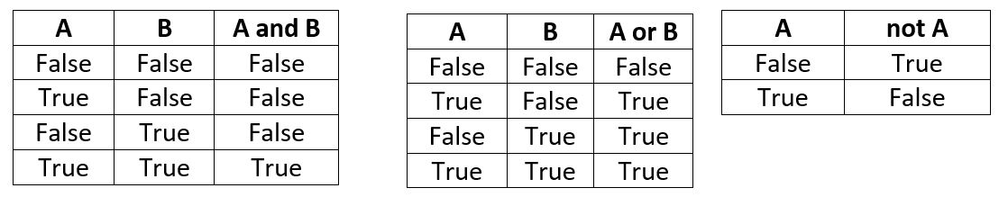

---
jupytext:
  formats: ipynb,md:myst
  text_representation:
    extension: .md
    format_name: myst
    format_version: 0.12
    jupytext_version: 1.7.1
kernelspec:
  display_name: Python 3
  language: python
  name: python3
---

# Operadores, expresiones y tipos de datos 

+++

[El intérprete como calculadora](#El_intérprete_como_calculadora)<br>
[Expresiones. Operadores aritméticos](#Expresiones._Operadores_aritméticos)<br>
[Tipos de datos enteros y reales](#Tipos_de_datos_enteros_y_reales)<br>
[El tipo booleano y sus operadores](#El_tipo_booleano_y_sus_operadores)<br>
[Tabla de precedencias](#Tabla_de_precedencias)<br>
[Cadenas de caracteres](#Cadenas_de_caracteres)<br>
[Variables](#Variables)<br>
[Otras constantes literales](#Otras_constantes_literales)

+++

***
<a id='El_intérprete_como_calculadora'></a>

+++ {"nbpresent": {"id": "71219fc3-c9cb-4700-9f0b-ab38b1b223da"}, "slideshow": {"slide_type": "-"}}

## El intérprete como calculadora
Antes de hacer nuestros primeros programas en Python, conviene familiarizarnos con los valores básicos que pueden ser representados y manipulados en el lenguaje. Lo haremos mediante ejemplos sencillos, utilizando el intérprete como una **calculadora**.

Véase, por ejemplo, la línea representada en la siguiente celda. Para seleccionar una celda nos situamos sobre ella y para ejecutarla, pulsamos el botón:
 o presionamos simultáneamente **`Shift + Enter`**.

```{code-cell} ipython3
---
nbpresent:
  id: ae8725fa-30f7-4d7f-a2c2-5f86953d730b
---
2 + 3
```

+++ {"nbpresent": {"id": "86423d42-e808-47e6-b1a7-e925e195f821"}}

Como habrás observado, se obtiene el resultado esperado para la suma planteada de dos **números enteros**. Puedes modificar la suma anterior eligiendo el *modo Edición* de la celda y cambiando los operandos.

En programación se llaman **constantes literales** a aquellas cuyo valor aparece _tal cual_ en el código fuente y cuya representación se deduce de forma evidente. En el ejemplo, `2` y `3` son dos constantes literales enteras.

Algunas combinaciones producen un **error sintáctico**. Véase, por ejemplo, el resultado de la siguiente celda.

```{code-cell} ipython3
---
nbpresent:
  id: d0569bb0-fad8-48b7-8d48-0066bfb90401
tags: [raises-exception]
---
2 + 7 +
```

El intérprete nos reporta la existencia de un error debido a una construcción *sintáctica inválida*. Es importante que aprendas a interpretar los mensajes de error para corregir sus causas. ¡Corrige la línea para evitar que se produzca!

+++

***
<a id='Expresiones._Operadores_aritméticos'></a>

+++

## Expresiones. Operadores aritméticos
Una **expresión** combina **operandos** (como los literales enteros `3` ó `5`) y **operadores** (como `+` para la suma) siguiendo unas reglas sintácticas simples, similares a las que ya conocemos de la aritmética. 
Como es natural, además de la suma, se tienen operadores para el resto de las operaciones aritméticas:

| Operador | Operación      |
|:--------:|:---------------|
| `+`      | Suma           |
| `-`      | Resta          |
| `*`      | Multiplicación |
| `/`      | División       |

En la celda siguiente multiplican de dos enteros. ¿Te animas a intentar la resta y la división? ¿Cómo harías para multiplicar varios valores? ¿Se pueden combinar operadores diferentes? 

```{code-cell} ipython3
:hideOutput: false

2 * 3
```

### Reglas de precedencia
Considera la siguiente expresión y calcula mentalmente el resultado que debe dar. ¿Coincide con el que brinda Python? ¿Sorprendido? 

```{code-cell} ipython3
---
hideOutput: false
nbpresent:
  id: 998dc7f5-ab6d-4fb8-866f-4fa96a06aaaa
tags: [hide-output]
---
3 + 2 * 5
```

Cuando se combinan diferentes operadores, el valor determinado por la expresión se calcula en función de unas **reglas de precedencia**. Estas reglas coinciden con lo esperable a partir de nuestros conocimientos aritméticos: **la multiplicación y la división son prioritarios con respecto a la suma y la resta**. 

La precedencia habitual se puede alterar utilizando paréntesis. Los paréntesis pueden anidarse unos dentro de otros, todo lo que se necesite.

```{code-cell} ipython3
(3 + 2)*5
```

```{code-cell} ipython3
((3 + 2)*5 + 1)*10
```

En presencia de operadores de **igual precedencia**, el cálculo del valor de una expresión se realiza **típicamente de izquierda a derecha**. 

Por ejemplo, en la siguiente celda, la división (que aparece primero desde la izquierda) tiene preferencia sobre la multiplicación.

```{code-cell} ipython3
2/2*3
```

En general, para evitar dudas y, en muchas ocasiones, para mejorar la legibilidad, **¡usa paréntesis!**

+++

### El operador de exponenciación `**`

En Python, el operador `**` eleva un valor a una potencia dada. Este operador tiene mayor preferencia que los anteriormente mencionados y, además, tiene la característica de que la prioridad se evalúa a la inversa de los anteriores, o sea, de derecha a izquierda:

```{code-cell} ipython3
2**3**2  
```

Usando paréntesis salimos de dudas:

```{code-cell} ipython3
2**(3**2)
```

### Operadores binarios y unarios
Los operadores anteriores se denominan **binarios** porque afectan a dos valores, situados a su izquierda y a su derecha. Existe también operadores **unarios**.  Por ejemplo, el `-` como operador unario, cambia el signo al valor situado a su izquierda. También existe el `+` unario, pero su utilidad es evidentemente menor.

```{code-cell} ipython3
-2*-3
```

+++ {"nbpresent": {"id": "829150e0-712b-4739-92d6-37b9c3d789cb"}}

Observe que la precedencia del `-` unario es incluso mayor que la del producto `*`.
Existen otros operadores unarios y binarios que veremos más adelante. Pero debemos dedicar algo de tiempo a la operación de división.

+++ {"nbpresent": {"id": "829150e0-712b-4739-92d6-37b9c3d789cb"}}

### El operador división

```{code-cell} ipython3
---
nbpresent:
  id: 8dce188c-36b7-41fa-9020-b5cb5502e452
---
2/3
```

+++ {"nbpresent": {"id": "85d1ab90-cc65-4935-808b-a6f57ecc892e"}}

A diferencia del resto de los operadores vistos, la división brinda un resultado cualitativamente diferente. El cociente contiene un punto decimal (equivalente al separador decimal coma muy utilizado en múltiples paises). 
Este resultado es coherente con lo que sabemos de las matemáticas. Si nos limitamos a las operaciones de suma, resta y multiplicación entre enteros, el resultado es otro entero. 
La división, sin embargo, puede dar un cociente que solo puede definirse correctamente para todos los casos si ampliamos su definición, por los menos, al campo de los números racionales.

El operador división es un ejemplo de expresión que puede dar lugar a **errores en tiempo de ejecución** (**runtime errors**). En este caso, cuando el denominador es nulo, la ejecución del programa lanza una **excepción** llamada `ZeroDivisonError`.

```{code-cell} ipython3
:tags: [raises-exception]

5/0
```

### La división entera `//` y el operador resto `*`
Existe una forma de realizar la división sin abandonar el campo de los enteros. Se tiene para ello el operador de **división entera** que se representa por `//`. También se cuenta con el operador `%` que devuelve el **resto de la división entera** tal y como se muestra en los ejemplos que siguen. Estos operadores, lejos de ser una curiosidad sin importancia, resultan muy útiles en programación.

```{code-cell} ipython3
5//3
```

```{code-cell} ipython3
5%3
```

***
<a id='Tipos_de_datos_enteros_y_reales'></a>

+++ {"nbpresent": {"id": "d99a804c-9444-418b-bc94-3c2f064e2844"}}

## Tipos de datos enteros y reales
Como se estudia en detalle en los **Sistemas de Representación**, la información se **representa** en los computadores utilizando un conjunto de celdas de memoria que almacenan dígitos binarios (0 ó 1). El rango de los números **enteros** y **reales** en matemáticas es un conjunto infinito. El ordenador, por contra, dispone de un número finito de celdas en las que almacenar bits.

En lenguajes como C/C++, de forma *nativa*, el tamaño máximo de un valor entero, **tipo** `int`, está determinado por la arquitectura del ordenador concreto que se utilice, típicamente **32** celdas binarias, **bits**, o sea **4 bytes** (8 **bits** son 1 **byte**). Sin embargo, en Python, un lenguaje de más alto nivel, no hay un límite predeterminado para el valor absoluto del mayor entero representable. Este valor puede crecer ocupando más y más celdas hasta alcanzar los límites de la memoria disponible en el ordenador.

En la celda que sigue puedes intentar encontrar el límite de la representación de enteros. 

```{code-cell} ipython3
---
nbpresent:
  id: 86172e20-fe16-447d-859f-24a81e563011
---
1222333545345345* 123432554356654*-12435346543443435
```

Para los números **reales**, se utiliza una representación muy diferente a la de los enteros, denominada de **punto (o coma) flotante**, definida en el estándar **IEEE 754**. El **tipo** de dato se denomina `float` por ese motivo. El mayor y menor número real representable, en valor absoluto, está en el rango aproximado [1e-323,1.7e308]. Esta es la consecuencia de utilizar un total de **64 bits**, **8 bytes**, para esta representación.

```{code-cell} ipython3
1e-323
```

Nótese que la presencia o ausencia del separador decimal `.` es lo que determina que Python considere a una constante literal como de tipo ìnt`o `float`.

+++

Se debe ser consciente del carácter limitado de la representación de los `float`. No solo no se puede expresar un número real tan grande como se quiera, sino que la precisión no es infinita y, por tanto, relativamente pocos números reales se pueden representar exactamente. 

+++

### Expresiones con mezcla de tipos
En Python se pueden mezclar en una misma expresión valores numéricos de diferentes tipos (ej.: `int` y `float`). Cuando esto ocurre, la operación se convierte hacia el tipo más general, que es el `float`.

```{code-cell} ipython3
(2 + 3)/2.1
```

```{code-cell} ipython3
100**1e2
```

Aumenta el valor del exponente en la celda anterior (ej.: 1e10) ¿Qué pasa? Recuerda que a diferencia de los enteros, los reales, `float`, tienen un tamaño limitado. Sin embargo, observa el resultado de la celda siguiente. ¿Qué conclusión se puede sacar?

```{code-cell} ipython3
100**1000
```

### Números complejos
A diferencia de muchos otros lenguajes, Python soporta de forma nativa el trabajo con los números complejos, **tipo** `complex`. Véanse los ejemplos a continuación:

```{code-cell} ipython3
1+2j + 2+2J
```

```{code-cell} ipython3
2 * (1+1j)
```

Esta posibilidad del trabajo con complejos resulta muy útil en muchos campos de aplicación de las ciencias y las ingenierías. La cobertura de este tema en este curso será sin embargo muy limitada. 

El trabajo con complejos resulta además, como se sabe, una extensión natural del campo de los reales para acomodar la raíz cuadrada (o en general la raíz par) de números negativos. Se debe comentar que la integración de los complejos como dicha extensión está implementada en Python de forma natural, como lo está el paso de los enteros a racionales por efecto de la división. 

Ved el siguiente ejemplo:

```{code-cell} ipython3
(-1)**0.5
```

***
<a id='El_tipo_booleano_y_sus_operadores'></a>

+++

## El tipo booleano y sus operadores

En la discusión previa, hemos visto tipos de datos numéricos y los operadores aritméticos conocidos. Pero existen otros tipos de valores y otras categorías de operaciones que quisiéramos poder realizar.

+++

### Operadores de comparación

Muchas veces es necesario comparar valores que pertenezcan a un tipo que tenga definida alguna operación de orden, como, por ejemplo, los propios datos de tipo numéricos. Python tiene para ese propósito los operadores:  

| Operador | Tipo de comparación | 
|:--------:|:--------------------|
| `<`      | Menor que           |
| `>`      | Mayor que           |
| `<=`     | Menor o igual que   |
| `>=`     | Mayor o igual que   |
| `==`     | Igual que           |
| `!=`     | Distinto de         |

Observe en la celda siguiente el comportamiento de estos operadores y experimente con varios de ellos.

```{code-cell} ipython3
2 > 3
```

```{code-cell} ipython3
3 == 3*1
```

Estas expresiones involucran típicamente operandos de tipo numérico pero el resultado es cualitativamente diferente. Es un resultado **lógico** o **booleano** (en referencia al álgebra de [**G. Boole**](https://es.wikipedia.org/wiki/%C3%81lgebra_de_Boole)). Este tipo de datos puede representar solo dos valores, `True` ó `False`.

+++

### Operadores lógicos (booleanos)

Estos operadores permiten trabajar con las **conectivas lógicas** **conjunción**, **disyunción** y **negación**.

| Operador | Conectiva  | 
|:--------:|:-----------|
| `and`    | Conjunción |
| `or`     | Disyunción |
| `not`    | Negación   |

El **operador de conjunción** o **Y lógico** se representa con el operador `and`.
Devuelve un valor que es `True` solo si todas las proposiciones lógicas representadas por sus operandos son simultáneamente también `True`. 

Véase el ejemplo a continuación:

```{code-cell} ipython3
1 > 0 and 1 < 100
```

La conectiva lógica **disyunción** o **O lógico** se representa con el operador `or`. La operación `or` brinda un resultado cierto (`True`) cuando al menos uno de sus operandos es `True`. Tanto el `or` como el `and` son operadores binarios.

Una operación lógica aún más simple es la **negación**, representada en Python por el operador `not`. Este último es un operador unario que simplemente *invierte* el valor lógico del operando al que se aplica.

```{code-cell} ipython3
not False and True
```

Los operadores lógicos se especifican completamente por sus **tablas de verdad**.



+++

Se pueden asociar tantos operadores como se deseen. El `not` unario es el de mayor prioridad y el `or` es el de menor. Se deben utilizar paréntesis para modificar esa precedencia por defecto. 

La evaluación de las operaciones lógicas tiene la propiedad de **cortocircuito**: si se puede concluir el valor lógico del resultado a partir de una evaluación parcial de la expresión, no se sigue evaluando la misma. 

Analice, por ejemplo, por qué la siguiente expresión no genera al ejecutarse una **excepción** de división por cero. ¿Qué pasa si se cambia el orden de ambos operandos? 

```{code-cell} ipython3
True or 2/0 > 1
```

Los valores y operadores lógicos se pueden mezclar con operadores de tipo numérico. En esos casos, un valor numérico cero se comporta como `False` y cualquiera diferente de cero como `True`.
En cualquier caso, los operadores lógicos típicamente se utilizan junto a los operadores de comparación. 

En el ejemplo siguiente, queremos determinar si el número `3` está entre otros dos números, el `10` y el `0`:

```{code-cell} ipython3
10 > 3 and 3 > 0
```

O sea, tiene que cumplirse que el `3` es simultáneamente menor que el `10` `and` mayor que el `0`. Este tipo de sintaxis es habitual y obligada en la mayoría de los lenguajes de programación. En Python es perfectamente legítima. Sin embargo, este lenguaje ofrece una forma alternativa de *encadenar* los operadores de comparación, que resulta, en ocasiones como ésta, estar más en concordancia con nuestras intuiciones matemáticas. 

Por ejemplo, la misma proposición se podría haber expresado en Python de la siguiente manera:

```{code-cell} ipython3
10 > 3 > 0
```

***
<a id='Tabla_de_precedencias'></a>

+++

## Tabla de precedencias

La siguiente tabla muestra las precedencias de los operadores estudiados hasta el momento.

| Operador | Evaluación | Rango |
|:--------:|:----------:|:-----:|
| `()`     | Izq. a Der.| 1     |
| `**`     | Der. a Izq.| 2     |
| `+`      | Unario     | 3     |
| `-`      | Unario     | 3     |
| `*`      | Izq. a Der.| 4     |
| `\`      | Izq. a Der.| 4     |
| `\\`     | Izq. a Der.| 4     |
| `%`      | Izq. a Der.| 4     |
| `+`      | Izq. a Der.| 5     |
| `-`      | Izq. a Der.| 5     |
| `==`     | Izq. a Der.| 6     |
| `!=`     | Izq. a Der.| 6     |
| `<`      | Izq. a Der.| 6     |
| `<=`     | Izq. a Der.| 6     |
| `>`      | Izq. a Der.| 6     |
| `>=`     | Izq. a Der.| 6     |
| `not`    | Unario     | 7     |
| `and`    | Izq. a Der.| 8     |
| `or`     | Izq. a Der.| 9     |

+++

***
<a id='Cadenas_de_caracteres'></a>

+++

## Cadenas de caracteres

Los computadores son conocidos por su capacidad para trabajar con valores numéricos. Hemos visto que también pueden compararlos y manipular valores lógicos o booleanos. De igual forma, cualquier usuario contemporáneo de los ordenadores sabe que estos se utilizan en muchos otros tipos de aplicaciones que frecuentemente demandan otros tipos de datos.

El **manejo de textos** es una tarea conocida de los ordenadores (procesadores de texto, correos electrónicos, sistemas de mensajería, etc.).
En todos estos casos, las **cadenas de caracteres** juegan un papel fundamental. 

Una **cadena de caracteres**, tipo de dato `str`, representa precisamente eso: una ristra de caracteres alfanuméricos que puede ser tratada como una unidad.

Tanto las **comillas simples**, `'cadena'` como las **dobles**, `"cadena"`, identifican los caracteres alfanuméricos que delimitan un valor constante de tipo `str`.

```{code-cell} ipython3
"Esta es una cadena de caracteres"
```

```{code-cell} ipython3
'Se pueden representar con comillas simples'
```

```{code-cell} ipython3
"Las cadenas se pueden " + "sumar"
```

***
<a id='Variables'></a>

+++

## Variables

+++ {"nbpresent": {"id": "9659b1c1-9aed-4d71-b830-4a60d408ad71"}}

Sabemos que existen diferentes tipos de valores y operaciones definidas sobre dichos valores, conformando __expresiones__.
Acabamos de ver que el **intérprete** de Python resulta una calculadora excelente. Sin embargo, a la hora de hacer cálculos más complejos, surge la necesidad de *almacenar* el valor de algún resultado intermedio para utilizarlo posteriormente. Esta posibilidad de _memorizar_ (que ya está de forma parcial en las calculadoras que conocemos) es una de las capacidades más reconocibles de los lenguajes de programación. 
La solución es darles __nombres__ o **identificadores** a los valores. En otros lenguajes de programación (y también en Python) se reconoce esta actividad esencial como asignar valores a **variables**. 

Por ejemplo:

```{code-cell} ipython3
radio = 5
PI = 3.14159
area_circulo = 2*PI*radio
```

```{code-cell} ipython3
---
nbpresent:
  id: 5a579720-fa62-4525-85e3-dd049cbd73be
---
area_circulo
```

+++ {"nbpresent": {"id": "f6847886-4044-43a7-9edd-f18efddcb7a9"}}

Esto es, se le ha dado provisionalmente el nombre `radio` al valor numérico entero `5`. O dicho de otra forma, se le ha asignado el valor `5` a la variable `radio`. Luego se ha dado el nombre `PI` a una aproximación de cinco valores decimales del número real $\pi$ y finalmente se ha asignado a la variable `area_circulo` el valor que resulta de __evaluar__ una expresión en la que aparecen __nombres__ (de variables) a las que anteriormente se les ha asignado un valor, operadores y constantes literales de tipo numérico. 

+++ {"nbpresent": {"id": "5d433d13-f44a-45bb-91fd-406f60b33b67"}}

Se tiene entonces, de una parte el nombre (o identificador) a la izquierda del signo `=` y a la derecha el valor que va a ser **asignado** a la localización de memoria que dicho nombre identifica. 

Cuando se trabaja con el intérprete, la asignación no produce inmediatamente la salida por pantalla del valor almacenado. Si se desea, se puede poner dicho nombre por sí solo, en una línea aparte y, entonces, el intérprete mostrará el valor al que hace referencia.
Se puede asignar el mismo valor a varios identificadores simultáneamente:
```python
a = b = 1
```
O diferentes valores a sendas variables utilizando la coma:
```python
a, b = 1, 2
```

```{code-cell} ipython3
a = b = c = 1
```

### La asignación no es equivalente a la igualdad matemática
La semejanza formal entre la sintaxis de la asignación en computación y la igualdad en matemáticas no debe llevarnos a pensar que son la misma cosa. 
Para convencernos de ello, baste con considerar el siguiente código de Python:
```python
a = 3
a = a + 1
```
Sentencias similares a la segunda línea en el fragmento anterior aparecen continuamente en programación, aunque resulten absurdas desde el punto de vista matemático. 
En programación, se trata simplemente de la operación mediante la cual se utiliza el valor previo asociado a la variable `a`  (que era `3` en el ejemplo) se le adiciona la constante `1` (que aparece **literalmente**) y al resultado (`4` en el ejemplo) se le vuelve a asignar el nombre `a`.


En resumen, se trata de la actualización del valor asociado a `a`.

### Operadores de asignación compuestos
Son tan comunes este tipo de operaciones en programación, que Python (al igual que en C/C++) ofrece variantes de la asignación que la combinan con una actualización del valor previamente almacenado en la variable, utilizando algunos de las operaciones aritméticas más comunes:
```python
a += 1   # --> a = a + 1 
```
También se tienen, por ejemplo:
```python
a /=2    # --> a = a/2
a -= -1  # --> a = a - (-1)
a *= 2   # --> a = a*2
a **= 2  # --> a = a**2
```

```{code-cell} ipython3
#Prueba algunas de estas variantes de la asignación compuesta:
a = 5
a //= 2
a
```

***
<a id='Otras_constantes_literales'></a>

+++

## Otras constantes literales
Los formatos básicos para introducir las constantes literales para cada tipo de datos han sido introducidos en los ejemplos vistos. Hay, sin embargo, otros formatos menos usuales.

* **Constantes literales `int`**
    * *Notación decimal*: dígitos decimales, opcionalmente precedidos de signo. El primer digito no puede ser cero.
   
       `10`, `-1234`
    * *Notación binaria*: dígitos binarios {0,1}, precedidos por `0B` o `0b`.
  
       `0b101`, `0B1110`
    * *Notación octal*: dígitos octales {0,...,7}, precedidos por `0o` ó `0O`:
  
       `0O2357`
    * *Notación hexadecimal*: dígitos hexadecimales {0,...9,A,...,F} precedidos por `0x` o `0X`:
  
       `0xFE`, `0X1249`
  
* **Constantes literales `float`**

    * *Notación con punto*: puede incluir dígitos decimales, signo y punto decimal
  
       `234.15`, `-10.85`
    * *Notación científica*: donde la letra `e` simboliza la base 10.
  
       `-1.01e10`, `23.5e-100`, `1e6`
  
* **Constantes literales `complex`**

    * Parte real y parte imaginaria deben ser de tipo real:
  
       `1.1 + 2j`, `10 - 1e2J`

* **Constantes literales `bool`**

    * Las únicas constantes literales booleanas son `True` y `False`

* **Constantes literales `str`**

    * Caracteres alfanuméricos rodeados de comillas simple o dobles.
  
     `"Esta es una constante de cadena"`
     
     `'Otra cadena que incluye al final un fin de línea\n'`
  
Además de los caracteres convencionales que representan letras del alfabeto (mayúsculas y minúsculas), dígitos y otros signos diversos, se utiliza una codificación especial para hacer referencia a **caracteres especiales**.
Estos caracteres especiales comienzan con el signo `\` (llamado **carácter de escape** en este contexto) seguido de un código que lo identifica:

Ejemplos:

| Carácter de escape | Función                                                         |
|:------------------:|:----------------------------------------------------------------|
| `'\n'`             | Cambio de línea                                                 | 
| `'\t'`             | Tabulador                                                       | 
| `'\\'`             | Para utilizar el propio carácter `\`                            | 
| `'\''`             | Para utilizar el propio carácter `'`                            | 
| `"\""`             | Para utilizar el propio carácter `"`                            | 
| `'\dd'`            | Para hacer referencia al carácter ASCII de valor decimal dd     |
| `'\xhh'`           | Para hacer referencia al carácter ASCII de valor hexadecimal hh | 


Intenta escribir diferentes constantes en el cuadro que sigue:

```{code-cell} ipython3
'\65'
```
